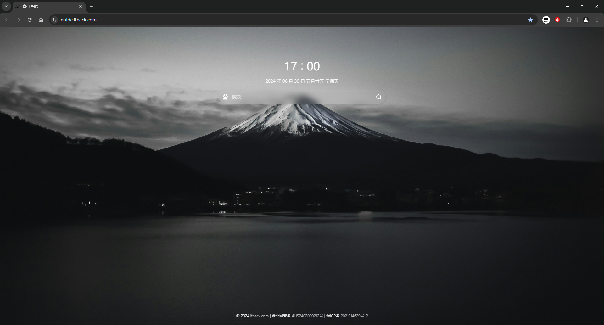
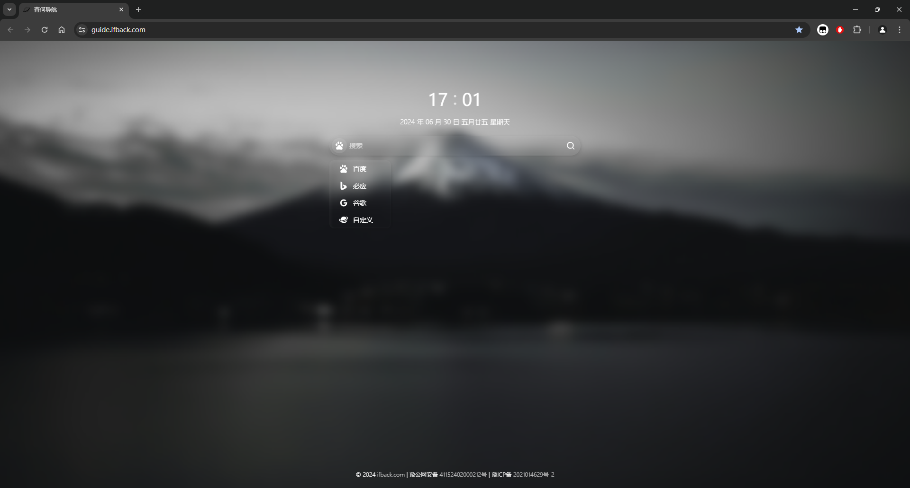
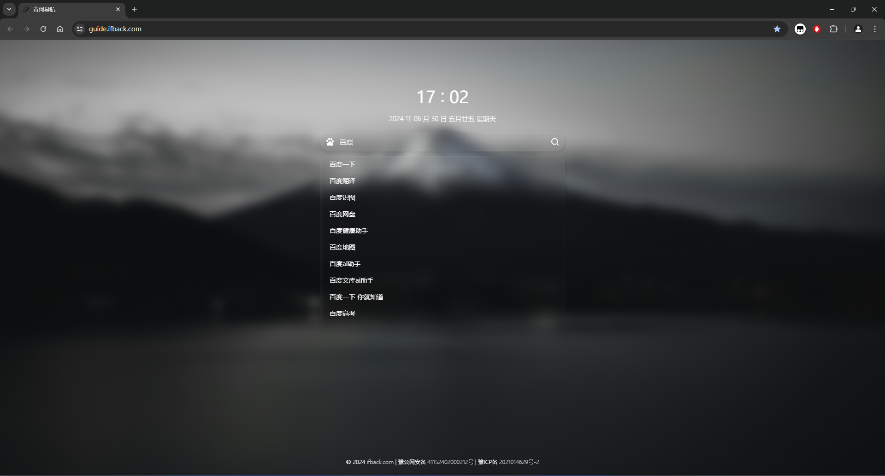
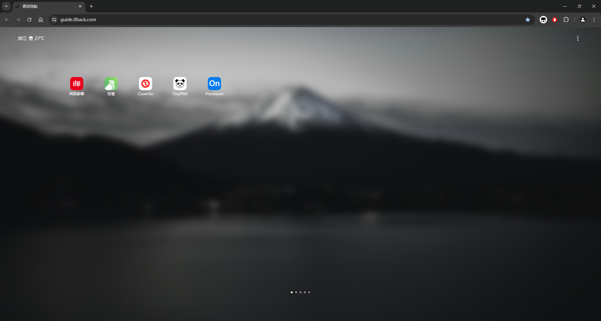
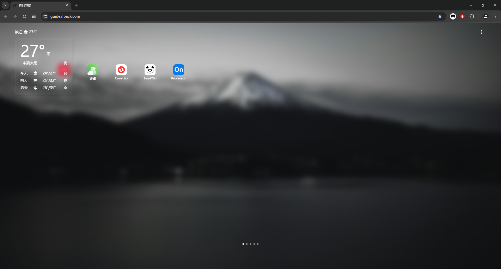
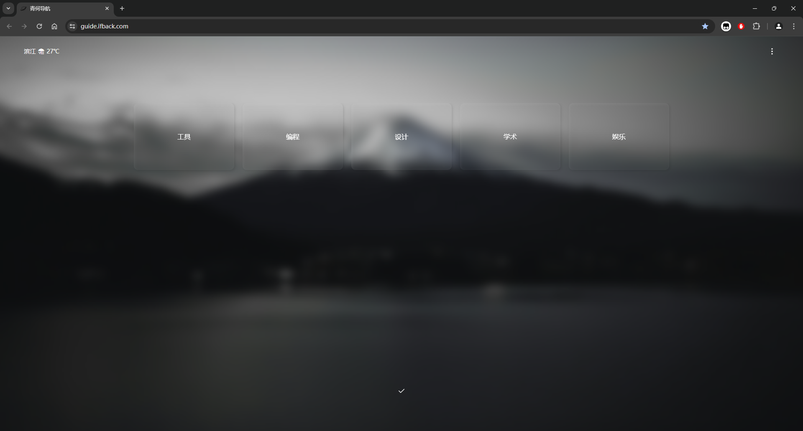
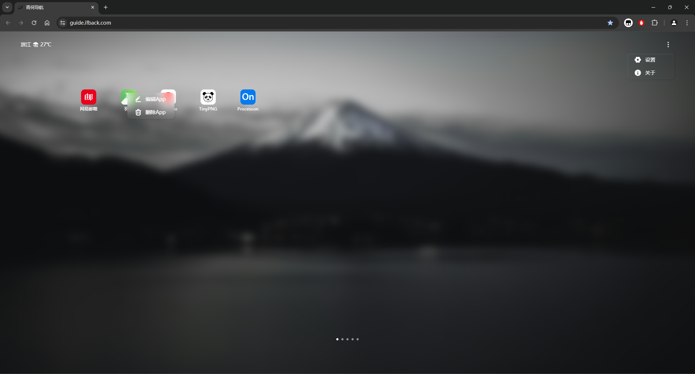
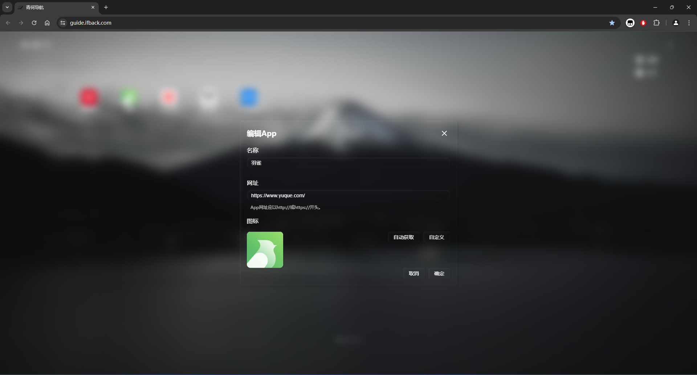
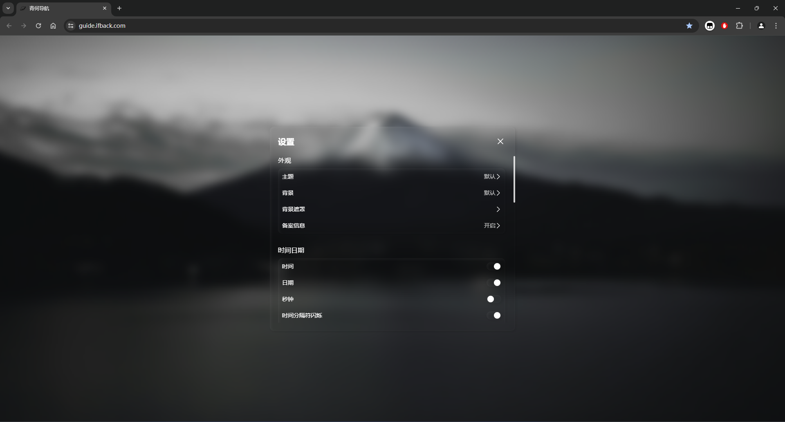
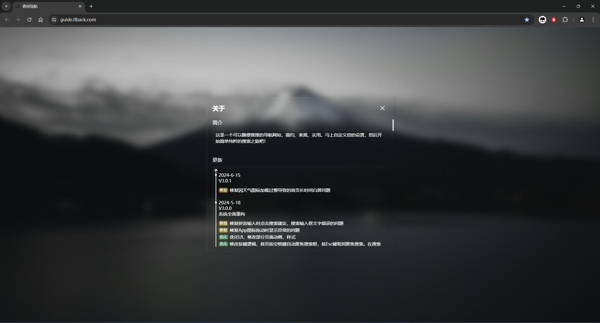

## 简介
青何导航是一个可以随便搜搜的导航网站，简约、美观、实用。马上自定义您的设置，然后开始简单纯粹的搜索之旅吧！

## 使用说明
> 以下介绍均是在默认设置的情况下进行的。
>

### 首页
首页水平居中为搜索栏，上方显示当前时间与日期，页面底部为网站备案信息。

#### 切换搜索引擎
点击搜索引擎图标，或者点击Tab键，可以自行切换搜索引擎，默认提供了3个可供选择的搜索引擎以及一个可供自定义的搜索引擎。

#### 搜索
在首页，可以通过鼠标点击输入框，或者直接点击空格按键，聚焦至输入框。

输入搜索信息，自动展开搜索建议栏，首项为翻译，余项为搜索建议（搜索建议数据来自百度）。

此时可以通过鼠标或者键盘上下按键选择您希望搜索的表项，选中后点击鼠标或者按回车按键即可跳转至指定的搜索引擎页面。

### 导航页
在首页，鼠标右键或者点击搜索框上方时间，进入导航页面。

#### 天气
页面顶栏左侧为天气组件（天气数据来自和风天气），组件会显示指定地点今天、明天和后天三天的天气，默认地点为北京。

#### 菜单
页面顶栏右侧为菜单项。点击后出现通用设置和关于选项，点击则会进入对应页面。

#### 导航
页面中间为导航页主体，默认有5个分组，分别是工具、编程、设计、学术和娱乐，每个分组默认提供了数个常用网站图标。

点击页面底部中间的按钮，或者使用鼠标滚轮上下滑动可以切换分组。

长按页面底部中间的按钮，可以进入分组排序页面。

拖动对应分组卡片后，点击页面底部确认按钮即可修改分组排序。

#### 图标
点击图标即可跳转至图标所在网站。

长按图标可以拖动图标进行排序，支持在不同分组之间进行拖动。

在图标上鼠标右键，可以选择编辑图标和删除图标。

选择编辑图标，打开图标编辑页面，可以编辑图标名称、网址。默认提供的网站，图标无需自行设置，如果自己添加图标，可以点击自动获取图标按钮，网站会自动尝试获取图标。如果获取失败或者对获取的图标不满意，可以自定义上传。

### 设置页
设置页提供了网站可以自定义修改的设置项，这里不再一一介绍。

### 关于页
关于页介绍了网站的简介和更新历史。

## 其他
本人只是一个业余的前端开发者，开发这个网站很大一部分原因是为了方便自己使用。如果您在使用过程中遇到什么问题，欢迎在下面评论反馈（虽然我不一定会处理🙂）。

