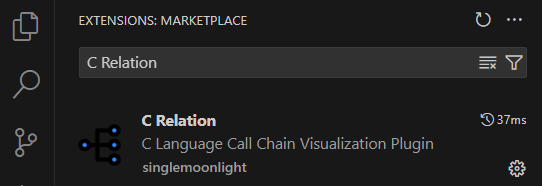
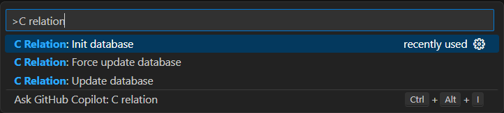
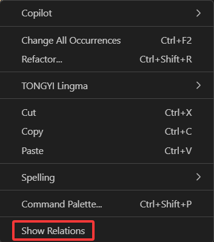

## 简介
> 一直想用 SourceInsight 一样的可以查看函数调用链一样的功能，但是又不想用 SourceInsight，找了一圈没有找到 VS Code 有类似功能的插件，索性自己开发了一个。
>

这是一个可以可视化显示 C 函数调用关系的 VS Code 插件，功能纯粹，使用简单。

## 项目依赖
[Tree-sitter](https://tree-sitter.github.io/tree-sitter/)，一个解析器生成器工具和一个增量解析库，它可以为源文件构建具体的语法树。

[D3](https://d3js.org/)，是一个免费的、开源的JavaScript库，用于可视化数据。

本插件通过 Tree-sitter 分析出 C 语言工程的符号表和调用关系表格，并用 D3 可视化显示出来。

## 快速开始
### 安装插件
首先打开一个 C 语言项目，然后在 VS Code 应用市场搜索 `C Relation` ，选择安装。

### 初始化数据
`Ctrl+Shift+P` ，打开命令面板，然后选择 `C Relation: Init database` 。插件将扫描整个项目的 `.c` 和 `.h` 文件，并构建符号表数据。

如果 C 语言项目比较大，第一次扫描耗时可能会比较久。

扫描完成后，会有如下提示：

### 查看调用链
打开项目中的某一个文件，选中一个函数符号，右键选择 `Show Relations` 。

调用关系会在一个新的标签页打开，每次选择一个符号，右键查看调用链都会打开一个新的标签页，可以同时查看多个函数的调用链。

鼠标移动到函数上，可以看到函数所在文件和具体的行号，点击函数可以展开或者合并下一级调用，右键函数可以跳转到函数所在文件和行号处。

如果展开调用链树太长或者太宽，可以拖动整棵树，以便更好的查看。

### 更新数据
插件主要是为了查看调用链，如果你在开发，代码存在更新，请 `Ctrl+Shift+P` ，打开命令面板，然后选择 `C Relation: Update database` 。插件将扫描更新果的文件，并更新符号表数据。

如果你想重新完全更新一遍数据库，可以打开命令面板，然后选择 `C Relation: Force update database` 即可。

### 设置
插件目前提供了以下几个设置：

#### 数据保存路径
默认会放在 `username/.crelation` 目录下，可以自行修改。如果修改该路径，将在重启 VS Code 后生效。

#### 自动初始化数据库
默认关闭，开启后会在打开 VS Code 项目时自动初始化数据库。

#### 自动更新数据库间隔
默认为 0 ，表示不自动更新数据库。单位为分钟，设置后每隔该间隔将自动更新数据库。如果修改该间隔，将在重启 VS Code 后生效。

#### 调用链显示位置
默认显示在主编辑器，也就是和普通文件并列，可以选择显示在右侧，即新开一列编辑器。

#### 调用链显示模式
默认会为每个函数单独显示标签页，可以改为独立模式，每次选择函数查看调用链将始终在一个窗口显示，后者会覆盖前者。

#### 日志等级
默认为`error`，有多个等级可选，等级越高，控制台日志越多，主要是用于问题调试，一般用户无需关心。

新版本将日志注册到了 VS Code 的 Output 面板，可以在该面板直接查看日志。不过该面板本身也会控制日志等级，插件自身的等级控制要高于 VS Code 输出面板。

## 问题或者疑问
如果有使用问题或者疑问，可以在下面留言，或者直接在 GitHub 上提 issue。

> 仓库：[https://github.com/SingleMoonlight/crelation](https://github.com/SingleMoonlight/crelation)
>
> 原始文档：[https://blog.ifback.com/article/automatically-publish-vscode-plugins-using-github-action/](https://blog.ifback.com/article/automatically-publish-vscode-plugins-using-github-action/)
>

