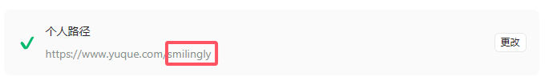
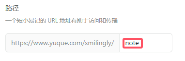

一个基于账号密码的个人语雀 Markdown 文档批量导出工具，使用简单便捷。

+ 支持按目录批量导出文档
+ 支持多知识库批量导出
+ 支持文档图片导出
+ 支持自定义文档处理器

<!-- more -->

## 快速开始
项目依赖`puppeteer-core`，使用`puppeteer`模拟用户的登录操作，因此请确保已安装谷歌浏览器。

### 安装
使用以下命令安装`yuque-exporter`，默认会安装最新版本。

```bash
npm i @singlemoonlight/yuque-exporter
```


安装完成后请在`package.json`文件中添加以下命令，如果不添加，后续命令请将`npm run`替换为`npx`。

```json
"scripts": {
    "yuque-exporter": "yuque-exporter"
},
```

### 初始化
使用以下命令进行工具初始化，初始化完成后，会在项目的根目录下生成工具文件夹以及相关默认配置。如果使用了 git 进行版本控制，会自动在 .gitignore 文件文件中添加工具目录。

```bash
npm run yuque-exporter init
```

### 配置
初始化完成后，必须对工具进行必要的配置，项目根目录下生成的`yuque_exporter`文件夹，其中包含默认用户配置文件`user_config.json`和默认用户插件文件`user_hooks.js`。

#### 默认用户配置
默认用户配置是一个 JSON 文件，其中必要配置均没有填写。

```json
{
    "puppeteer": {
        "chromePath": "",
        "headless": true
    },
    "account": {
        "user": "",
        "password": "",
        "cookies": ""
    },
    "sync": {
        "repo": "",
        "books": []
    },
    "output": {
        "docPath": "books",
        "imgPath": "images"
    }
}
```

各个配置含义以及示例如下：

| 配置项 | 含义 | 是否必须配置 | 示例 |
| --- | --- | --- | --- |
| chromePath | 本地谷歌浏览器路径，一般是 | 是 | `"C:\\Program Files (x86)\\Google\\Chrome\\Application\\chrome.exe"` |
| headless | puppeteer登录行为，无头模式不会启动页面 | 否 | / |
| user | 语雀登录账号 | 是 | `"***********"` |
| password | 语雀登录密码 | 是 | `"********"` |
| cookies | 语雀登录cookie，登录后自动生成 | 否 | / |
| repo | 语雀个人路径 | 是 | `"my-yuque-repo"` |
| books | 需要同步的语雀知识库列表，如果通过指定知识库的方式就不需要配置 | 否 | `["note", "code"]` |
| docPath | 文档输出目录，默认为 项目根目录/books | 否 | `books`、`dir/books` |
| imgPath | 图片输出目录，默认为 项目根目录/images | 否 | `images`、`dir/images` |


其中需要对以下几个配置进一步说明：

`repo`：语雀个人路径，可以在语雀的`设置`->`账户管理`->`个人路径`处修改和查看。这里需要填的是个人配置的部分，前面公共部分不需要填。



`books`：需要同步的语雀知识库列表，可以在语雀的`知识库`->`更多设置`->`路径`处修改和查看。这里需要填的是个人配置的部分，前面公共部分不需要填。



`docPath`：文档输出目录，会将配置的知识库按照语雀目录的形式整体放在该目录下。文档输出目录是基于本地项目的根目录的，也就是说最后文档所在目录是`本地项目根目录/docPath`。

`imgPath`：图片输出目录，会将所有文档里的图片全部集中放在该目录下。图片输出目录是基于本地项目的根目录的，也就是说最后图片所在目录是`本地项目根目录/imgPath`。图片输出目录强烈建议使用一个独立的目录，即除了输出图片，不存放其他文件。

#### 默认用户插件
默认用户插件提供了文档自定义处理的入口，默认情况下返回文档内容，即不做任何处理。

如有自定义文档处理的需求，可对`customHook`接口进行修改，也可以通过`registerHook`接口注册其他处理函数。需要注意的是，该接口必须返回处理后的文档。

```javascript
import { registerHook } from '@singlemoonlight/yuque-exporter/hook'

/**
 * 注册自定义文档处理接口
 * 可以在此处处理文档内容，比如替换图片链接等
 * 
 * @param {string} docContent 文档内容
 * @param {object} docDetail 文档详情
 * @param {string} docPath 文档路径
 * @param {string} bookSlug 知识库标识
 * @return {string} 处理后的文档内容
 */
async function customHook(docContent, docDetail, docPath, bookSlug) {
    // 自定义处理逻辑

    return docContent;
}

registerHook(customHook);
```

自定义接口的参数详细含义如下：

`docContent`：文档内容，这里文档里的图片链接已经被替换为了本地相对路径。

`docDetail`：文档详情，是语雀平台 API 返回的原始数据，包含各类属性，具体可以通过打印自行查看。

`docPath`：文档的绝对路径，是本地文档将会存放的路径。

`bookSlug`：文档所属知识库的标识。

### 登录
配置好上述信息后，就可以执行以下命令进行登录，登录是利用`puppeteer`模拟用户行为的方式，即输入用户名、密码，然后点击登录。

```bash
npm run yuque-exporter login
```

登录以后，工具会自动解析出登录获取的`Cookies`，用于后续的文档同步。

语雀默认的`Cookies`过期时间是一个月，还是比较长的，因此登录一下后，一个月都不需要登录。当然，不需要记录这个，同步的时候工具会自动检测`Cookies`是否过期。

如果想要强制重新登录，可以添加`-f`选项。

```bash
npm run yuque-exporter -- login -f
```

> npm run 命令会将选项视为 npm 的，需要添加 -- 分隔符，表示后面的参数选项是自定义命令的，下同。
>

完成初始化、配置和登录后，后续同步文档不需要再执行上述步骤。

### 同步文档
登录语雀拿到`Cookies`后，就可以执行同步命令了，使用以下命令就会同步在用户配置文件里指定的所有知识库。

```bash
npm run yuque-exporter sync
```

如果想单独同步某一个知识库，可以添加`-b <book>`选项，`book` 为知识库标识。

```bash
npm run yuque-exporter -- sync -b book
```

当知识库同步完成后，如果文档更新了，此时再执行同步命令，只会同步更新了的文档。如果想想强制进行同步，可以添加`-f`选项。

```bash
npm run yuque-exporter -- sync -f
```

### 删除文档
当你想要删除同步的文档时，可以执行以下命令。该命令会删除同步的所有知识库和图片，删除知识库会删除各个知识库目录，删除图片会删除整个图片输出目录。

该该命令风险较高，因此添加了二次确认，执行后需要输入 yes 进行确认，否则会取消执行。

```bash
npm run yuque-exporter clear
```

## 问题或者疑问
如果有使用问题或者疑问，可以在下面留言，或者直接在 GitHub 上提 issue。

> 仓库：[https://github.com/SingleMoonlight/YuqueExporter](https://github.com/SingleMoonlight/YuqueExporter)
>
> 原始文档：[https://blog.ifback.com/article/yuque-exporter-a-document-bulk-export-tool](https://blog.ifback.com/article/yuque-exporter-a-document-bulk-export-tool)
>

