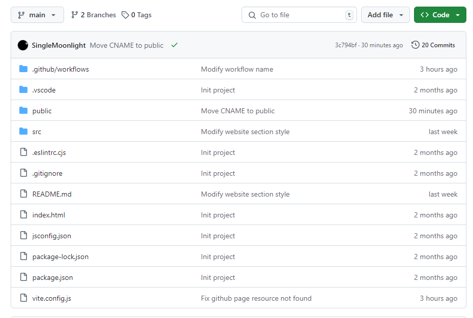
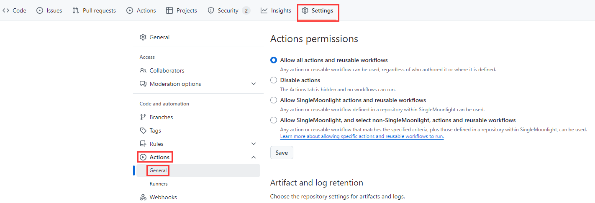
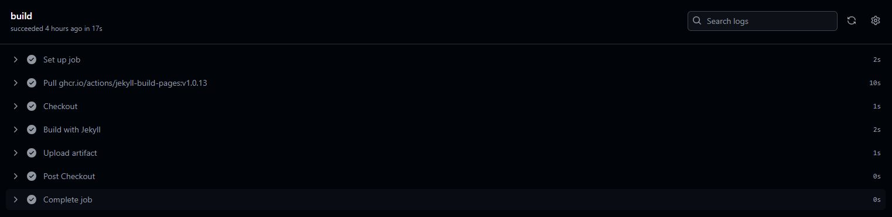
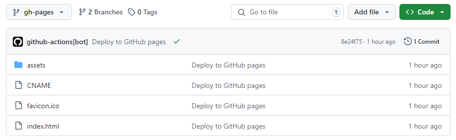
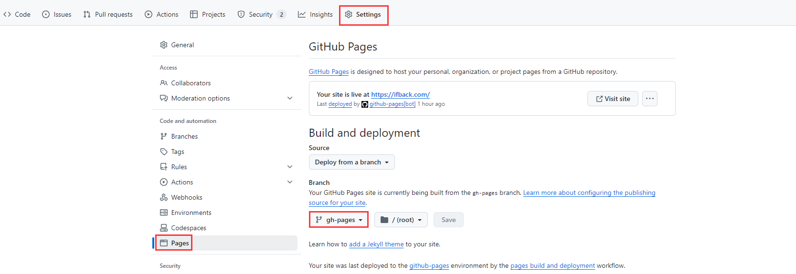

从萌生创建网站的想法开始，试过了很多建站方式，目前是云服务器自建博客前台，博文托管平台，各个子站容器化部署，更新使用 Jenkins 自动化部署和发布，配置、迁移、SSL 等都是通过脚本一键完成，可以说十分优雅，一定程度上，我觉得这将是最终形态，不会再折腾了。

但是云服务器还是有成本的，本着能~~白嫖绝不花钱~~的态度，决定将几个网站都迁移到 GitHub 上。

<!-- more -->


这里介绍的 GitHub 的两种工具分别是 GitHub Pages 和 GitHub Action，前者用于托管静态网站，后者用于网站的自动化部署和发布。对于个人开发者来说，建站十分方便。

静态网站意味着不能访问后台 API，不过一般来说也用不到，如果确实有使用第三方 API 的需求，就会面临着跨域和安全问题，需要仔细考虑是否有解决方案。

## 开始
### 网站开发
网站开发不必多说，每个人都不一样，需要保证本地构建运行没有问题。

### 代码推送
当本地开发好网站后，需要将代码推送到 GitHub 仓库，例如：



请先忽略图中的 workflows 文件，后面会说明如何进行配置。

### GitHub Action 配置
在仓库页面上方，依次选择`Setting`->`Action`->`General`。



然后划到最下面，在`Workflow permissions`项中，选择赋予读写权限。


这里是因为后面使用 GitHub Action 自动打包部署时，会创建 gh-pages 分支，并将打包好的文件自动上传到该分支，所以需要写入权限，如果不进行配置，自动部署回报没有权限的错误。

```shell
Run crazy-max/ghaction-github-pages@v4
Initializing local git repo
Copying /home/runner/work/qingheifback/qingheifback/dist to /tmp/github-pages-NOVeCl
Configuring git committer
Updating index of working tree
Committing changes
Pushing dist directory to gh-pages branch on SingleMoonlight/qingheifback repo
  /usr/bin/git push --force ***github.com/SingleMoonlight/qingheifback.git gh-pages
  remote: Permission to SingleMoonlight/qingheifback.git denied to github-actions[bot].
  fatal: unable to access 'https://github.com/SingleMoonlight/qingheifback.git/': The requested URL returned error: 403
  Error: The process '/usr/bin/git' failed with exit code 128
```

### GitHub Aciton workflow 编写
GitHub Action 自动打包部署是根据 GitHub 规定的一个名为`deploy.yml`文件自动完成的，这个文件需要放在代码库`.github/workflow/deploy.yml`路径下。

这个文件需要怎么写呢？可以参考[官网](about:blank)的介绍，或者直接用现成的模板，管他三七二十一，先跑起来再说定制化。这里直接给一个基本万能，vue 项目可以直接用的文件：

```shell
name: deploy

on:
  # 每当 push 到 main 分支时触发部署
  # Deployment is triggered whenever a push is made to the main branch.
  push:
    branches: [main]
  # 手动触发部署
  # Manually trigger deployment
  workflow_dispatch:

jobs:
  build-and-deploy:
    runs-on: ubuntu-latest

    steps:
      - uses: actions/checkout@v4
        with:
          # “最近更新时间” 等 git 日志相关信息，需要拉取全部提交记录
          # "Last updated time" and other git log-related information require fetching all commit records.
          fetch-depth: 0

      - name: Setup Node.js
        uses: actions/setup-node@v4
        with:
          # 选择要使用的 node 版本
          node-version: 20
      
      # 安装依赖
      # Install dependencies
      - name: Install Dependencies
        run: npm ci

      # 运行构建脚本
      # Run the build script
      - name: Build site
        run: npm run build

      # 查看 workflow 的文档来获取更多信息
      # @see https://github.com/crazy-max/ghaction-github-pages
      - name: Deploy to GitHub Pages
        uses: crazy-max/ghaction-github-pages@v4
        with:
          # 部署到 gh-pages 分支
          target_branch: gh-pages
          # 部署目录
          build_dir: dist
        env:
          # @see https://docs.github.com/cn/actions/reference/authentication-in-a-workflow#about-the-github_token-secret
          GITHUB_TOKEN: ${{ secrets.GITHUB_TOKEN }}
```

默认情况下，这个文件一点都不需要动，唯一需要关注的就是部署目录，也就是本地编译后，产物的打包目录，默认都是 dist。

### 推送 deploy.yml
现在本地编写完了`deploy.yml`，将其 push 到 GitHub 仓库，此时可以看到 GitHub 在自动执行构建。



如果不出意外的话，构建完成就可以看到自动创建的新分支`gh-pages`以及打包好的产物。



### GitHub Pages 配置
在仓库的`Setting`->`Pages`里，`Branch`选择自动生成的`gh-pages`，稍等一会，将会在上面看到网站可以访问。



> 这里我自定义了域名，所以地址不是`***.github.io/project_name`
>

如果此时访问上述网站，会发现静态资源全都加载失败，如果查看访问的地址，会发现静态资源的访问地址是`***.github.io/***.css`，而不是`***.github.io/project_name/***.css`。

这是因为 vue 项目的本地还缺少了下面的配置。

### Base URL 配置
在`vite.config.js`里指定`base`为仓库的名称，否则部署后访问时会找不到静态资源。

> 这里项目是用vite构建的，webpack构建的项目也是一样，可能配置地方不同。
>

不过先别急着修改，如果你打算绑定自己的域名，那么这一步的base就需要配置为`'/'`。

> 如何自定义域名：[https://blog.ifback.com/article/github-pages-bind-custom-domain-and-enable-https/](https://blog.ifback.com/article/github-pages-bind-custom-domain-and-enable-https/)
>

```shell
export default defineConfig({
  base: '/qingheifback', // 这里需要配置为仓库名称或者'/'
  plugins: [
    vue(),
  ],
  resolve: {
    alias: {
      '@': fileURLToPath(new URL('./src', import.meta.url))
    }
  },
  build: {
    outDir: 'dist',
    rollupOptions: {
      output: {
        manualChunks(id) {
          if (id.includes("node_modules")) {
            // 将外部依赖单独打包
            return 'vendor';
          }
        }
      },
    },
  },
  server: {
    host: '0.0.0.0', // 配置项目可以局域网访问
    port: 8000,
  },
})
```

修改好 base 后，将代码推送到 GitHub，不出意外，网站就可以正常访问了。


