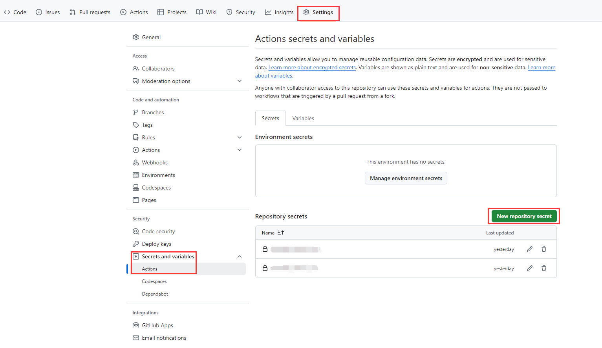
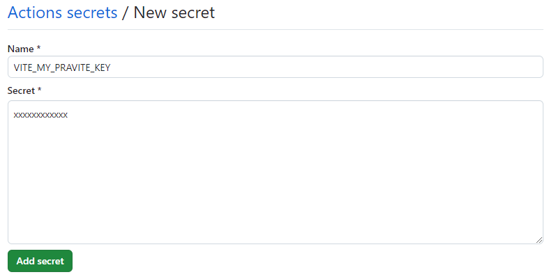

我们在开发引用第三方 API 时，往往需要用到 API 平台要求的 KEY，这些密钥在本地可以通过文件的形式引入到代码中，然后版本维护的时候不上传到 GitHub，这样可以一定程度上避免密钥泄露的风险，当我们使用 GitHub 进行打包编译的时候，又需要用到密钥，这时候就可以用 GitHub 提供的密钥管理工具管理我们的密钥。

<!-- more -->

## 本地密钥
这里本地的密钥是通过 vite 环境变量的方式引用，即将密钥写在单独的环境变量文件 .env 中，然后在 .gitignore 中忽略 .env 文件。

```javascript
VITE_MY_PRAVITE_KEY=xxxxxxxxxxxx
```

代码里就可以通过如下方式直接使用：

```javascript
import.meta.env.VITE_MY_PRAVITE_KEY
```

## GitHub 密钥
### 创建密钥
在代码仓库 `Setting`->`Actions secrets and variables`->`Actions`->`Repository secrets`中新建一个密钥。



输入密钥名称和密钥，点击添加即可：



### 使用密钥
然后在 GitHub Aciton 的部署文件 deploy.xml 中就可以通过如下方式进行引用：

```javascript
# 其他构建步骤

- name: Set environment secrets
  env:
    VITE_MY_PRAVITE_KEY: ${{ secrets.VITE_MY_PRAVITE_KEY }}
  run: |
    touch .env
    echo "VITE_MY_PRAVITE_KEY = VITE_MY_PRAVITE_KEY" >> .env

# 其他构建步骤
```

这里就是在原本的部署流程中添加了一个创建环境变量文件的步骤，将环境变量写入 .env 文件中，然后再进行构建，这样就达到了和本地打包构建一样的效果。

在构建完成后，构建环境会直接被清除，因此上述步骤中创建的文件也并不会被保存。

