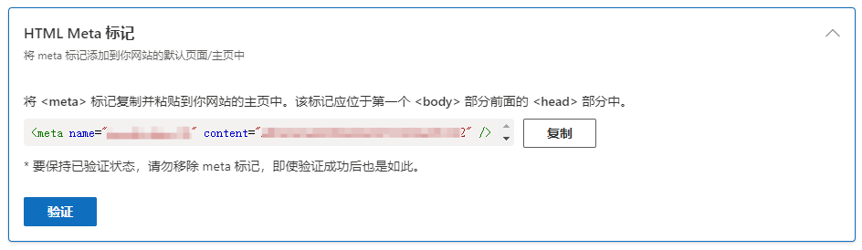

在搭建并部署了个人网站后，如果希望自己的网站被搜索引擎收录，网站内容能够被别人检索到，那就有必要在搜索引擎的站长平台提交自己的网站，根据站长平台的统计数据优化网站的 SEO。

各个搜索引擎的站长平台功能和使用方式大同小异，下面简单介绍一下`必应`和`百度`两个搜索引擎的站长平台。

<!-- more -->

## 必应站长平台
必应站长平台官网：[https://www.bing.com/webmasters/home](https://www.bing.com/webmasters/home)

必应的站长平台个人用着感觉要比百度要好一点，收录也快，这里先介绍一下。

### 添加网站
有两种添加方式，第一种估计都没有，这里采用第二种方式，手动添加网站。输入自己网站的 URL，然后点击添加。

### 验证网站
添加网站后，需要验证对网站的所有权，必应这里提供了三种方式，分别是 XML 文件验证、HTML Meta 标记验证和 DNS 验证，每种验证方式都挺简单的。

#### XML 文件验证

将这里的 xml 文件下载下载下来，然后放到网站的根目录，也就是达到能通过 `https://your_domain.com/BingSiteAuth.xml` 访问的效果。

#### HTML Meta 标记验证

将这里的标记复制粘贴到网站的主页中，该标记应位于第一个 `<body>` 部分前面的 `<head>` 部分中。对于 Vue 项目来说，就是在放在 index.html 文件中。

#### DNS 验证

DNS 验证就是最简单的了，在域名服务商控制台，添加 CNAME 解析记录即可。但需要提一下，如果是二级域名，记得要在他给的名后面添加二级域名。

比如我这里的阿里云 DNS 解析：

### 网站管理
通过上述方式验证过后，就可以在在首页看到自己的网站了，不过此时应该没有任何数据。

必应提供了一系列的工具，这里着重介绍其中个人认为比较有用的。

#### 搜索性能

可以查看网站的搜索次数、展现次数、点击次数，这里个人认为比较重要的就是关键字，可以看到别人搜索了什么，以及必应推荐的相应页面，可以看到别人是否点击了，如果点击了，证明关键字和内容比较匹配，如果没有就可以考虑修改页面标题等。

#### 网站地图

为了让必应更快地知道自己的网站有哪些链接，而不用通过爬虫慢慢去爬，就可以提供网站地图。

网站地图通常是一个包含了网站所有链接的一个 xml 文件，比如我这个博客网站的网站地图：[https://blog.ifback.com/sitemap.xml](https://blog.ifback.com/sitemap.xml)。

通过这里提交网站地图后，必应就能更快的发现网站的所有链接。

#### 建议

在建议这里，必应会按照优先级统计网站的所有可以完善的建议，而且点击进去后会给出具体的操作方法，个人觉得非常有用。

## 百度站长平台
百度站长平台官网：[https://ziyuan.baidu.com/site/index](https://ziyuan.baidu.com/site/index)

百度的站长平台限制有点多，基本没有什么操作空间。

### 输入网站
首先输入网站网址，要选择网站的协议头，即用的是 `http` 还是 `https`。

### 设置站点属性
根据自己网站的类型进行选择选择站点的属性，可能并不会十分契合，选择相近的即可。

### 验证网站
百度的网站验证提供了两种方式，文件验证和 HTML 标签验证，和前面必应的两种验证方式是一样的，这里就不再啰嗦了。

#### 文件验证

#### HTML 标签验证

### 网站管理
添加完成后就可以在网站管理页面看到网站的基本信息了。

虽然百度也提供了很多管理功能，但是基本都是不可用的，或者说不太好用。

#### 资源提交
比如网站资源提交，百度提供了三种方式，API 提交、sitemap 提交和手动提交。

API 提交和手动提交都需要导出自己网站的链接，然后逐条上传，并不能向 sitemap 一样自动提交和更新。如果想用 sitemap 提交的话，还有提交上限和余额限制。

#### 数据统计
数据统计和必应差不多，可以知道用户搜索和展现页面的关系，可以进行针对性的优化，但是我这里啥也没有，哈哈哈。

#### 搜索展现
这个是对自己网站的定制，我们平时搜索的话，可以看到有的网站（广告）会有网站说明、网站图标之类的，但是这个是面向 VIP 开放。

