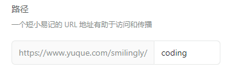
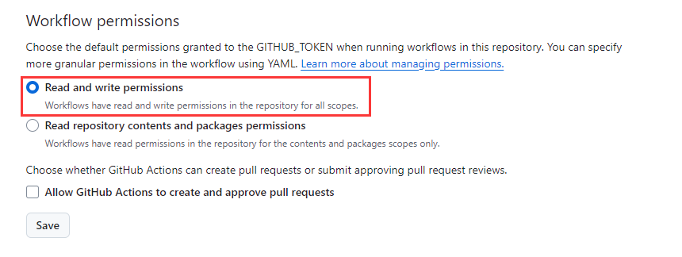
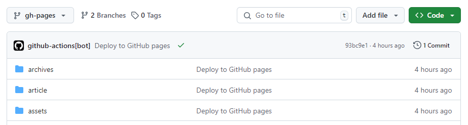
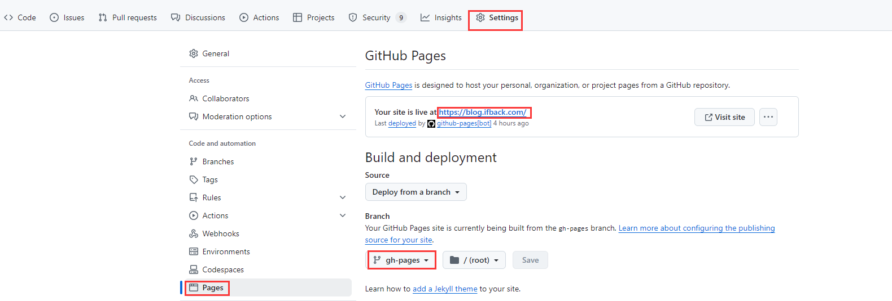
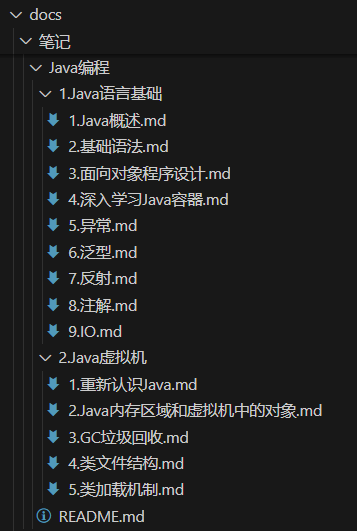
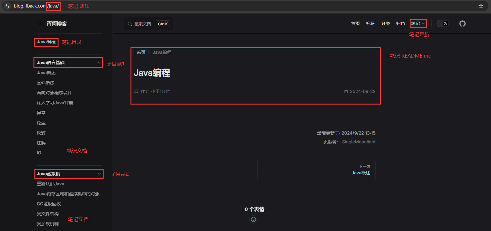
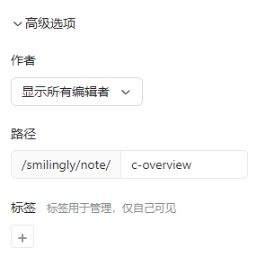

前面博客说过，博客方案换来换去，没有优雅，只有更优雅。现在找到了满足我所有需求的方案。不出意外，这也将是最终的方案了，折腾了一天，写下来看看能不能帮到有相同想法的人。

<!-- more -->

### 最终效果
+ 语雀上写文章。
+ 本地执行同步。
+ 推送到 GitHub。
+ 完成！

如果觉得不符合你的要求，那么下面就不用浪费时间看了，除非说有兴趣哈。

### 本方案的优势/特点
+ 本地/平台/云端三方备份，极为安全，不用担心数据丢失的问题。
+ 自动集成/自动部署，优雅便捷。
+ 不需要云服务器，不需要域名备案，甚至可以不需要域名，没有负担。
+ 主题插件丰富，可直接使用，也可自由定制，如何配置由自己掌控。
+ 上手难度低，各个工具都有详尽的介绍文档，甚至可以直接问作者。

### 本方案的不足/缺点
+ 如果没有开通语雀会员，无法使用 WebHook 实现完全的自动化，还需要在本地手动同步，然后 push 到 GitHub，不过我要的效果就是这样，可以在本地预览和备份。
+ 语雀自带的部分扩展语法，如分页、个别颜色高亮、字体颜色配置等， Elog 以及 vuepress 没有完全同步。
+ GitHub 访问可能会因为网络问题收到影响。

如何取舍，看大家的需求，目前来说本方案可以满足我的所有需求，可以看看本博客的效果。

## 开始实践
用到的所有工具如下，各个工具的官方文档表格里也已贴出，如果想自己摸索，也可以自己文档介绍。

| 工具 | 用途 |
| --- | --- |
| [vuepress](https://vuepress.vuejs.org/) | 博客框架 |
| [vuepress-theme-plume](https://theme-plume.vuejs.press/) | 博客主题 |
| [Elog](https://elog.1874.cool/) | 语雀文章同步 |
| [GitHub Pages](https://pages.github.com/) | 部署平台 |
| [GitHub Action](https://docs.github.com/zh/actions) | 自动构建 |


废话不多说，下面直接开始实操。

### 环境准备
本记录并非面对纯小白、从零开始，最基本的环境配置需要有，这里不会做过多介绍。

#### Git
用于管理代码库。

#### Node
最基本的依赖库，截至目前（2024/9/22），vuepress-theme-plume 和 Elog 各自对 Node 的版本要求如下：

| 工具 | Node 版本要求 |
| --- | --- |
| [vuepress-theme-plume](https://theme-plume.vuejs.press/) | >= v18.20.0 |
| [Elog](https://elog.1874.cool/) | >= v12.0.0 |


我本地用的 Node 版本为`v20.11.0`。

### vuepress 配置
> vuepress 是博客的框架，原生的框架功能并不完善，因此采用了 vuepress-theme-plume 主题。
>

#### 命令行安装
在本地任意目录下执行如下命令：

```plain
npm init vuepress-theme-plume@latest
```

启动安装向导后，部署方式选择 GitHub Pages，选择初始化 git 仓库，其他的根据实际情况进行选择，这些后面都可以在代码中进行修改：

```plain
T  Welcome to VuePress and vuepress-theme-plume !
|
o  Select a language to display / 选择显示语言
|  简体中文
|
o  您想在哪里初始化 VuePress？
|  ./my-project
|
o  站点名称：
|  My Vuepress Site
|
o  站点描述信息：
|  My Vuepress Site Description
|
o  是否使用多语言？
|  No
|
o  请选择站点默认语言
|  简体中文
|
o  是否使用 TypeScript？
|  No
|
o  请选择打包工具
|  Vite
|
o  部署方式：
|  GitHub Pages
|
o  是否初始化 git 仓库？
|  Yes
|
o  是否安装依赖？
|  Yes
|
o  🎉 创建成功!
|
—  🔨 执行以下命令即可启动：
      cd ./my-project
      npm run docs:dev
```

现在 vuepress 就配置好了，就是这么简单。

#### 启动
进入目录执行如下命令后，就可以在本地看到默认 vuepress-theme-plume 的站点了。

```javascript
npm run docs:dev
```

#### 自定义
到这你肯定觉得还不够，想要自己修改样式、布局，自己规划文件类别，那么请接着看。当然你也可以先跳过这一节，先把整个流程走通，最后在做自定义的配置。

下面是本博客所做的一些自定义配置。

##### 网站图标
请在 config.js 文件的 defineUserConfig 中添加 head 配置，href 请修改为自定义的图标路径，图标文件记得放在 docs/.vuepress/public 文件夹下，博客的所有地方图片引用都可以使用相对于 docs/.vuepress/public 文件夹的路径。

```javascript
export default defineUserConfig({
  head: [
    ['link', { rel: 'icon', href: '/favicon.ico' }],
  ],
  // 其他配置
})
```

##### 页脚
页脚默认可配置两行。message 和 coptright，可以是直接的字符串，也可以是 html 元素，比如本博客的配置如下：

```javascript
export const copyright = 
  '© ' +
  new Date().getFullYear() +
  ' ' +
  '<a href=https://ifback.com/ target=_blank>ifback.com</a>' +
  ' ' +
  '豫公网安备 ' +
  '<a href=https://www.beian.gov.cn/ target=_blank>41152402000212号</a>' +
  ' ' +
  '豫ICP备 ' +
  '<a href=https://beian.miit.gov.cn/ target=_blank>2021014629号-2</a>'

export default defineUserConfig({
  theme: plumeTheme({
    footer: {
      message: '',
      copyright: copyright,
    },
  })
  // 其他配置
})
```

##### 导航栏
导航栏的配置很简单，在 navbar.js 中可以自行配置，可以进行嵌套，本博客的配置如下：

```javascript
export const navbar = defineNavbarConfig([
  { text: '首页', link: '/' },
  { text: '标签', link: '/tags/' },
  { text: '分类', link: '/categories/' },
  { text: '归档', link: '/archives/' },
  {
    text: '笔记',
    items: [
      { text: 'C编程', link: '/c/', activeMatch: '^/c/', },
      { text: 'Java编程', link: '/java/', activeMatch: '^/java/', },
    ],
  },
])
```

这里需要说明一下，导航栏的默认标签、分类和归档链接是内置的，默认都会有 `/blog/` 的前缀，如果你不想要这个前缀，不仅需要在此处修改，还需要在 config.js 中进行同步，以覆盖内置的定义。

```javascript
export default defineUserConfig({
  theme: plumeTheme({
    blog: {
      tagsLink: '/tags/',
      categoriesLink: '/categories/',
      archivesLink: '/archives/',
    },
  })
  // 其他配置
})
```

> 关于笔记文章，需要注意的比较多，放在后面的小节专门说明。
>

### elog 配置
#### 命令行安装
在创建好的 vuepress-theme-plume 目录下执行如下命令：

```javascript
npm install @elog/cli
```

#### 初始化
首先在根目录 package.json 中手动添加 `"elog:init": "elog init"` 一条命令

> 上一步使用的是局部安装，而默认安装后 package.json 里没有自动生成上述命令，导致在初始化的时候执行 elog init 命令会报错。
>

```javascript
{
  "scripts": {
    // 其他指令
    "elog:init": "elog init",
    "elog:sync-note": "elog sync",
    "elog:clean": "elog clean",
  },
}
```

然后执行如下命令：

```javascript
npm run elog:init
```

执行上述命令后，会在根目录下自动生成 `elog.config.js` 配置文件和本地调试用的 `.elog.env` 环境变量配置文件。

> 记得将 .elog.env 文件加到 .gitignore 文件中，避免密钥信息上传到 GitHub 泄露。
>

#### 语雀环境变量配置
编辑 .elog.env 文件中的语雀配置信息，根据不同的方式选择不同的配置，这里是根据账号密码进行配置。

`YUQUE_LOGIN`：个人路径，在`头像`->`设置`->`账户管理`->`个人路径`进行配置。

`YUQUE_REPO`：知识库路径，在`知识库`->`更多设置`->`路径进行`配置。



```javascript
# 语雀（Token方式）
YUQUE_TOKEN=
# 语雀（帐号密码方式）
YUQUE_USERNAME=**********
YUQUE_PASSWORD=**********
# 语雀公共参数，使用语雀必填
YUQUE_LOGIN==smilingly
YUQUE_REPO==coding
```

#### 输出配置
编辑`elog.config.js` 配置文件，修改其中的部署平台配置和图床配置。

1. deploy，部署平台配置，这里就是本地（后面推送到 GitHub）。

`outputDir`：输出到指定的目录下，是将上一步配置的语雀知识库文档整个输出到这个指定的目录下。

`catalog`：true，按照语雀的目录进行输出，而非全部同一级输出。

2. image，图床配置，这里就是本地（后面推送到 GitHub）。

`outputDir`：输出到指定的目录下，是将语雀文档中下载的所有图片放在这个指定的目录下，这里指定为 vuepress 的 public 路径下。

`prefixKey`：不用管，默认即可。

`pathFollowDoc`：true，采用相对路径，即将文档里的所有图片路径替换为相对路径，这样在本地和 GitHub 部署后可以直接正常访问。

```javascript
module.exports = {
  deploy: {
    platform: 'local',
    local: {
      outputDir: './docs/编程',
      filename: 'title',
      format: 'markdown',
      catalog: true,
    },
  },
  image: {
    enable: true,
    platform: 'local',
    local: {
      outputDir: './docs/.vuepress/public/images',
      prefixKey: '/images',
      pathFollowDoc: true,
    },
  }
  // 其他配置
}
```

#### 开始同步
完成上述配置后，执行如下命令即可开启自动同步：

```javascript
npm run elog:sync
```

不出意外的话，就可以看到控制台在输出同步过程。等到同步完成，启动 vuepress，你就可以看到自己的博客运行起来了，能够在首页看到自己的博客文章。

#### 自定义
##### 多知识库
如果有多个知识库需要同步，只需要将`elog.config.js` 和 `.elog.env` 配置文件分别 copy 一份，重新命名一下。比如我这里就以`elog-知识库路径`命名。命名为`elog-share.config.js` 和 `.elog-share.env`，然后对这两个新的配置文件也做一下上面的环境变量配置和输出配置即可。简单来说，只需要修改环境变量配置中的知识库路径和输出配置中的输出目录。

然后在 package.json 中修改一下命令，指定同步和清除时用的配置文件：

```javascript
{
  "scripts": {
    // 其他指令
    "elog:init": "elog init",
    "elog:sync-coding": "elog sync -e .elog-coding.env -a elog-coding.cache.json -c elog-coding.cjs",
    "elog:clean-coding": "elog clean -a elog-coding.cache.json -c elog-coding.cjs",
    "elog:sync-share": "elog sync -e .elog-share.env -a elog-share.cache.json -c elog-share.cjs",
    "elog:clean-share": "elog clean -a elog-share.cache.json -c elog-share.cjs"
  },
}
```

执行同步的时候分别执行相应命令即可：

```javascript
// 同步coding知识库
npm run elog:sync-coding
// 同步share知识库
npm run elog:sync-share
```

到这里，每当语雀新建或者更新文档后，在本地执行同步命令，本地的 vuepress 站点就可以看到文档更新了。

### GitHub 配置
#### 创建代码库
为博客站点创建一个代码仓库。

然后在仓库页面上方，依次选择`Setting`->`Action`->`General`，然后划到最下面，在`Workflow permissions`项中，选择赋予读写权限。



#### 推送代码
因为前面已经初始化过代码仓库和 GitHub Pages，现在只需要将代码推送到 GitHub 即可触发 GitHub 自动打包构建。如果不出意外的话，构建完成就可以看到自动创建的新分支`gh-pages`以及打包好的产物。



#### 配置 Pages
OK，到现在到博客网站能够正常访问只差一步之遥。

在仓库的`Setting`->`Pages`里，`Branch`选择自动生成的`gh-pages`，稍等一会，将会在上面看到网站可以访问了。



我这里自定义了域名，如果没有自定义域名地址应该是`***.github.io/仓库名称`。

> 如何自定义域名：[https://blog.ifback.com/article/github-pages-bind-custom-domain-and-enable-https/](https://blog.ifback.com/article/github-pages-bind-custom-domain-and-enable-https/)
>

## 更进一步
### vuepress-theme-plume 笔记
`note` 笔记是 vuepress-theme-plume 主题的一大特色，可以将成系列的文章组织到一起，只需要在 defineNavbarConfig 的条目中添加 items 的子成员条目即可，同时在 notes.js 里定义具体的笔记，需要声明笔记目录、笔记链接，具体可以参考本博客的配置或者默认的 demo 笔记。

#### 总笔记目录名称
默认情况下总笔记目录是 notes，个人不是很喜欢，因为后面会在在 docs 目录下同步语雀的文档，目录都是中文，这里整个英文看着很难受，因此将其改为了`笔记`，下面 defineNotesConfig 的 dir 也需要同步修改。

> 如果你不在意，可以不修改。
>

```javascript
export const notes = defineNotesConfig({
  dir: '笔记',
  link: '/',
  notes: [],
})
```

#### 添加笔记目录声明
首先在 notes.js 中声明要添加的笔记，需要指定每个笔记的目录、URL 前缀，声明后添加到总笔记的 `notes` 数组里。

```javascript
// 每个笔记的声明
const cNote = defineNoteConfig({
  dir: 'C编程', // 笔记的目录，这个在本地看就是./docs/笔记/C编程/
  link: '/c/', // 笔记的 URL 前缀，这个在地址栏中就是domain/c/
  sidebar: 'auto', // 自动生成侧边栏
})

const javaNote = defineNoteConfig({
  dir: 'Java编程',
  link: '/java/',
  sidebar: 'auto',
})

// 总的笔记声明
export const notes = defineNotesConfig({
  dir: '笔记', // 所有笔记的根目录
  link: '/', // 所有笔记 URL 的工共前缀
  notes: [cNote, javaNote],
})
```

#### 导航栏添加笔记链接
导航栏里添加笔记的路径要与上面声明的路径一致：

```javascript
export const navbar = defineNavbarConfig([
  { text: '首页', link: '/' },
  { text: '标签', link: '/tags/' },
  { text: '分类', link: '/categories/' },
  { text: '归档', link: '/archives/' },
  {
    text: '笔记',
    items: [
      { text: 'C编程', link: '/c/', activeMatch: '^/c/', },
      { text: 'Java编程', link: '/java/', activeMatch: '^/java/', },
    ],
  },
])
```

这时候没有笔记文档，页面还无法访问到笔记。

#### 添加笔记首页
再添加完笔记目录声明后，需要在笔记目录下创建一个 README.md 文档，在文档头部添加 frontmatter，例如：

> 如果此时已经运行起了 vuepress，那么 frontmatter 会自动生成。
>

```javascript
---
title: C编程
createTime: 2024/09/22 00:29:57
permalink: /c/
---
```

其中的 permalink 需要与上一步声明的笔记 URL 前缀相同，否则页面访问会出现 404。

页面访问 domain/permalink/ 后，就会访问到笔记 README.md 文档。

#### 添加笔记文档
在笔记目录下创建任意 md 文档，在文档头部添加 frontmatter，例如：

```javascript
---
title: C概述
createTime: 2023/04/02 18:28:57
permalink: /c/c-overview/
---
```

> 如果此时已经运行起了 vuepress，那么 frontmatter 会自动生成。
>

这里的 permalink 尤其需要注意，一定得带着笔记的 URL 前缀，否则这篇文档将不会在笔记的侧边栏里显示。

#### 笔记编号
非笔记目录下的文档，都被认为是博客，是单独的、一篇篇的类似动态，按照时间排序，没有侧边栏，统一 URL 前缀为 `/article/`。

而笔记目录下的文档，每个笔记的子目录都被认为是一个系列，按照文章编号排序，有侧边栏，统一 URL 前缀在上述 defineNoteConfig 中指定。

笔记文章的编号即每篇文章标题中`编号.`的前缀，如 `1.C 概述`、`2.基础语法`等，如果不指定编号，文章的顺序就是字母序。

#### 笔记目录子目录
笔记文档下的子目录在页面中会以分割线的形式展示。

#### 效果图说明




### 自定义 frontmatter
上一节说了文档的 frontmatter 属性，frontmatter 可以帮助生成一些文章信息，如文章名称、文章创建时间、文章链接，这些信息会在页面中进行展示。

```javascript
---
title: C概述
createTime: 2023/04/02 18:28:57
permalink: /c/c-overview/
---
```

其中文章链接这个信息个人认为非常重要，即每篇文章在地址栏里的 URL，关系着搜索引擎的 SEO，最好不要经常变动，上述文章的 URL：

```javascript
https://blog.ifback.com/c/c-overview/
```

默认情况下 vuepress-theme-plume 会自动生成 frontmatter，但其生成的 frontmatter 有两个问题：

1. 文章创建时间是文档在本地创建的时间，不是语雀上创建的时间，显然与我们同步语雀文档的想法不一致。
2. 文章的链接是随机生成的 8 位 uid，在每次文档更新时都会发生变化。

鉴于此，我们需要自己控制生成每篇文章的 frontmatter，好在 elog 提供了文档处理接口，里面包括了文档的基本信息，可以满足要求。

> 如果你不介意这一点，那么就不必自定义 frontmatter 了。
>

#### 关闭 vuepress-theme-plume 的自动生成 frontmatter
```javascript
export default defineUserConfig({
  theme: plumeTheme({   
    autoFrontmatter: false,
  })
  // 其他配置
})
```

#### 开启 elog 的文档处理
创建自定义文档插件 elog-front-matter.cjs 文件：

> 该文件你可以根据实际情况进行修改。
>

```javascript
const { matterMarkdownAdapter } = require('@elog/cli')

// 笔记目录和 URL 前缀
const docNotes = [
  { dir: 'C编程', path: '/c/' },
  { dir: 'Java编程', path: '/java/' },
]

/**
 * 自定义文档插件
 * @param {DocDetail} doc doc的类型定义为 DocDetail
 * @param {ImageClient} imageClient 图床下载器，可用于图片上传
 * @return {Promise<DocDetail>} 返回处理后的文档对象
 */
const format = async (doc, imageClient) => {
  let date = doc.properties.date; // 获取语雀文档创建时间
  let directories = doc.docPath.split('\\'); // 本地文档的目录
  let docNotePermalink = '/article/'; // 默认文档是博客文档

  if (directories[1] === '笔记') { // 如果文档处在笔记目录下
    docNotes.forEach(item => {
      if (item.dir === directories[2]) {
        docNotePermalink = item.path; // 获取文档 URL前缀
      }
    });
  }

  doc.properties.date = date.replace(/-/g, '/'); // 格式化时间
  // 去掉文档名称的编号加.的前缀
  // 添加时间
  // 添加文档链接
  doc.body = 
    '---\n' + 
    'title: ' + doc.properties.title.replace(/^\d+\./, '') + '\n' +
    'createTime: ' + doc.properties.date + '\n' +
    'permalink: ' + docNotePermalink + doc.properties.urlname + '\/'  + '\n' +
    '---\n' + 
    doc.body;

  return doc;
};

module.exports = {
  format,
};
```

`doc.properties.urlname` 是语雀每篇文档的 url，类似知识库。默认情况下是随机字符串，也可以自己指定，可以在文档设置的高级选项里看到/设置。

> 个人建议每篇文档在创建的时候可以顺便设置一下这个文档的名称，是一个很好的习惯，也有利于 SEO。
>



在输出配置里，指定自定义文档插件的文件：

```javascript
module.exports = {
  deploy: {
    platform: 'local',
    local: {
      formatExt: './elog-front-matter.cjs',
    },
  }
  // 其他配置
}
```

后面在执行文档同步的时候，文档就会按照上面我们自定义的格式添加 frontmatter 了。

