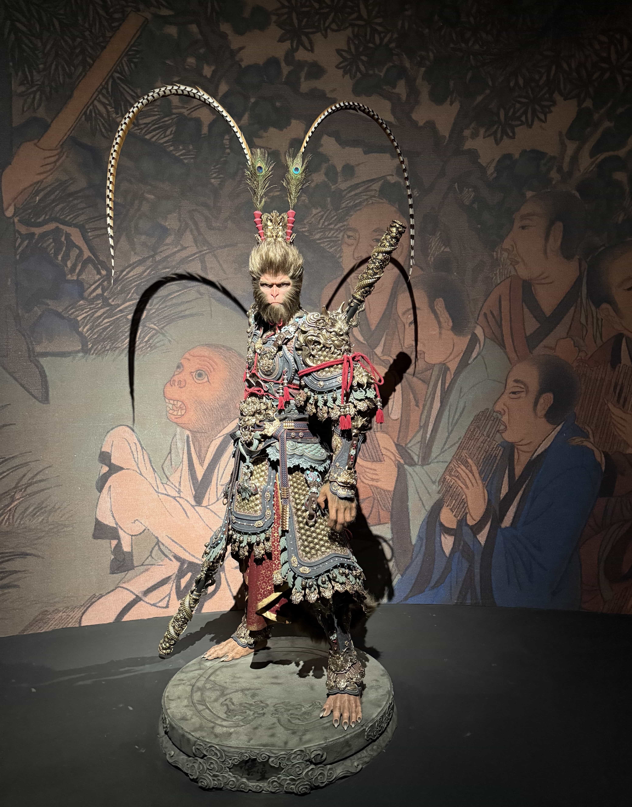

今年（准确说是去年，现在已经是 2026 年了）在娱乐上面花了不少时间，不是娱乐后的自艾，只是突然想着写下来，哈哈哈。下面就全凭记忆写了，也不知还有几分真实。

## PC 游戏
早前组了台电脑，哼哧哼哧开始了 PC 游戏之路（再之前，刚毕业的时候用笔记本玩过奥日系列，但不是主机 PC，就不算这里了，嘿嘿），今年通关的就下面几个，想到哪就写到哪了。

### 黑神话
最开始是黑神话悟空，这也是我组电脑的动力之一吧，我们这一代的孩子，从动画版的西游记到影视 86 版的电视剧，猴哥的形象深刻地烙印在我们心中，那时的我们心中谁没有一个齐天大圣的梦呢。在没有多少娱乐活动的年代，一根路边捡的笔直的棍子，都能想着和孙大圣一样舞地虎虎生风。到了如今，黑猴凭空出世，像极了他诞生自先天灵石的场景，我们得以以天命人的视角，去追寻当初大圣走过的路。

精美的画面和场景设计，饱含中式美学。每个章节的场景，初见都让人啧啧称奇，真是由衷佩服杨奇的审美和美术功底。精心设计的动作模组和法术神通，符合我对西游神话世界的想象。不光光是天命人，还有各个妖怪、boss，在战斗的过程中，能够充分感受到动作游戏的魅力。值得品味的剧情，是对原著的合理拓展。开放性的结局，给人留下丰富的想象空间。比较遗憾的是天命人自始至终都没有说过一句话。

黑神话质量绝对称得上顶级，虽然有不完美，但支持者的数量、丰富的奖项，也证明了其“村里第一个大学生”的含金量。

后来杭州办了一场黑神话悟空的艺术展，人一直特别多，等到快结束人逐渐少了，和朋友一块去看了展子，各色绘图、手办、塑像，十分精美。还领了一本设定集，装帧也很精致。

### 艾尔登法环
玩老头环就没有什么情感因素了，就是单纯的像接触一个新的游戏类型，选择了魂游，评价很高，新手友好。

场景美术设计很有特色。我也不懂这种美学风格算是什么，总之，奇幻瑰丽，初见黄金树的震撼至今难忘。丰富的兵器和流派，可玩性非常高。不过自从拿到狗刀和冰仗，我基本就没换过了，体验的不多。开放地图加上典型的碎片化叙事。说实话，除了明确的主线，我其实对人物关系和他们的背景故事了解的比较有限，而且是外国名字，中文音译之后可太难记了。

### 只狼：影逝二度
入手只狼，其实纠结了一段时间。老头环很多 boss 我都打了很久，而只狼更是出了名的难，纯粹的动作游戏。但我就是想挑战自己，迎难而上。

极简的操作门槛，只需要两个键，攻和防。但是有着极高的操作上限，可以秀各种花式无伤甚至速通。对于我这个手残党来说，目标只有打过。一些难的 boss，打了几天都打不过。一遍遍的尝试，一遍遍的重来，过程还有点痛苦。但是，随着目标越来越近，等到胜利的那一刻，就一个字，爽！

### 巫师三：狂猎
玩完魂游，又换了一个类型的游戏，是剧情向、故事向的，在同事的推荐下入坑了巫师三。

毕竟是 10 年前的游戏了，画面是不及黑猴和老头环的。战斗系统和操作手感更是一言难尽，远不及只狼。但是但是但是，我选择了剧情模式，战斗就随便打打。剧情是很不错的，代入感还行，没有遇到网上说玩不进去的情况。

另外还想提一点的是，地图的标点非常详细，可以轻松全收集，对收集党（你都标了，不全清就不礼貌了）来说非常友好。

### 空洞骑士
随着丝之歌的预热，我逐渐起了对空洞骑士的兴趣，同学也说很好玩。而且前面说过，在笔记本上我玩过奥日两部曲，空洞骑士和奥日在风格上是很相似的，不过空洞骑士的本质更接近魂游，是 2D 的。经过了只狼，我也不怕了，入坑入坑。

画面、配乐、地图设计很不错，就是初上手容易迷路，拿到指南针就好了。战斗系统也很多样，可以通过搭配不同的符文，玩不同的流派，我就一路劈到底了。除了打 boss，跳跳乐也是游戏的一大乐趣（bushi），各式各样的跳跳乐，正负反馈极强。跳跳乐之王苦痛之路，在看了网上的视频之后我清晰地认知，这不是我能挑战的，果断放弃。

等到丝之歌发售一段时间，空洞骑士我也玩完了，不过看了反馈，似乎很难，就没有继续入坑了。后面要是还有想法，再回头玩吧。

### 荒野大镖客 2
继续换个口味，趁着打折，入手了评论两级分化的神作大表哥 2，同样的剧情向游戏，同样是很多人说玩不下去，但巫师三我都玩完了，没有这个顾虑。

精美的画面、丰富的剧情、真实细致的人物刻画、完全自由的开放地图，构成了一个栩栩如生的西部世界。玩家可以很轻易地代入其中，感受角色所处世界的魅力。

大表哥 2 是写文前两天刚通关的，亚瑟死的那一天，真是意难平，好在约翰最后报了仇，可以算是个 HE。

## 动漫
我看的动漫大部分是电影形式，TV 版不多。有限的 TV 版动漫里，基本上都是国创。刷 B 站老是刷到些切片，得空时索性打开了正片，结果一发不可收拾。

从牧神记到凡人修仙传再到灵笼，题材不同，但都让人印象深刻。文戏武戏双双在线，配合气势恢宏的场面和恰到好处的 BGM，着实让人欲罢不能。

### 牧神记
牧神记目前更新的不多，背景才刚刚展开，所以可聊的不多。现在的剧情线有那么一点像庆余年，男主和范闲一样，虽然有一堆大爹，但也不会无脑爽。另外视效很在线，各种光影细节，很有玄机特色。话说秦时明月现在也不更了，不知道是不是在内部被边缘或者被放弃了。

### 凡人修仙传
这个名字初看是很抗拒的，这也太直白了，估计没啥内涵。前几集我看了几天，一度想弃坑。非常古早的建模，很让人出戏。不过这么高的评分，这么多人二刷，肯定有其独特之处。看了评论得知，最初的 20 集，已经是 5 年前的了，起步资金技术不足，做的比较粗糙，到后面就好了。

咱主打听劝，步入正轨之后看的确实很上瘾。韩立，怎么说呢，确实不是一般主角，除了重情义、知爱恨这些通项优点外，为人处世，就一个稳字当先。轻易不结因果，做任何事都要留后路，做任何事都要有足够把握，做任何事都要不虚此行。这样的特质，让他在残酷的修仙界，能够一步一步往上。作为观众，看着他一步步走到现在，真的不容易。就如插曲所唱，这一路破空，苦难有千重，谁人懂。

一口气看了一百六十多集，把五年更的量全部消化了。然后就进入了追更大军，到今年还停更了，哎。得等一到两个季度才复播，既是为了打磨剧本，优化视效，提升制作水准以满足观众期待，也可以接受的。

### 灵笼
末日题材的动漫，第一次接触，设定很新颖，非常吸引人。可惜两季加起来也才 24 集，没看过瘾就结束了。刀子发又快，后劲大受不了啊。最后面到了地面，故事才刚刚拉开帷幕。玛娜生态到底隐藏了什么秘密，人类文明究竟何去何从，一切都是未知的，期待更新吧。

好啦，凭着记忆稀稀拉拉地写了这么一堆。其实连自己都分不清，这里面究竟有几分是游戏的剧情，又有几分是自己投入其中的情感。但这都不重要了，重要的是，这些作品确实陪我走过了一段时光，带来了无数个或紧张、或震撼、或会心一笑、或意难平的瞬间。

写下这些，就像把散落的快乐收集起来，封存在这里。等未来某个时候再回看，或许会觉得幼稚，或许会感慨万千，但那都是真实的、属于此刻的我的感受。

2025年（或者说去年）的娱乐时光，大概就到这里了。不知道新的一年，又会与哪些故事相遇呢？有点期待了。

