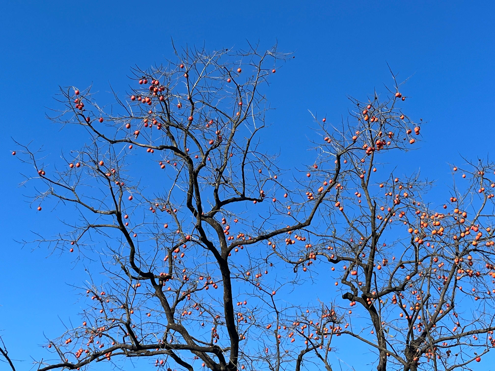

这两天央视公布了乙巳年春晚的图标和吉祥物图案，图标是一个“乙巳”的艺术体，重复组合可以形成各式图案，像是吉祥如意纹。吉祥物则是一只可爱的小蛇——巳升升，憨态可掬。

<!-- more -->

2024 甲辰年已经接近尾声，仿佛工作了，时间过的更快，好像前几天才登上反杭的车，这马上又可以回家过年了。不知怎的，想写点东西回味一下这一年的时光，但是细细想想，好像又没什么可写的，没有时间线，想到哪算哪吧。

去年来到杭州，搞了一堆做饭的家伙什，也是一直坚持下来每个工作日做饭，不然杭州的物价和外面，真的让人顶不住。

从冬天到冬天，吃过的、没吃过的各类食材，看到有兴趣就动手做做，烹饪的乐趣此间诞生，管不得色香味，好像自从做饭后，从未出现过没有食欲的情况了。中医提到“胃喜则补”，估计也是因为这样，年度体检也没啥异常指标，算是个惊喜。

大雪已过，天气渐冷，加班回家变得晚了，冬天不知道买啥菜，一个人的饭也有点不好做，几个加起来想想，先不做饭了，等到来年开春再拾掇起来。

除了做饭，偶尔还会和同事朋友出去吃吃，由头多种多样，生日、团建、时令、节气，或者说就是馋了。价格不高，换换口味。

除了吃，当然还有娱乐。

一年的大部分时间还是在工作上，即使等到周末，也只想躺在家里，不想出去，当然也不是完全不出去，天气好还是会约着同事朋友出去逛逛的。有时候会看看感兴趣的电影，有时候会去 KTV 宣泄一下，总归好过整天在家。

在家的话，娱乐无外乎短视频和游戏了，不过现在感觉对这些都提不起太多兴趣了，短视频纯属消磨时光，游戏也聚不起来人，一个人玩就像游戏里的每日任务，快速搞完，快速下线。

打工人是没有寒暑假的，刨去周末，剩下的法定节假日是打工人不可多得的放空机会，但随之而来的调休又让人痛不欲生。

小长假可以离开杭州，去其他地方走走，但去哪里都是人人人人人。旅游吗，不就是一堆人离开住惯了的地方去别人住惯了的地方。

除了上班的工作之外，每天下班和休息日还抽了点时间搞了些其他的小玩意，比如现在的博客网站，还有之前做的个人网站，全部都翻新了一遍，可能这就是程序员对重构的执着吧。

说来也怪，人总是对自己分内工作以外的事情特别感兴趣，搞这些业余小玩意能让我在真工作的时候都分心，哈哈哈哈。

也借着搞这些小玩意的时候，学会了不少和现在工作无关的知识，也不管有有没有用了，现在不可多得的愿意投时间沉浸进去的事情，就做好罢，说不定后面都不知道做啥了。

本不想提本职工作的，毕竟天天挂在嘴边，茶余饭后，总是埋怨，周边同事无一例外。但毕竟是大头，还是提一嘴，转眼工作两年半了，身边的同事朋友，有不少已经走了，坚持还是离开，选择各有理由，希望大家都能有更好的发展。

话说回来，想到过年，不由得心生惧意，各个亲戚的轮番轰炸是逃不掉的，这也是现在过年唯一有点年味的的环节了。如何面对，如何处理，真叫 i 人自闭。

一晃两轮过去了，过去的几十年，拉长一点看也很快，自小的记忆在一次次回忆中不断加深记忆，好像从历史中也总结不出啥有用的经验，未来如何，还是顺其自然吧。

---

2024/12/8 上午

