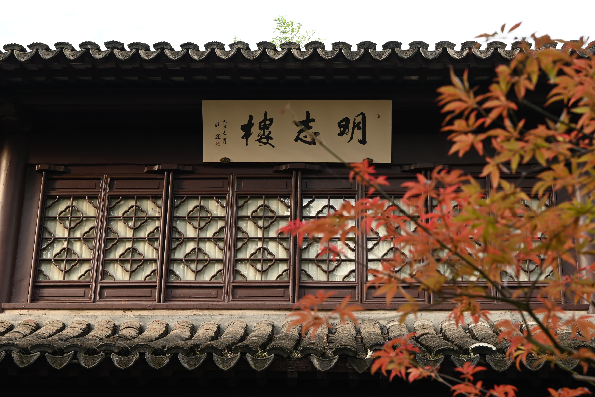
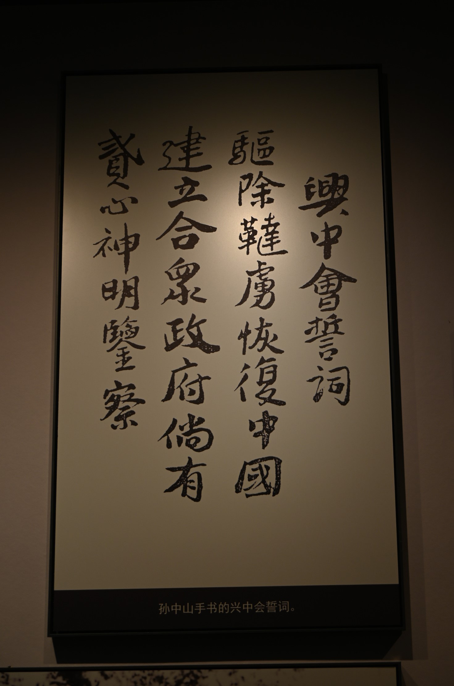

南京，离杭州不远，票也不需要抢，趁着假期去玩了两天。

到的时候已经是夜里一点，路上人不多，尘土倒是飞飞扬扬，映着路灯朦朦胧胧，心里不由得盘算，要是白天还是这样，岂不没得玩了。

一早在施工声中醒来，拉开窗帘，望着微蓝的天空，青翠的绿化带，五颜六色的共享单车上残留着稀稀拉拉的水滴。夜里雨水冲刷净了扬尘，为这次的南京之行开了个好头。

来到众寺之首的鸡鸣寺，人群已是簇拥。自山门拾级而上，不一会便走到敬香的最高处，曾经盛极一时的古刹，现如今走快步完不消一刻。“南朝四百八十寺，多少楼台烟雨中”，虽不是春天，秋日的一场雨，裹挟着阵阵风，不禁让人想起杜牧的诗。

鸡鸣寺依着鸡笼山而建，背靠玄武湖，明城墙矗立其中。走上城墙，果真见到一块块石砖上刻着某某造的文字，想来这样实名的压力下，各地官员确实不敢糊弄，也得益于此，我们才能在百年后的今天看到如此完好的古迹。

再往上走，视野开阔，极目环视偌大的玄武湖。湖水碧色，不似西湖、湘湖般宁静的蓝。湖中四洲，树木依旧葱郁，偶有飞鸟掠过。秋风过处，湖面泛起阵阵涟漪，游客们正兴致勃勃地乘着各式游船往四方散去。

走到一处可以下楼的地方，穿过城墙，来到湖岸边，循着人多的地方走去，竟发现游船是游客自己操作的，兴趣上来决定“泛舟游湖”。

想来是为了安全，游船速度不快。慢慢开到湖心，风力更胜，不实时盯着方向，风浪就带着船飘走了。盯着水面，感觉水很深，联想到深海、风暴，不由得佩服水手们的无畏勇气。

江南四大名园之一的瞻园，位于夫子庙秦淮风光带附近，重重现代建筑包围下显得遗世独立。进入园内，亭台楼阁、假山流水、草木鱼虫，大大小小的景致纷至沓来，从外面看来不大的瞻园，里面可以说是琳琅满目。除此之外，还有昆虫馆、纪念馆，为这古老园林添了些趣味和历史的厚重。

逛至闭园，走到夫子庙附近，恰好夜色降临。河道两岸青砖白墙，星星点点的光映着河水，俨然一幅江南水乡风光。天色渐暗，灯火霓虹，人头攒动。步行街两侧是各色店铺，小吃、文创、服装，让人目不暇接。再走了好一会，终于到了夫子庙，还没进门，就传来一阵庄重的音乐声，仿佛孔夫子讲学，引人侧耳。

庙中道路两侧雕像站立，居中的夫子双手交叉与胸前，目光深邃，望向远方。穿过大成殿进入学宫，两侧祈福架还有树上系满了来自五湖四海的祈福带，每一条都饱含着父母家长的殷殷期盼。如果见到如今的胜景，不知夫子又会留下怎样的经典。

第二天天气不错，日头高照，阳光洒在身上竟有些热。

钟山，又称紫金山，连着玄武湖，构成了钟山风景名胜区，面积广、古迹多、文化深、生态好，想要全部逛遍定是不可能的，只能挑几处看看。

先是去了世界文化遗产明孝陵，三号门入，沿着月牙湖，走到梅花公园，十月的梅花山，是“没花山”，看着盘虬的枝干，也可以想象冰雪时节的梅花竞相开放的美景。再往前走就到了神道石兽段，各色石兽分列两旁，沿着路走到尽头，右转便是神道翁仲段，文武官员站立两边。神道尽头，便是明孝陵，抬头望去，红色的墙体，彩色的斗拱，黄色的琉璃，恢弘大气。

因为人比较多，没有选择继续往上，转而来到颜真卿碑林。碑上风雨的痕迹，更衬着颜体的刚劲。对书法一窍不通，行书大多辨不出来，楷书读起来倒是没有压力。

参观完碑林，出了明孝陵，往中山陵走去。进入孙中山纪念馆，瞻仰风云年代革命前辈的人生。从 19 世纪到 21 世纪，中国一路走来，从弱到强，离不开每位前辈的热血奉献。

离开中山陵，顺着梧桐大道，踏上离开南京的路，夕阳下，游客们争相合影留念。一阵风过，桂花香飘满了南京城。

此次南京之行，印象深刻，可仍有遗憾，比如最想去的遇难同胞纪念馆没去成。不过遗憾才是常态，不必为遗憾惋惜，至少这些遗憾是可以弥补的。

---

2024/10/3 夜

