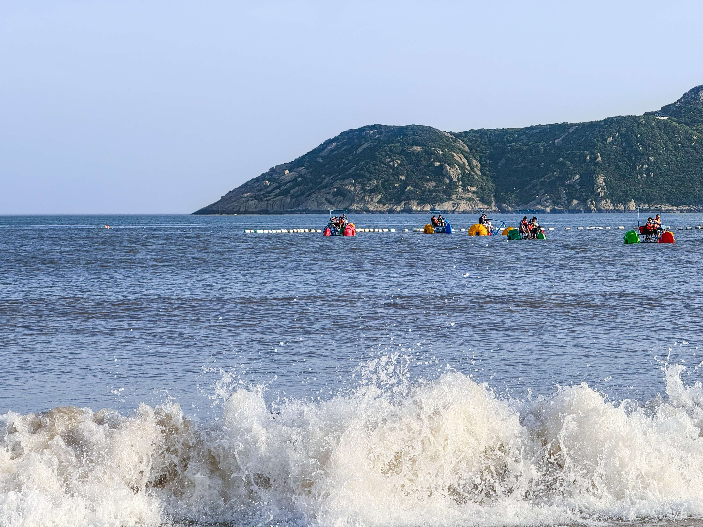

又到了五一假期，这次续上了去年没有去到舟山的计划。没有直达的高铁，大巴把三个小时的路程翻了一番，不那么顺利地到了舟山。

<!-- more -->

舟山由很多个岛屿构成，下车点是在舟山本岛，离鸭蛋山码头比较近，离东港比较远，附近没什么吃的，去 KFC 对付了一顿，吃完已经是三点钟，打车前往朱家尖，定的民宿，计划游玩的地方都在那边。

一个小时的车程，相比较来舟山的路，顺利不少，路边的建筑由疏到密，再由密到疏，经过朱家尖海峡大桥，之后不久，到了民宿所在的小渔村，离海边很近，走路二十分钟左右。

小渔村家家户户都是小楼房，对面就是很大一片你菜园子，种了不少应季蔬菜，路边一排排的餐馆，在家工作，可以想象这边居民的生活多么惬意。

天光还早，游客都在往南沙方向漫步，很多孩子提着小水桶，拿着小铲子，准备在沙滩上好好玩耍，看着他们一个个穿的拖鞋，意识到自己犯了大错，没带拖鞋，来海边沙滩不下水可不白来吗。

马上到海边，还是没有见到有卖拖鞋的，不过地上零零散散的各式各样的鞋子给出了另一个答案，直接卷起裤脚、光着脚丫踩在沙滩上。

脚底接触沙子的一瞬间，觉得票价值回了一半，这才是真正的海边嘛。零星几朵白云点缀在蔚蓝的天空上，青翠的山峦矗立在微蓝的海面上。游艇在疾驰，游客在欢呼。没有见过这场面的人，一眼望去，应该会心头一颤吧。

快步往前走，到了海浪冲刷的地方，伴着一阵阵的海风，海浪冲到脚边，这种感觉很难以名状，很舒服。不过不能站久了，哎就是“河中石兽”，每冲一阵，脚边的沙子就被带走一点，不一会儿就只剩一点点接触面了。

从东走到西，在从西走到东，落日随着脚步在山尖不断跳跃，夕阳将人影拉的很长，游客们兴致依旧不减，我也一样，不过还得去东沙看看，不然行程来不及。

从南沙到东沙不是特别远，脚程 20 分钟左右，不过我们走了远路，跑到了一个度假酒店后面，不过入口是给酒店入住用户的专有通道，散客还是得走正门。

沙滩就在眼前，五颜六色、大大小小的帐篷支在沙滩上，估计是游客是打算过夜吧，要不是已经定了民宿，高低也体验一下。

绕到正门后得知，东沙要单独的票，我们买的联票不含在内。月亮已经快到头顶，既然已经在酒店后面已经欣赏了东沙，不进去也行，路边买了个椰子，准备回渔村餐馆吃饭。

到了晚上各家全部挤满了游客，我们挑了一家最火的，来都来了，不急一时。

味道还行，没有特别惊艳，也可能是我们点的食材不够顶级，顶级的也吃不起，哈哈哈。

休息一晚，第二天一早吃完早饭往白山景区去，原本是想去东极岛的，可以不懂情况，打算买票的时候发现整个五一都已经没票了，看来缘分未到啊，大陆第一缕阳光洒在的土地，只能有机会在探访了

相比南沙、东沙，白山游客就没那么多了，可能大家不喜欢爬山吧。

走入景区，一股清凉袭满全身，环境清幽，树影斑驳，很像是很像是黑神话的取景地。

白山地图不大，按照 DFS 的方式一个不落的逛完了所有景点，结论就是非常值得一看。白山的奇石，很难不让人感慨大自然的鬼斧神工。形似八戒的“八戒望海”、只能一人通行“苗条三关”、说法台、木鱼石、清凉洞等等，只有身处其中，才能体会到那庞然大物以非比寻常的姿态立在山尖的震撼。

在出口附近处，还有一幅绘制在一整个山体上的、高进百米的观音法相，慈眉善目、远眺普陀，在观佛台远望，着实让人惊叹。

离开白山，徒步到观音法界，时间原因，只在外面远看了一下，建筑形式我不懂，看着很恢宏大气。法界旁边的围栏种满了月季，花朵簇拥着争相开放，俨然一堵花墙，特别漂亮。

午饭选的是一家东北菜，爬山一上午，再走到居民区，已经饥肠辘辘，没有特别选择。

最后一站是乌石塘，顾名思义，就是充满黑色石头的一个海滩，这个景区怎么说呢，可能是因为是港口，船比较多，海水很浑浊，观感远不如南沙，有点失望，不过躺在被晒热的石头上，吹着海风还是很舒服的，三面环海，东风一吹就会持续好一会。

离开乌石塘，回到本岛。怕回程还会堵车，我们选择了做轮渡先回宁波，然后在宁波坐高铁回杭州，可以稍微弥补一下未能出海的遗憾。40 分钟左右的行程，很快就到了宁波白峰码头。

没想到迎接我们的却是人迹罕至的工业区，没有地铁，走了很久才走出工业区找到一个公交站，公交已经是最后一班了。很幸运，打车秒接，司机刚好顺路，不然就得露宿街头了，而我们离市区还有将近五十公里。

到了市区，在宁波站附近找了一家客人很多的路边摊，或者说大排档，是真的在路边，路人来往都会瞅两眼桌子上的菜，在行人的注目下吃饭，感觉很奇妙。价格很实惠，味道也很不错，算是给这次舟山之行画上了一个圆满的句号。

