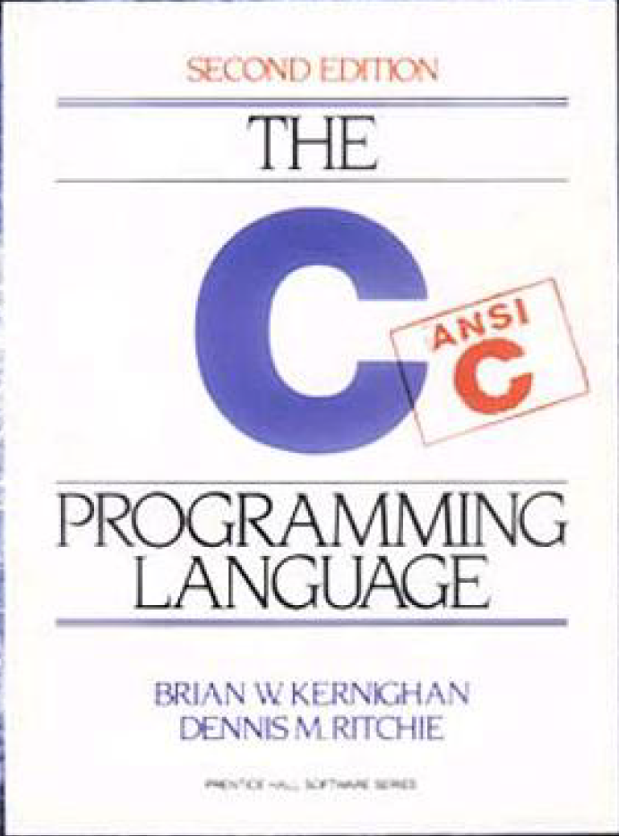

## 历史
C 语言诞生于上世纪 70 年代初，其很多重要概念来源于由 Martin Richards 开发的 BCPL 语言。BCPL 对 C 语言的影响间接地来自于 B 语言，它是 Ken Thompson 为第一个 UNIX 系统而于 1970 年在 DEC PDP-7 计算机上开发的。

很多年来，C 语言的定义就是《The C Programming Language》第 1 版中的参考手册。1983 年，美国国家标准协会（ANSI）成立了一个委员会以制定一个现代的、全面的C语言定义。最后的结果就是 1988 年完成的 ANSI 标准，即“ANSI C”。

尽管过去这么多年，C 语言依旧宝刀未老，依然受到开发者的青睐，并称为广大工程师的入门首选语言。至今最新的的编程语言排行榜上，C 语言仍处于第二的位置。

> TIOBE 编程社区
>
> [https://www.tiobe.com/tiobe-index/](https://www.tiobe.com/tiobe-index/)
>

## 标准
### ANSI C
ANSI（美国国家标准协会）对 C 做了一个标准“ANSI C”，后来被国际标准协会接收成为标准 C。于 1989 年 12 月完成，在 1990 年春发布，因此也叫“C89”标准。后面的“C99”、“C11”以及最新的“C18”，是在这一分支上不断迭代完善而来的。

### GNU C
GNU 计划在编写 Linux 的时候自己制作了一个标准，称为 GNU C 标准。GNU C 对标准 C 进行了一系列的扩展，以增强标准 C 的功能。

Linux 系统上可用的 C 编译器是 GNU C 编译器，它建立在自由软件基金会的编程许可的基础上，因此可以自由发布。总体来说，现在 Linux 环境下也支持标准 C，因此以后标准C可以跨平台，而 GUN C 标准一般只在 Linux 环境下应用。

> 该系列文章主要是介绍一下C语言基础，因此后面的介绍如果没有特殊说明，均按ANSI C标准进行。
>

## 特点
1. 简洁的语言
2. 具有结构化的控制语句
3. 丰富的数据类型
4. 丰富的运算符
5. 可对物理地址进行直接操作
6. 代码具有较好的可移植性
7. 可生成高质量、目标代码执行效率高的程序

C 语言是一门面向过程的计算机编程语言，与 C++、C#、Java 等面向对象编程语言有所不同。C 语言的设计目标是提供一种能以简易的方式编译、处理低级存储器、仅产生少量的机器码以及不需要任何运行环境支持便能运行的编程语言。C 语言描述问题比汇编语言迅速、工作量小、可读性好、易于调试、修改和移植，而代码质量与汇编语言相当。

## 开发和运行环境
简单来说开发和运行环境只需要编译器即可，编码工具根据个人喜好，甚至可以用记事本。写完代码，使用编译命令即可编译运行程序。当然在实际开发中，肯定要使用集成开发环境，而不是单独地使用编译器。

### 编译器
#### GCC
GCC 是一个用于 Linux 系统下编程开发的自由编译器，GCC 最开始只是 C 语言的编译器，是 GNU C Compiler 的英文缩写。如今它已经包含众多语言的编译器，如 C、C++、Ada、Java等，所以 GCC 也由原来的 GNU C Compiler 变为  GNU Compiler Collection。

#### MSVC
微软 Windows 平台 Visual Studio 自带的 C/C++ 编译器，不开源。

### 集成开发环境
当然现在有很多一站式的集成开发环境（IDE），例如 Visual Studio、Dev C++、Xcode、Code::Blocks 等。它们提供了：

1. 编辑器：用来编写代码，并且给代码着色，以方便阅读；
2. 代码提示器：输入部分代码，即可提示全部代码，加速代码的编写过程，提高工作效率；
3. 调试器：观察程序的每一个运行步骤，发现程序的逻辑错误；
4. 项目管理工具：对程序涉及到的所有资源进行管理，包括源文件、图片、视频、第三方库等；
5. 漂亮的界面：各种按钮、面板、菜单、窗口等控件整齐排布，操作更方便。

> 这里就不得不提到 VS Code 了，但它并不是一个 IDE，它是一个轻量、扩展性极好的“记事本”，可以通过一系列的插件，把它打造成一个高度定制化的开发环境，不仅限于 C。
>

## 安装
如上所说，环境使用依据个人的喜好，这里先省略。

> 微软官方 Visual Studio 安装教程
>
> [https://learn.microsoft.com/zh-cn/visualstudio/install/install-visual-studio?view=vs-2022](https://learn.microsoft.com/zh-cn/visualstudio/install/install-visual-studio?view=vs-2022)
>

