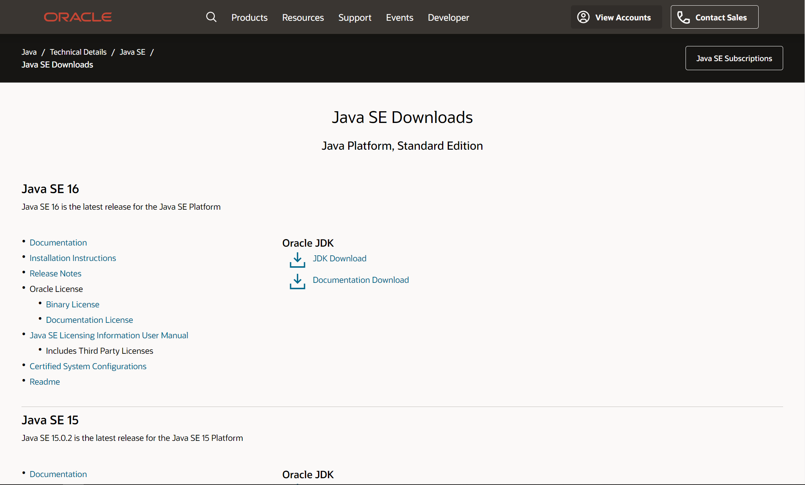
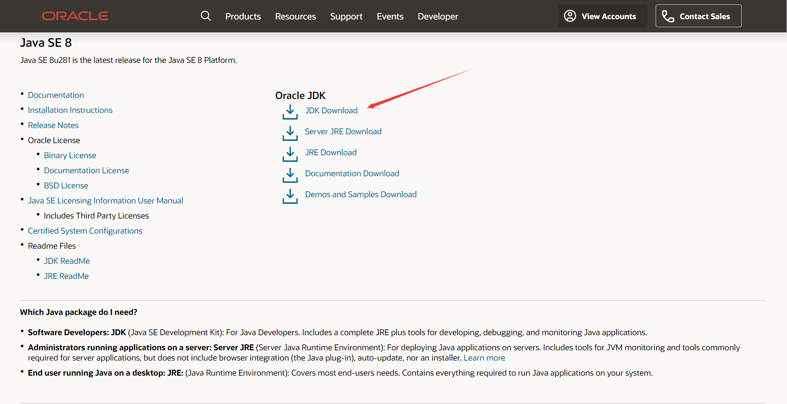
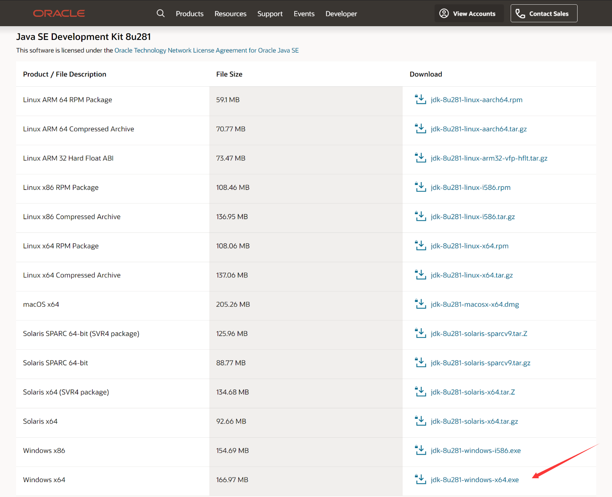
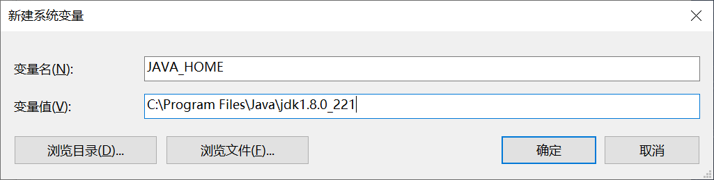
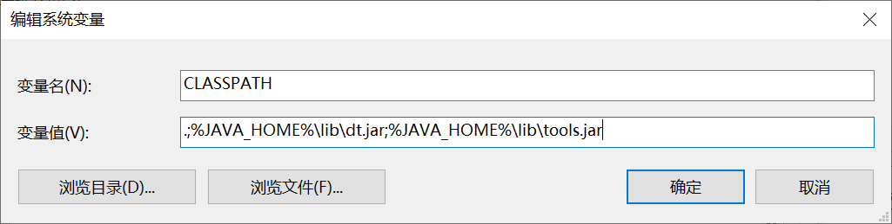
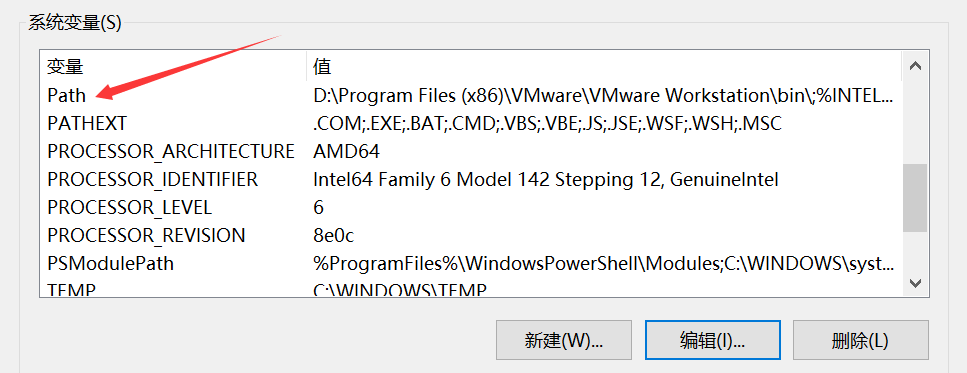
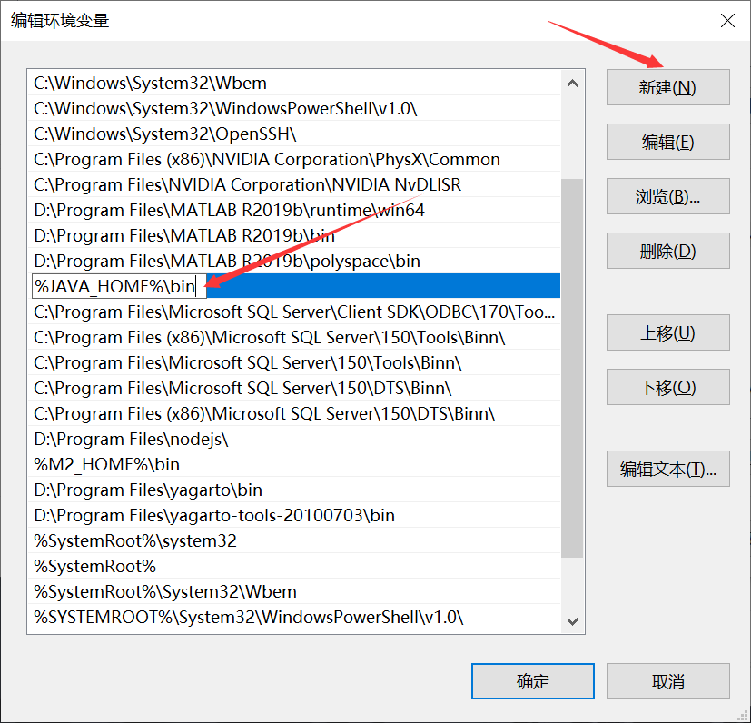
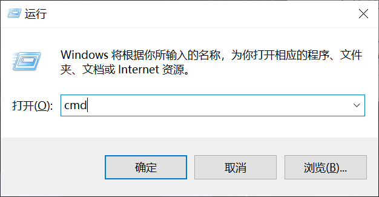

## 历史
Java 是由 Sun Microsystems 公司于 1995 年 5 月推出的 Java 面向对象程序设计语言和 Java 平台的总称。由 James Gosling 和同事们共同研发，并在 1995 年正式推出。

后来 Sun 公司被 Oracle （甲骨文）公司收购，Java 也随之成为 Oracle 公司的产品。

Java分为以下三个体系：

+ JavaSE（J2SE）（Java2 Platform Standard Edition，java平台标准版）
+ JavaEE（J2EE）（Java 2 Platform,Enterprise Edition，java平台企业版）
+ JavaME（J2ME）（Java 2 Platform Micro Edition，java平台微型版）

## 特点
> “Java编程语言是个简单、面向对象、分布式、解释性、健壮、安全与系统无关、可移植、高性能、多线程和动态的语言”
>

Java 不同于一般的编译语言或解释型语言。它首先将源代码编译成字节码，再依赖各种不同平台上的虚拟机来解释执行字节码，从而具有 “一次编写，到处运行” 的跨平台特性。

## 开发和运行环境
### JDK
> The JDK is a development environment for building applications, applets, and components using the Java programming language.
>
> The JDK includes tools useful for developing and testing programs written in the Java programming language and running on the Java platform.
>

JDK 是 Java 语言的软件开发工具包，主要用于移动设备、嵌入式设备上的 Java 应用程序。JDK 是整个 Java 开发的核心，它包含了 Java 的运行环境（JRE）和 Java 工具。

### JRE
> Do you want to run Java™ programs, or do you want to develop Java programs? If you want to run Java programs, but not develop them, download the Java Runtime Environment, or JRE™.
>
> If you want to develop applications for Java, download the Java Development Kit, or JDK™. The JDK includes the JRE, so you do not have to download both separately.
>

Java 运行环境（Java Runtime Environment，简称 JRE ）是一个软件，JRE 可以让计算机系统运行 Java 应用程序（Java Application）。JRE 的内部有一个 Java 虚拟机（Java Virtual Machine，JVM）以及一些标准的类别函数库（Class Library）。

### 开发工具
Eclipse、Intellij IDEA 等。

## 安装
以下配置均基于 Windows 操作系统（Win 10 64位）。

开发和运行环境的搭建主要分3步，第一步安装 JDK ，第二步配置环境变量，第三步安装集成开发环境。

### JDK安装
1. 进入 [Oracle官网](https://www.oracle.com/java/technologies/javase-downloads.html) ，向下滑可以看到以他版本。

2. 选择 JDK 的版本点击下载，这里选择的是 JDK 8（经典）。

3. 进入后可以看到有很多版本可供选择，在列表最后选择 Windows 64位版本。

4. 点击下载会要求注册账号，按要求注册账号后就可以下载了。
5. 下载后双击安装，安装过程很简单，注意安装路径即可，不同于一般的软件安装，这个建议安装在C盘。

### 环境变量配置
1. 桌面右键“此电脑”，选择“属性”，点击“高级系统设置”，在“高级”栏里，点击“环境变量”。

2. 在系统变量栏点击“新建”，新建如下系统变量，变量名为 JAVA_HOME ，变量值为 JDK 安装时选择的路径（以个人实际安装情况为准）。

3. 再次点击“新建”，新建如下系统变量，变量名为 CLASSPATH ，变量值为 .;%JAVA_HOME%\lib\dt.jar;%JAVA_HOME%\lib\tools.jar ，注意最前面有一个英文的小圆点。

4. 在系统变量里找到一个叫 Path 的变量，点击“编辑”。

5. 点击“新建”后，输入 %JAVA_HOME%\bin ，点击“确定”保存即可。

6. 按 Win + R 键，输入 cmd ，点击“确定”。

7. 在控制台输入 java -version ，可以看到如下信息（版本不同可能会略有差异），证明 Java 的开发和运行环境已经搭建完成啦。

### 集成开发环境安装
开发软件的的使用依据个人的喜好，这里先省略。

