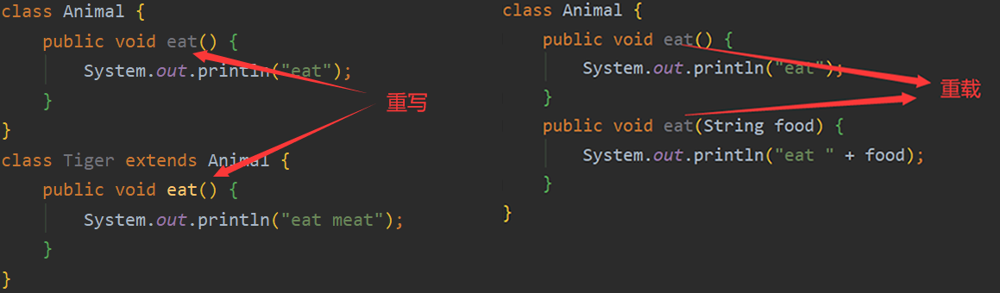

## 概述
### 面向对象的思想
面向对象编程（Object Oriented Programming，OOP，面向对象程序设计）的主要思想是把构成问题的各个事务分解成各个对象，建立对象的目的不是为了完成一个步骤，而是为了描叙一个事物在整个解决问题的步骤中的行为。

面向对象的思维更符合人认识和思考问题的方式，面向对象的概念和应用已经超越了软件开发和程序设计，扩展到多个的领域，其中一个应用的分支就是面向对象的知识表示法。这种表示法把组成客观世界的实体抽象为数据和对数据的操作，并使用类把数据和对数据的操作封装成为一个不可分割、互相依存的整体。

### 与面向过程的区别
面向过程就是分析出解决问题所需要的步骤，然后用函数把这些步骤一步一步实现，使用的时候一个一个依次调用就可以了；面向对象是把构成问题事务分解成各个对象，建立对象的目的不是为了完成一个步骤，而是为了描叙某个事物在整个解决问题的步骤中的行为。

知乎上力扣官方的这一个[什么是面向对象编程思想？](https://www.zhihu.com/question/31021366/answer/761614647)的回答个人认为讲的很通俗易懂，通过一个具体的应用场景，展现面向对象和面向过程的区别。

[这篇文章](https://blog.csdn.net/jerry11112/article/details/79027834)很清楚地描述了面向对象与面向过程的区别以及各自的特点，其中有许多生动形象的例子，下面对其中一个例子以及原文章中针对该例子的一个很不错的评论进行简单转述。

#### 问题表述
如何实现一个五子棋游戏？

#### 面向过程的处理方法
面向过程的设计思路就是首先分析问题的步骤：

1.  开始游戏； 
2.  黑子先走； 
3.  绘制画面； 
4.  判断输赢； 
5.  轮到白子； 
6.  绘制画面； 
7.  判断输赢； 
8.  返回步骤2； 
9.  输出最后结果。 

整个游戏的过程是按部就班，一点点实现的，每个过程之间有很强的依赖关系。

#### 面向对象的处理方法
面向对象的设计思想是将问题抽象成一个个对象：

1.  棋手（黑白双方的行为是一样的）； 
2.  棋盘（负责布局画面绘制）； 
3.  规则（负责判定诸如犯规、输赢）。 

第一类对象（棋手对象）负责接受用户输入，并告知第二类对象（棋盘对象）棋子布局的变化，棋盘对象接收到了棋子的变化就要负责在屏幕上面显示出这种变化，同时利用第三类对象（规则系统）来对棋局进行判定，游戏过程中每一类对象之间相互独立。

#### 面向对象的优点
如果这时候最初问题的需求发生了变化，例如加入悔棋功能。

对于面向过程而言，每次棋手落子前都需要判断对方是否选择悔棋，如果对方选择悔棋该棋手是否同意，如果同意就需要回到上一步棋的状态，如果不同意则按照原过程继续下去。可见面向过程需要改动从棋手落子到规则判断的整个过程，甚至每一步之间的执行顺序都要重新考量。

对于面向对象而言，只需要让棋盘对象保存棋盘布局，当有棋手选择悔棋且被同意时，棋盘对象进行回溯即可，游戏的过程不会改变，改变的只是棋盘对象的状态。

如果这时候最初的问题都发生了变化，例如要实现一个围棋游戏呢（不考虑棋盘大小的变化，假设只有规则发生了变化）？当然这个例子比较极端，不是很恰当，但也可以用来说明问题。如果是面向过程设计的程序，那么整个程序中涉及五子棋规则的地方都要修改。如果是面向对象设计的程序，只需要修改规则对象就可以了。

不难看出，面向对象具有易维护、易复用、易扩展的优点，基于此可以设计出低耦合的、灵活的系统。

## 面向对象三大特性
在面向对象技术中，客观世界里的某一个事物可以被看作是一个对象。例如，有一个人叫张三，他就是一个对象，他有自己的属性和行为。他的属性有姓名、性别、年龄等，行为有学习、跑步、开车等。从面向对象程序设计的角度来看，属性的展现可以通过变量表示，行为的演绎可以通过方法描述。

客观世界中的属性和行为可以传递，当一个事物得到了另一个事物传递给他的属性和行为，我们就称之为继承。例如，张三生了个儿子，儿子继承了父亲的某些属性和行为，如姓名叫张三三，也是男生，今年20岁，也会学习、跑步和开车。但是继承不等同于复制，实现继承的事物可以拥有自己独特的属性和行为，例如张三三是学生，他还会编程。通过继承，会使得程序修改和扩充变得简单方便。

面向对象程序设计中，将客观事物进行抽象，例如还有很多像张三一样的人，它们都可以看作一类人，将具有某一类属性和行为的事物称为类。

### 类的封装
#### 封装的基本概念
在面向对象程式设计方法中，封装（Encapsulation）是指一种将抽象性函数式接口的实现细节部分包装、隐藏起来的方法。类是封装的基本单元，类把属性和方法封装起来，使外界对类的认识和使用不用考虑类中的具体细节。

封装可以被认为是一个保护屏障，防止该类的代码和数据被外部类定义的代码随机访问。但封装不是意味着不允许对类的成员进行访问，而是创建外部可以访问的方法，同通过这些方法来访问类的成员，这样的方法称为公共接口。

封装最主要的功能在于我们能修改自己的实现代码，而不用修改那些调用我们代码的程序片段。适当的封装可以让程序更容易理解与维护，也加强了程序的安全性。

#### 访问权限设置
##### 访问权限
Java 中有四种访问权限：共有的（public）、保护的（protected）、默认、私有的（private）。各种权限的访问级别如下：

| 修饰符 | 当前类 | 同一包中的类 | 子类(同一包) | 子类(不同包) | 其他包中的类 |
| --- | --- | --- | --- | --- | --- |
| public | Y | Y | Y | Y | Y |
| protected | Y | Y | Y | Y/N | N |
| default | Y | Y | Y | N | N |
| private | Y | N | N | N | N |


##### 类的访问权限设置
类的权限设置有两种：默认和 public 。

如果在一个源程序文件中声明了多个类，只能有一个类的权限关键字为 public ，这个类的名字应该和程序文件同名且 main 方法也在这个类中。

##### 类的成员的访问权限设置
用权限关键字设置类的成员的权限，决定了是否允许类外部代码访问这些成员。具体规则见上表。

### 类的继承
#### 继承的基本概念
继承是面向对象程序设计的重要方法，被继承的类成为基类、父类或超类（下面都叫父类），从父类派生出的类被称作子类。

在 Java 中，只支持单重继承，不支持多重继承，也就是说一个类只能有一个父类。

#### 子类的创建
##### 声明
```java
[<修饰符>] class <子类名> extends <父类名> {
	// 子类体
}
```

##### 子类继承父类的成员变量
1. 继承原则：子类只继承父类中非 private 的成员变量。
2. 隐藏原则（Hiding）：子类成员变量和父类的成员变量同名时，父类的成员变量被隐藏。

##### 子类继承父类的成员方法
1. 继承原则：子类继承父类中非 private 的成员方法。
2. 覆盖原则（Override）：子类成员方法和父类的成员方法同名时，父类的成员方法被覆盖。

##### 子类的构造方法
父类的构造方法不会被子类继承。在调用子类的构造方法时，要先调用父类的构造方法，并将此调用语句写在子类构造方法的第一行。如果父类中有默认的构造方法（JVM自动提供的），则在子类的构造方法中可以不显式地调用父类的构造方法。

例子：

```java
public class Main {
    // 主方法
    public static void main(String[] args) {
        ZhangSan zhangSan = new ZhangSan("张三", "男", 46);
        ZhangSanSan zhangSanSan = new ZhangSanSan("张三三", "男", 20, "CS");

        zhangSan.learn();	// 调用父类方法
        zhangSanSan.learn();// 调用子类方法
    }
}

class ZhangSan {
    // 父类成员变量
    protected String name;
    protected String gender;
    protected int age;
	// 父类构造方法
    public ZhangSan(String name, String gender, int age) {
        this.name = name;
        this.gender = gender;
        this.age = age;
    }
	// 父类的 learn 方法
    public void learn() {
        System.out.println("ZhangSan likes learning.");
    }
}

class ZhangSanSan extends ZhangSan{
    // 子类特有成员变量
    String major;
    // 子类构造方法
    public ZhangSanSan(String name, String gender, int age, String major) {
        super(name, gender, age);	// 调用父类构造方法
        this.major = major;
    }
	// 重写父类 learn 方法
    @Override
    public void learn() {
        System.out.println("ZhangSanSan also likes learning.");
    }
}
```

程序输出结果：

```plain
ZhangSan likes learning.
ZhangSanSan also likes learning.
```

#### null、this、super
##### null
null 表示空对象，即没有创建任何实例。

在前面的文章中总结过，在程序中定义的基本数据类型变量如果没有赋初值，那么它们都有自己默认的初始值，如 int 型的初始值为0。而当我们声明一个对象，没有使用 new 实例化该对象时，这个对象有一个初始值 null 。

##### this
当在类的方法定义中需要引用正在使用该方法的对象时，可以用 this 表示。

1. 用 this 指代对象本身。
2. 访问本类的成员

```java
this.<变量名>
this.<方法名>
```

3. 调用本类的构造方法

```java
this[<参数列表>]
```

##### super
super 表示对某个类的父类的引用，可以用 super 来引用被子类屏蔽的父类成员。

1. 子类和父类同名的成员变量和成员方法

```java
super.<成员变量名>
super.<成员方法名>
```

2. 调用父类的构造方法

```java
super[<参数列表>]
```

#### Override/Overload
##### 重写/覆盖（Override）
如果子类和父类有同名的方法（参数也相同），子类的方法将覆盖父类的方法。重写是子类对父类的允许访问的方法的实现过程进行重新编写，返回值和形参都不能改变。

重写方法访问权限不能比父类中被重写的方法的访问权限更低。

重写方法不能抛出新的检查异常或者比被重写方法申明更加宽泛的异常。

##### 重载（Overload）
重载是在一个类里面，方法名字相同，而参数不同，返回类型可以相同也可以不同。最常用的地方就是构造器的重载。

每个重载的方法（或者构造方法）都必须有一个独一无二的参数类型列表。无法以返回值类型作为重载方法的区分标准。

##### 区别
方法重载是一个类中定义了多个方法名相同，而他们的参数的数量不同或数量相同而类型和次序不同。

方法重写是在子类存在方法与父类的方法的名字相同，而且参数的个数与类型一样，返回值也一样的方法。



#### 最终类和抽象类
##### 最终类和最终方法
1. 不能被继承的类称为最终类，在声明最终类时用 final 修饰符修饰。
2. 将非最终类中的成员方法用 final 修饰，这样的方法成为最终方法，最终方法不能被子类重写。

##### 抽象类和抽象方法
在面向对象的概念中，所有的对象都是通过类来描绘的，但是反过来，并不是所有的类都是用来描绘对象的，如果一个类中没有包含足够的信息来描绘一个具体的对象，这样的类就是抽象类。

1. 抽象方法必须被子类重写或者子类声明自身为抽象类，声明抽象方法时，用 abstract 修饰，并且不设方法体。
2. 含有抽象方法的类称为抽象类（抽象类不一定含有抽象方法），用 abstract 修饰，并且抽象类不能被实例化。
3. 对于成员方法，不能同时用 static 和 abstract 修饰；对于类，不能同时用 final 和 abstract 修饰。

### 类的多态性
#### 多态的基本概念
多态性是指同一个名字的若干个方法，也就是同一个行为（由不同的实例执行）具有多个不同表现形式或形态的能力。

多态分为编译时多态和运行时多态。重载可以理解成多态的具体表现形式（编译时多态），重写是父类与子类之间多态性的一种表现（运行时多态，程序中定义的对象引用所指向的具体类型在运行期间才确定）。

#### 运行时多态的三个必要条件
+ 继承
+ 重写
+ 父类引用指向子类对象

当使用多态方式调用方法时，首先检查父类中是否有该方法，如果没有，则编译错误；如果有，再去调用子类的同名方法。

例子：

```java
class Animal {
    public void eat() {
        System.out.println("eat");
    }
}
class Tiger extends Animal {
    public void eat() {
        System.out.println("eat meat");
    }
}
public class Main {
    public static void main(String[] args) {
        // 父类引用指向子类对象
        Animal animal = new Tiger();
        animal.eat();
    }
}
```

程序输出结果：

```plain
eat meat
```

## 接口
接口（Interface），在 JAVA 编程语言中是一个抽象类型，是抽象方法的集合，接口通常以 interface 来声明。一个类通过继承接口的方式，从而来继承接口的抽象方法。

### 接口的声明
```java
[修饰符] interface <接口名>{
	// 接口体
}
```

接口只由常量和抽象方法组成，不含变量和方法的实现，没有构造方法不能实例化。

### 接口的实现
一个接口可以被一个或多个类实现，当一个类要实现一个接口，就必须实现接口的所有方法，这些方法都要被说明为 public 。

在 Java 中不支持多重继承，但实际中往往会需要多重继承，一个类实现多个接口就可以间接的实现多重继承。

```java
class <类名> implements 接口名1, 接口名2, ...
```

如果一个类继承某个父类，同时还实现某些接口，extends 关键字要在 implements 关键字前。

当类实现接口的时候，类要实现接口中所有的方法。否则，类必须声明为抽象的类。

一个接口可以继承另一个接口，和类之间的继承方式比较相似。接口的继承使用 extends 关键字，子接口继承父接口的方法。

### 接口的特点
+  接口是隐式抽象的，当声明一个接口的时候，不必使用abstract关键字。 
+  接口中每一个方法也是隐式抽象的，接口中的方法会被隐式的指定为 public abstract（只能是 public abstract，其他修饰符都会报错）。 
+  接口中可以含有变量，但是接口中的变量会被隐式的指定为 public static final 变量（并且只能是 public，用 private 修饰会报编译错误）。 
+  接口中的方法是不能在接口中实现的，只能由实现接口的类来实现接口中的方法。 

## 枚举
Java 枚举是一个特殊的类，一般表示一组常量。Java 枚举类使用 enum 关键字来定义，各个常量使用逗号来分割。

枚举跟普通类一样可以用自己的变量、方法和构造方法，构造方法只能使用 private 访问修饰符，所以外部无法调用。

枚举既可以包含具体方法，也可以包含抽象方法。 如果枚举类具有抽象方法，则枚举类的每个实例都必须实现它。

例子：

```java
enum Color {
    RED, GREEN, YELLOW;
}

public class Main {
    public static void main(String[] args) {
        // 调用 values()，返回枚举类中所有的值
        Color[] arr = Color.values();
        // 迭代枚举
        for (Color col : arr) {
            // 查看索引，ordinal()方法可以找到每个枚举常量的索引，就像数组索引一样
            System.out.println(col + " at index " + col.ordinal());
        }
        // 使用 valueOf() 返回指定字符串值的枚举常量，不存在的会报错 IllegalArgumentException
        System.out.println(Color.valueOf("RED"));
    }
}
```

程序输出结果：

```plain
RED at index 0
GREEN at index 1
YELLOW at index 2
RED
```

## 包
包（package）是类的逻辑组织形式。在程序中可以声明类所在的包，同一包中的类的名字不能重复。通过包可以对类的访问权限进行控制。包中可以有包。

### Java 常用的包
+ java.lang： 这个包下包含了Java语言的核心类，如String、Math、Sytem和Thread类等，使用这个包无需使用import语句导入，系统会自动导入这个包中的所有类。
+ java.util：这个包下包含java的大量工具类/接口和集合框架类/接口。如Arrays和List、Set等。
+ java.awt：这个包下包含了抽象窗口工具集(Abstract Window Toolkits) 的相关类/接口，这些类主要用于构建图形用户界面(GUI)程序。
+ java.swing：这个包下包含了Swing图形用户界面编程的相关类/接口，这些可用于构建平台无关的GUI程序。
+ java.text：这个包下包含一些Java格式化相关的类。
+ java.io：这个包含了一些Java输入/输出编程相关的类/接口。
+ java.net：这个包下包含了一些Java网络编程相关的类/接口。
+ java.sql：这个包下包含了java进行JDBC数据库编程的相关类/接口。

### import
如果要使用 Java 类中的包，要在源程序中使用 import 语句导入。

```java
import <包名>[.<包名2>][.<包名3>...].<类名>;
import <包名>[.<包名2>][.<包名3>...].*;
```

在 java 源文件中 import 语句应位于 package 语句之后，所有类的定义之前，可以没有，也可以有多条。如果有多个包或类，用 “.” 分割，“*”表示包中的所有类。

