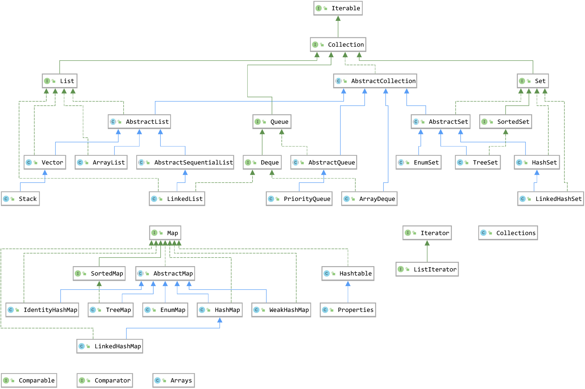
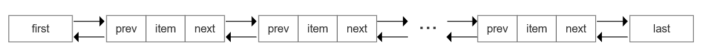
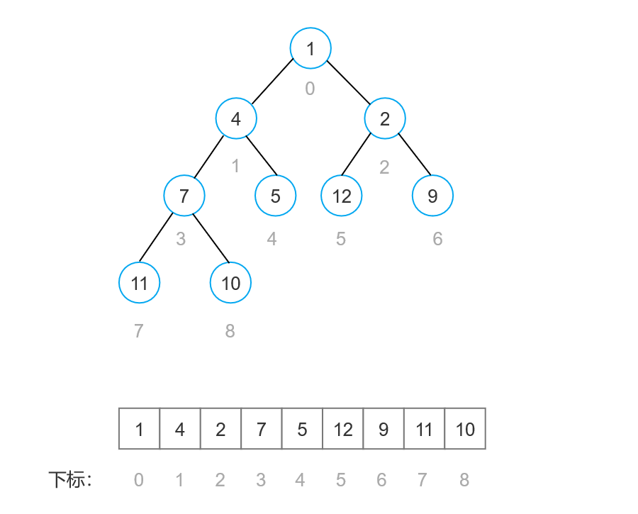
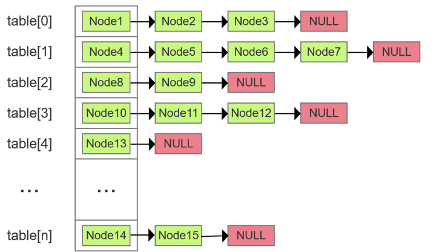

## 概念
一种用来存储数据的数据结构。在 Java 当中，如果有一个类专门用来存放其它类的对象，这个类就叫做容器，或者就叫做集合（不准确，因为集合也是容器的一种），就是将若干性质相同或相近的类对象组合在一起而形成的一个整体。

为什么需要容器呢，总的来说，主要是在以数组作为数据的存储结构中，其长度难以扩充，同时数组中元素类型必须相同，而容器可以弥补数组的这两个缺陷。

## 框架结构


从上面的集合框架图（jdk 1.8）可以看到，Java 集合框架主要包括两种类型的容器，一种是集合（Collection），存储一个元素集合，另一种是图（Map），存储键/值对映射。Collection 接口又有 3 种子类型，List、Set 和 Queue，再下面是一些抽象类，最后是具体实现类，常用的有 ArrayList、LinkedList、HashSet、LinkedHashSet、HashMap、LinkedHashMap 等等。

集合框架是一个用来代表和操纵集合的统一架构。所有的集合框架都包含如下内容：

+ 接口：是代表集合的抽象数据类型。例如 Collection、List、Set、Map 等。之所以定义多个接口，是为了以不同的方式操作集合对象
+ 实现（类）：是集合接口的具体实现。从本质上讲，它们是可重复使用的数据结构，例如：ArrayList、LinkedList、HashSet、HashMap。
+ 算法：是实现集合接口的对象里的方法执行的一些有用的计算，例如：搜索和排序。这些算法被称为多态，那是因为相同的方法可以在相似的接口上有着不同的实现。

## 分层详解
按照继承实现关系的层级，参考 Java8 API 逐个介绍框架图里的每个接口和类，重点介绍常用的容器的实现类。

### Iterable 接口
> Implementing this interface allows an object to be the target of the "for-each  loop" statement.
>
> —— Java8 API
>

Iterable 接口是最顶层的接口（JDK 1.5 后引入，使用 foreach 语句必须使用 Iterable ），被 Collection 接口继承。Iterable 接口里定义了 Iterator 方法，调用这个方法就可以返回一个迭代器。

### Iterator 接口
> An iterator over a collection. `Iterator` takes the  place of `Enumeration` in the Java  Collections Framework. Iterators differ from enumerations in two ways:
>
> + Iterators allow the caller to remove elements from the underlying collection  during the iteration with well-defined semantics.
> + Method names have been improved.
>
> —— Java8 API
>


一个集合的迭代器，定义了迭代逻辑的对象。Java 设计者让 Collection 继承于 Iterable 接口而不是 Iterator 接口，可以让迭代逻辑和数据结构（集合）分离开来，这样的好处是可以在一种数据结构上实现多种迭代逻辑，同时多个迭代器对象相互独立。

### ListIterator 接口
> An iterator for lists that allows the programmer to traverse the list in either  direction, modify the list during iteration, and obtain the iterator's current  position in the list. A `ListIterator` has no current element; its  cursor position always lies between the element that would be returned by  a call to `previous()` and the element that would be returned by a  call to `next()`.
>
> Note that the `remove()` and  `set(Object)` methods are not defined in terms of the cursor position; they are defined  to operate on the last element returned by a call to `next()` or `previous()`.
>
> —— Java8 API
>

继承于 Iterator 接口，用于允许程序员沿任一方向遍历列表的 List 迭代器，在迭代期间修改列表元素，并获取列表中迭代器的当前位置。

### Collection 接口
> The root interface in the collection hierarchy. A collection represents a  group of objects, known as its elements. Some collections allow duplicate  elements and others do not. Some are ordered and others unordered. The JDK does  not provide any direct implementations of this interface: it provides  implementations of more specific subinterfaces like `Set` and  `List`.
>
> Some collection implementations have restrictions  on the elements that they may contain. For example, some implementations  prohibit null elements, and some have restrictions on the types of their  elements.
>
> It is up to each collection to determine its own synchronization policy.
>
> —— Java8 API
>

Collection 接口是集合层次结构中的根接口。一个集合代表一组对象，称为它的元素。JDK 没有提供该接口的任何直接实现，它提供了更具体的子接口的实现，如 Set 和 List 。

不同的 Collection 子类的实现有不同的策略：有序性、重复性、是否允许为 null 、线程是否同步。

### AbstractCollection 抽象类
> This class provides a skeletal implementation of the `Collection`  interface, to minimize the effort required to implement this interface.
>
> To implement a modifiable collection, the programmer must additionally override this class's add method (which otherwise throws an UnsupportedOperationException), and the iterator returned by the iterator method must additionally implement its remove method.
>
> —— Java8 API
>

AbstractCollection 是 Java 集合框架中 Collection 接口的一个直接实现类（抽象类），实现了大部分的集合接口。 Collection 接口的大多数子类都继承 AbstractCollection ，比如 List 的实现类, Set 的实现类。该类提供集合接口的框架实现，以减少实现此接口所需的工作。

### List 接口
> An ordered collection (also known as a sequence). The user of this  interface has precise control over where in the list each element is inserted.  The user can access elements by their integer index (position in the list), and  search for elements in the list.
>
> Unlike sets, lists typically allow duplicate elements. More formally, lists  typically allow pairs of elements `e1` and `e2` such that  `e1.equals(e2)`, and they typically allow multiple null elements if they  allow null elements at all.
>
> —— Java8 API
>

List 是有序集合（也称为序列）。使用该接口可以精确控制列表中每个元素的插入位置，可以通过整数索引（列表中的位置）访问元素，第一个元素的索引为 0，并搜索列表中的元素。与 Set 不同，List 允许重复的元素，允许空元素。

List 接口提供了一个特殊的迭代器，称为 ListIterator ，其允许元素的插入和更换，并且除了该 Iterator 接口提供正常操作的双向访问。

#### AbstractList 抽象类
> This class provides a skeletal implementation of the `List` interface to minimize the  effort required to implement this interface backed by a "random access" data  store (such as an array). For sequential access data (such as a linked list), `AbstractSequentialList` should be used in preference to this class.
>
> —— Java8 API
>

继承于 AbstractCollection 并且实现了大部分 List 接口，支持随机访问（相对于顺序访问）。

#### ArrayList 类
ArrayList 是 Java 集合框架中 List 接口 的一个实现类，可以说 ArrayList 是我们使用最多的 List 集合。

ArrayList 是基于数组实现的List类，它封装了一个动态的、增长的、允许再分配的 Object[ ] 数组，它允许对元素进行快速随机访问。

当从 ArrayList 的中间位置插入或者删除元素时，需要对数组进行复制、移动、代价比较高。因此，它适合随机查找和遍历，不适合插入和删除。

##### 声明
```java
public class ArrayList<E> extends AbstractList<E> 
    implements List<E>, RandomAccess, Cloneable, Serializable {...}
```

##### 数据结构
ArrayList 是基于数组实现的。

```java
transient Object[] elementData;
```

##### 构造方法
1. 构造一个默认初始容量为10的空数组。

```java
public ArrayList() {...}
```

2. 构造一个指定初始容量的空数组。

```java
public ArrayList(int initialCapacity) {...}
```

3. 构造一个包含指定 Collection 的元素的数组，这些元素按照该 Collection 的迭代器返回它们的顺序排列。

```java
public ArrayList(Collection<? extends E> c) {...}
```

##### 容量
1. 默认容量

```java
private static final int DEFAULT_CAPACITY = 10;
```

2. 扩容

每次扩容新的容量为旧的容量加上旧的容量右移一位，新的容量将是旧容量的1.5倍左右。这是因为当 oldCapacity 为偶数时，其右移一位的结果等于除以2，当 oldCapacity 为奇数时，其右移一位的结果约等于除以2。

```java
int newCapacity = oldCapacity + (oldCapacity >> 1);
```

扩容操作后会调用 Arrays.copyOf() 把原数组整个复制到新数组。

```java
elementData = Arrays.copyOf(elementData, newCapacity);
```

##### 非线程安全
ArrayList 不是线程安全的容器，如果多个线程同时访问一个 ArrayList 实例，并且至少有一个线程在结构上修改了这个列表，那么它必须在外部同步。结构修改是指添加或删除一个或多个元素，或显式调整后备数组的大小的任何操作，仅仅设置元素的值不算结构上的修改。

如果是在多线程的环境下，需要外部给 ArrayList 加个同步锁，或者直接在初始化时用 Collections.synchronizedList 方法进行包装：

```java
List list = Collections.synchronizedList(new ArrayList(...));
```

##### fail-fast
1.  ArrayList 具有 fail-fast 快速失败机制，能够对 ArrayList 作出失败检测。 
2.  什么是 fail-fast 机制 

> The iterators returned by this class's `iterator` and  `listIterator` methods are fail-fast: if the list is structurally modified at any  time after the iterator is created, in any way except through the iterator's own  `remove` or  `add` methods,  the iterator will throw a `ConcurrentModificationException`.  Thus, in the face of concurrent modification, the iterator fails quickly and  cleanly, rather than risking arbitrary, non-deterministic behavior at an  undetermined time in the future.
>
> Note that the fail-fast behavior of an iterator cannot be guaranteed as it  is, generally speaking, impossible to make any hard guarantees in the presence  of unsynchronized concurrent modification. Fail-fast iterators throw  `ConcurrentModificationException` on a best-effort basis. Therefore,  it would be wrong to write a program that depended on this exception for its  correctness: the fail-fast behavior of iterators should be used only to  detect bugs. 
>
> —— Java8 API
>

fail-fast 机制是java集合中的一种错误机制（ java.util 包下的集合类都有 fail-fast 机制，后面的集合不再单独说明）。当在迭代集合的过程中，集合的结构发生改变时就有可能产生 fail-fast 事件，抛出 ConcurrentModificationException 异常。

每当迭代器使用 hashNext() / next() 遍历下一个元素之前，都会执行 checkForComodification() 方法检测 modCout 和 expectedmodCount 值是否相等。modCount 用来记录 ArrayList 结构发生变化的次数，在进行序列化或者迭代等操作时，需要比较操作前后 modCount 是否改变，如果改变了需要抛出 ConcurrentModificationException 异常。

```java
final void checkForComodification() {
    if (modCount != expectedModCount)
        throw new ConcurrentModificationException();
}
```

在 API 文档里明确强调，迭代器的 fail-fast 快速失败机制仅仅是用于检测程序错误，而不是用来同步。

3. fail-safe 机制

与 fail-fast 机制相对的 另一种是 fail-safe 机制（ java.util.concurrent 包下的容器都是 fail-safe 的）。采用安全失败机制的集合容器，在迭代时并没有直接在原集合内容上访问的，而是先复制原集合的内容，再在拷贝的集合上进行遍历，所以迭代器无法知晓遍历过程中原集合发生的变化，因而不会抛出 ConcurrentModificationException 异常。

#### AbstractSequentialList 抽象类
> This class provides a skeletal implementation of the `List` interface to  minimize the effort required to implement this interface backed by a "sequential  access" data store (such as a linked list). For random access data (such as an  array), `AbstractList` should be used in preference to this class.
>
> —— Java8 API
>

AbstractSequentialList 继承自 AbstractList，是 LinkedList 的父类。AbstractSequentialList 只支持按顺序访问，而不像 AbstractList 那样支持随机访问。

#### LinkedList 类
LinkedList 继承自 AbstractSequentialList 接口，同时了还实现了 Deque 接口（后面会介绍）。

LinkedList 很适合数据的动态插入和删除，插入、删除时只需要改变前后两个节点指针指向即可，但查找效率低、遍历速度比较慢。

由于它还实现了Deque接口，专门用于操作表头和表尾元素，可以当作堆栈、队列和双向队列使用。

##### 声明
```java
public class LinkedList<E> extends AbstractSequentialList<E>
    implements List<E>, Deque<E>, Cloneable, java.io.Serializable {...}
```

##### 数据结构


LinkedList 基于双向链表实现，成员变量有头节点 first 和 尾节点 last 。

```java
transient Node<E> first;

transient Node<E> last;
```

链表节点信息包括元素 item ，下一个节点 next ，前一个节点 prev 。

```java
private static class Node<E> {
    E item;
    Node<E> next;
    Node<E> prev;

    Node(Node<E> prev, E element, Node<E> next) {
        this.item = element;
        this.next = next;
        this.prev = prev;
    }
}
```

##### 构造方法
1. 构造一个空的链表。

```java
public LinkedList() {...}
```

2. 构造一个包含指定 Collection 的元素的链表，这些元素按照该 Collection 的迭代器返回它们的顺序排列。

```java
public LinkedList(Collection<? extends E> c) {...}
```

##### 非线程安全
LinkedList 没有同步方法，如果多个线程同时访问一个 List ，则必须自己实现访问同步，在外部加锁或者在创建 List 时候构造一个同步的 List：

```java
List list=Collections.synchronizedList(newLinkedList(...));
```

#### Vector 类
Vector 和 ArrayList 一样，都是继承自 AbstractList ，它是 Stack 的父类。

Vector 类和 ArrayList 非常相似，不同之处就是该类是同步的，可以用在多线程的情况，因此开销比 ArrayList 要大，访问速度更慢，现在已经很少使用了。

##### 声明
```java
public class Vector<E> extends AbstractList<E>
    implements List<E>, RandomAccess, Cloneable, java.io.Serializable{...}
```

##### 数据结构
Vector 底层数据结构也是 数组。

```java
protected Object[] elementData;
```

##### 构造方法
1. 构造默认容量 10 的数组，同时增长量为 0 。

```java
public Vector() {...}
```

2. 构造一个用户指定容量的数组，同时增长量为 0 。

```java
public Vector(int initialCapacity) {...}
```

3. 构造指定容量大小的数组，设置增长量。

```java
public Vector(int initialCapacity, int capacityIncrement) {...}
```

4. 构造一个包含指定 Collection 的元素的数组，这些元素按照该 Collection 的迭代器返回它们的顺序排列。

```java
public Vector(Collection<? extends E> c) {...}
```

##### 容量
1. 默认容量

通过默认构造器创建 Vector 对象，容量为10。

```java
public Vector() {
    this(10);
}
```

2. 扩容

在容量不足进行扩容时，如果没有指定扩容大小或者指定的扩容大小小于0，那么新的容量等于旧的容量加上旧的容量，也就是原来容量的2倍。

```java
int newCapacity = oldCapacity + ((capacityIncrement > 0) ?
                                         capacityIncrement : oldCapacity);
```

扩容操作后会将原数组复制到新的数组里。

```java
elementData = Arrays.copyOf(elementData, newCapacity);
```

##### 线程安全
Vector 通过对内部的方法进行上锁（增加 synchronized 修饰符），可以避免多线程引起的线程安全问题，但是开销大、效率低，因此在没有线程安全要求的情况下一般推荐使用 ArrayList 。

#### Stack 类
Stack 是 Vector 提供的一个子类，除了可以用于模拟"栈"这种数据结构（ LIFO 后进先出）外，其余特性和 Vector 相同。

```java
class Stack<E> extends Vector<E> {...}
```

Stack 新增了一个构造方法，用于创建一个空的栈，加上 Vector 的四个构造方法，一共有5种方式可以创建一个栈。

```java
public Stack() {...}
```

该类提供了常用的栈的操作方法：

```java
// 入栈（没有同步）
public E push(E item) {...}
// 出栈
public synchronized E pop() {...}
// 取栈顶元素
public synchronized E peek() {...}
// 判断栈是否为空
public boolean empty() {...}
// 查找指定元素在栈中的位置
public synchronized int search(Object o) {...}
```

> A more complete and consistent set of LIFO stack operations is provided by  the `Deque` interface and its  implementations, which should be used in preference to this class.
>
> —— Java8 API
>

在 API 文档中，官方提到如果要使用先进后出这种数据结构，更推荐使用 Deque 双端队列，而不是 Stack 。

```java
   Deque<Integer> stack = new ArrayDeque<Integer>();
```

### Queue 接口
> A collection designed for holding elements prior to processing. Besides basic `Collection` operations,  queues provide additional insertion, extraction, and inspection operations. Each  of these methods exists in two forms: one throws an exception if the operation  fails, the other returns a special value (either `null` or  `false`, depending on the operation). The latter form of the insert  operation is designed specifically for use with capacity-restricted  `Queue` implementations; in most implementations, insert operations  cannot fail.
>
> `Queue` implementations generally do not allow insertion of  `null` elements, although some implementations, such as `LinkedList`, do not  prohibit insertion of `null`. Even in the implementations that permit  it, `null` should not be inserted into a `Queue`, as  `null` is also used as a special return value by the  `poll` method to indicate that the queue contains no elements.
>
> —— Java8 API
>

Queue 接口继承于 Collection ，并添加了添加、删除和查询操作，用于模拟“队列”数据结构（ FIFO 先进先出）。

添加、删除和查询操作均提供了两种方法，在失败的情况下一种抛出异常，一种返回特殊值。

|  | Throws exception | Returns special value |
| --- | --- | --- |
| Insert | `add(e)` | `offer(e)` |
| Remove | `remove()` | `poll()` |
| Examine | `element()` | `peek()` |


当队列满时，使用 add() 方法会抛异常，使用 offer() 会返回 false；当队列空时，使用 remove() 和 element() 方法会抛异常，使用 poll() 和 peek() 会返回 null 。

因此通常情况下 Queue 的实现类一般不允许添加 null 元素，否则在使用 poll() 和 peek() 方法返回了 null 时不知道是否是准确的。但是也有例外，如 LinkedList 。

#### Deque 接口
> A linear collection that supports element insertion and removal at both ends.  The name deque is short for "double ended queue" and is usually  pronounced "deck". Most `Deque` implementations place no fixed limits  on the number of elements they may contain, but this interface supports  capacity-restricted deques as well as those with no fixed size limit.
>
> This interface defines methods to access the elements at both ends of the deque.  Methods are provided to insert, remove, and examine the element. Each of these  methods exists in two forms: one throws an exception if the operation fails, the  other returns a special value (either `null` or `false`,  depending on the operation).
>
> —— Java8 API
>

Deque 是支持在线性集合两端进行元素插入和删除的队列，也就是双端队列。

Deque 继承自 Queue ，支持容量受限的双端队列，也支持容量不受限制的。这个接口定义了许多访问队列两端元素的方法，和 Queue 一样，这些方法分为两种，在失败的情况下一种抛出异常，一种返回特殊值。

|  | First Element (Head) | First Element (Head) | Last Element (Tail) | Last Element (Tail) |
| --- | --- | --- | --- | --- |
|  | Throws exception | Special value | Throws exception | Special value |
| Insert | `addFirst(e)` | `offerFirst(e)` | `addLast(e)` | `offerLast(e)` |
| Remove | `removeFirst()` | `pollFirst()` | `removeLast()` | `pollLast()` |
| Examine | `getFirst()` | `peekFirst()` | `getLast()` | `peekLast()` |


这个接口继承了 Queue 接口。当 Deque 被当作队列时，会实现 FIFO（先进先出）。元素在 Deque 容器的末尾添加，从开头删除。

| `Queue`<br/> Method | Equivalent `Deque`<br/> Method |
| --- | --- |
| `add(e)` | `addLast(e)` |
| `offer(e)` | `offerLast(e)` |
| `remove()` | `removeFirst()` |
| `poll()` | `pollFirst()` |
| `element()` | `getFirst()` |
| `peek()` | `peekFirst()` |


Deque 也可以用作后进先出的栈。如果使用栈的话应该优先使用这个接口，而不是遗留的 Stack 类。当使用 Deque 容器作为栈时，元素从 Deque 容器的开始处被推入和弹出。

| Stack Method | Equivalent `Deque`<br/> Method |
| --- | --- |
| `push(e)` | `addFirst(e)` |
| `pop()` | `removeFirst()` |
| `peek()` | `peekFirst()` |


#### AbstractQueue 抽象类
> This class provides skeletal implementations of some `Queue`operations. The  implementations in this class are appropriate when the base implementation does  not allow `null` elements. Methods `add`, `remove`, and `element` are based on `offer`, `poll`, and `peek`, respectively,  but throw exceptions instead of indicating failure via `false` or  `null` returns.
>
> A `Queue` implementation that extends this class must minimally define  a method `Queue.offer(E)` which does not permit insertion of `null` elements, along with methods `Queue.peek()`, `Queue.poll()`, `Collection.size()`,  and `Collection.iterator()`.  Typically, additional methods will be overridden as well. If these requirements  cannot be met, consider instead subclassing `AbstractCollection`.
>
> —— Java8 API
>

AbstractQueue 类实现了一些 Queue 接口的方法，实现该类方法的的容器不能包含 null 元素。

#### PriorityQueue 类
PriorityQueue 类继承自 AbstractQueue接口，它没有按照元素插入的顺序来存放元素，而是按照队列中某个属性的大小来排列的，故而叫优先队列。

优先队列不允许 null 元素。依赖自然排序的优先队列也不允许插入非可比对象（这样做可能会导致ClassCastException）。

该实现的入队和出队方法（offer，poll，remove()和add）的时间复杂度为  O(log(n))； remove(Object) 和 contains(Object) 方法的时间复杂度为  O(n)；以及检索方法（peek、元素和大小）的时间复杂度为  O(1)。

##### 声明
```java
public class PriorityQueue<E> extends AbstractQueue<E>
    implements java.io.Serializable {...}
```

##### 数据结构
优先队列的逻辑结构是基于平衡二叉堆实现的，底层数据用数组存储。



queue[n] 的两个孩子分别是 queue[2*n+1] 和 queue[2*(n+1)] 。如果 Comparator 为 null ，则优先队列按照比较器或元素的自然顺序排序，对于堆中的每个节点 n 和 n 的每个后代 d ，n <= d，最小值的元素为 queue[0] （假设该队列非空）。

PriorityQueue 默认实现的是小顶堆，可以通过自定义 Comparator 函数来实现大顶堆。

```java
transient Object[] queue;
```

##### 构造方法
1. 构造一个具有默认容量大小（11）的优先队列，元素以自然顺序存放。

```java
public PriorityQueue() {...}
```

2. 构造一个具有指定容量大小的优先队列，元素以自然顺序存放。

```java
public PriorityQueue(int initialCapacity) {...}
```

3. 构造一个具有默认容量（11）的优先队列，元素以指定比较器存放。

```java
public PriorityQueue(Comparator<? super E> comparator) {...}
```

4. 构造一个具有指定容量的优先队列，元素以指定比较器存放。

```java
public PriorityQueue(int initialCapacity,
                     Comparator<? super E> comparator) {...}
```

5. 构造一个包含指定集合元素的优先队列，如果这个集合原本是 SortedSet 或者 PriorityQueue ，那么构造的优先队列的元素就会按照原本的顺序存放，否则就以自然顺序存放。

```java
@SuppressWarnings("unchecked")
public PriorityQueue(Collection<? extends E> c) {...}
```

6. 构造一个包含指定 PriorityQueue 元素的优先队列，元素就会按照原本的顺序存放。

```java
@SuppressWarnings("unchecked")
public PriorityQueue(PriorityQueue<? extends E> c) {...}
```

7. 构造一个包含指定 SortedSet 元素的优先队列，元素就会按照原本的顺序存放。

```java
@SuppressWarnings("unchecked")
public PriorityQueue(SortedSet<? extends E> c) {...}
```

##### 容量
1. 默认容量

```java
private static final int DEFAULT_INITIAL_CAPACITY = 11;
```

2. 扩容

如果旧的容量小于64，新的容量就加2，否则就扩容至原来的1.5倍左右。

```java
int newCapacity = oldCapacity + ((oldCapacity < 64) ?
                                 (oldCapacity + 2) :
                                 (oldCapacity >> 1));
```

##### 非线程安全
PriorityQueue 是非线程安全的，所以 Java 提供了 PriorityBlockingQueue（实现 BlockingQueue 接口）用于 Java 多线程环境。

#### ArrayDeque 类
ArrayDeque 是 Deque 的实现类，基于数组的双端队列，类似于ArrayList有一个Object[] 数组。

ArrayDeque 既可实现普通队列 FIFO 先进先出，也可实现栈的先进后出功能。作为栈来使用时，效率高于 Stack ,作为队列来使用时，效率高于 LinkedList 。

##### 声明
```java
public class ArrayDeque<E> extends AbstractCollection<E>
                           implements Deque<E>, Cloneable, Serializable{...}
```

##### 数据结构
ArrayDeque 是基于数组实现的。

```java
transient Object[] elements;
```

它有两个重要的属性 head 和 tail ，它们是特定元素的索引。 head 指向队头元素（出队时的元素），tail 指向下一个将要插入的元素。

```java
transient int head;

transient int tail;
```

##### 构造方法
1. 构造一个具有默认容量 ArrayDeque 。

```java
public ArrayDeque() {...}
```

2. 构造一个具有指定容量的 ArrayDeque ，ArrayDeque 对数组的大小有特殊的要求，必须是2的幂次方，因此即使这个指定容量的数值不是2的幂次方，在程序内部也会被强制替换成2的幂次方。

```java
public ArrayDeque(int numElements) {...}
```

3. 构造一个包含指定集合元素的 ArrayDeque ，这些元素按照该集合的迭代器返回它们的顺序排列。

```java
public ArrayDeque(Collection<? extends E> c) {...}
```

##### 容量
1. 默认容量

通过默认构造器创建 ArrayDeque 对象，容量为16。

```java
public ArrayDeque() {
    elements = new Object[16];
}
```

2. 最小容量

新创建的 ArrayDeque 默认容量为8，容量始终是2的幂次方。

```java
private static final int MIN_INITIAL_CAPACITY = 8;
```

3. 扩容

当容量不足时，直接扩容至原来的2倍，维持数组大小是2的幂次方的要求。

```java
int n = elements.length;
int newCapacity = n << 1;
```

##### 非线程安全
ArrayDeque 不是线程安全的，在没有外部同步的情况下，它们不支持多个线程的并发访问。

### Set 接口
> A collection that contains no duplicate elements. More formally, sets contain no  pair of elements `e1` and `e2` such that  `e1.equals(e2)`, and at most one null element. As implied by its  name, this interface models the mathematical set abstraction.
>
> Some set implementations have restrictions on the elements that they may  contain. For example, some implementations prohibit null elements, and some have  restrictions on the types of their elements.
>
> —— Java8 API
>

Set 具有与 Collection 完全一样的接口，只是行为上不同。

Set 和数学上的集合意义一样，满足集合的无序性，确定性，单一性。Set 接口存储一组唯一，无序的对象。

#### AbstractSet 抽象类
> This class provides a skeletal implementation of the `Set` interface to  minimize the effort required to implement this interface.
>
> —— Java8 API
>

继承于 AbstractCollection 并且实现了 Set 接口中的 equals 和 hashCode 方法。

#### SortedSet 接口
> A `Set` that further provides a  total ordering on its elements. The elements are ordered using their natural  ordering, or by a `Comparator` typically  provided at sorted set creation time. The set's iterator will traverse the set  in ascending element order. Several additional operations are provided to take  advantage of the ordering. (This interface is the set analogue of `SortedMap`)
>
> —— Java8 API
>

继承于 Set 接口有序存储元素，元素的顺序按照自然顺序或者创建 SortedSet 时指定的比较器顺序存储，集合迭代器返回元素顺序默认升序，也可以通过自定义 Comparator 函数来实现降序。

#### HashSet 类
HashSet 类继承 Set 接口，底层是一个哈希表（实际是一个 HashMap 实例），不保证元素存放的顺序，允许存储 null 元素。

HashSet 使用 哈希算法来存储集合中的元素，因此具有良好的存取和查找性能。

HashSet 判断两个元素是否相等是通过 equals() 方法进行比较，并且两个对象的 hashCode() 方法的返回值相等。

##### 声明
```java
public class HashSet<E> extends AbstractSet<E>
    implements Set<E>, Cloneable, java.io.Serializable {...}
```

##### 数据结构
HashSet 底层是一个 HashMap 实例，HashMap 的数据结构在文章后面HashMap 类介绍了。

```java
private transient HashMap<E,Object> map;
```

而 Map 存储的是一组组键值对数据，为了和底层 Map 关联起来，HashSet 存放的每一个元素都有一个假的（不是真正意义上的）Value 。

```java
// Dummy value to associate with an Object in the backing Map
private static final Object PRESENT = new Object();
```

##### 构造方法
1. 构造一个空的 HashSet 。

```java
public HashSet() {...}
```

2. 构造一个包含指定集合元素的 HashSet 。

```java
public HashSet(Collection<? extends E> c) {...}
```

3. 构造一个指定初始容量和加载因子的空的 HashSet 。初始容量和加载因子是 HashMap 的两个重要属性，它们默认分别是16和0.75，这两个值会影响 HashMap 的性能，在文章的 HashMap 类处进行了详细介绍。当如果对迭代器的性能有要求，那么初始容量不能设置的过高，加载因子不能设置的过低。

```java
public HashSet(int initialCapacity, float loadFactor) {...}
```

4. 构造一个指定初始容量的空的 HashSet 。

```java
public HashSet(int initialCapacity) {...}
```

5. 构造一个指定初始容量和加载因子的空的 HashSet ，这里 dummy 参数是为了和其他构造方法做区分。这个构造方法比较特殊，没有用 public 修饰，使用在 LinkedHashSet 子类里。

```java
HashSet(int initialCapacity, float loadFactor, boolean dummy) {...}
```

##### 容量
由于 HashSet 底层是一个 HashMap 实例，其本身没有自有的容量属性，所有容量性质的都是和 HashMap 一样的。

1. 默认容量

```java
static final int DEFAULT_INITIAL_CAPACITY = 1 << 4;
```

2. 最大容量

```java
static final int MAXIMUM_CAPACITY = 1 << 30;
```

3. 扩容

维持容量为2的幂次方，每次扩容2倍。

```java
if (oldCap >= MAXIMUM_CAPACITY) {
		threshold = Integer.MAX_VALUE;
		return oldTab;
	}
else if ((newCap = oldCap << 1) < MAXIMUM_CAPACITY &&
         oldCap >= DEFAULT_INITIAL_CAPACITY)
    newThr = oldThr << 1; // double threshold
```

##### 非线程安全
HashSet 没有同步方法，如果多个线程同时访问一个 HashSet ，则必须自己实现访问同步，在外部加锁或者在创建 Set 时候构造一个同步的 Set ：

```java
Set s = Collections.synchronizedSet(new HashSet(...));
```

#### LinkedHashSet 类
LinkedHashSet 继承自 HashSet ，元素按照插入顺序排序，因此迭代是有序的（实际是一个 LinkedHashMap 实例）。

##### 声明
```java
public class LinkedHashSet<E> extends HashSet<E>
    implements Set<E>, Cloneable, java.io.Serializable {...}
```

##### 数据结构
LinkedHashSet 底层是一个 LinkedHashMap 实例，LinkedHashSet 的数据结构在文章后面LinkedHashMap 类介绍了。

和父类 HashSet 一样，LinkedHashSet 存放的每一个元素都有一个假的（不是真正意义上的）Value 。

##### 构造方法
LinkedHashSet 的构造方法全部都是直接调用父类 HashSet 中的这个构造方法，用于新建一个 LinkedHashMap 实例。

```java
HashSet(int initialCapacity, float loadFactor, boolean dummy) {
    map = new LinkedHashMap<>(initialCapacity, loadFactor);
}
```

1. 构造一个指定初始容量和加载因子的空的 LinkedHashSet 。初始容量默认是16，加载因子默认为0.75。

```java
public LinkedHashSet(int initialCapacity, float loadFactor) {...}
```

2. 构造一个指定初始容量的空的 LinkedHashSet 。

```java
public LinkedHashSet(int initialCapacity) {...}
```

3. 构造一个空的 LinkedHashSet 。

```java
public LinkedHashSet() {...}
```

4. 构造一个包含指定集合元素的 LinkedHashSet 。

```java
public LinkedHashSet(Collection<? extends E> c) {...}
```

##### 容量
由于 LinkedHashSet 底层是一个 LinkedHashMap 实例，而 LinkedHashMap 继承自 HashMap ，其本身没有自有的容量属性，所有容量性质的都是和 HashMap 一样的。

1. 默认容量

```java
static final int DEFAULT_INITIAL_CAPACITY = 1 << 4;
```

2. 最大容量

```java
static final int MAXIMUM_CAPACITY = 1 << 30;
```

3. 扩容

维持容量为2的幂次方，每次扩容2倍。

```java
if (oldCap >= MAXIMUM_CAPACITY) {
		threshold = Integer.MAX_VALUE;
		return oldTab;
	}
else if ((newCap = oldCap << 1) < MAXIMUM_CAPACITY &&
         oldCap >= DEFAULT_INITIAL_CAPACITY)
    newThr = oldThr << 1; // double threshold
```

##### 非线程安全
LinkedHashSet 没有同步方法，如果多个线程同时访问一个 LinkedHashSet ，则必须自己实现访问同步，在外部加锁或者在创建 Set 时候构造一个同步的 Set ：

```java
Set s = Collections.synchronizedSet(new LinkedHashSet(...));
```

#### TreeSet 类
TreeSet 继承于 AbstractSet 抽象类，是 SortedSet 接口的实现类，TreeSet 可以确保集合元素处于排序状态。

TreeSet 中的元素支持两种排序方式：自然排序或者根据创建 TreeSet 时提供的 Comparator 比较器进行排序，这取决于使用的构造方法。

TreeSet 不允许 null 元素。

##### 声明
```java
public class TreeSet<E> extends AbstractSet<E>
    implements NavigableSet<E>, Cloneable, java.io.Serializable {...}
```

##### 数据结构
TreeSet 底层实际上是一个TreeMap实例，TreeSet 的数据结构在文章后面TreeMap 类介绍了。

TreeSet 存放的每一个元素都有一个假的（不是真正意义上的）Value 。

```java
private static final Object PRESENT = new Object();
```

##### 构造方法
1. 构造一个基于指定 NavigableMap 的 TreeSet ，需要注意的是这个构造方法不是 public 的。

```java
TreeSet(NavigableMap<E,Object> m) {
    this.m = m;
}
```

2. 构造一个空的 TreeSet ，元素按自然顺序排序。

```java
public TreeSet() {
    this(new TreeMap<E,Object>());
}
```

3. 构造一个空的 TreeSet ，元素按给定比较器顺序排序。

```java
public TreeSet(Comparator<? super E> comparator) {
    this(new TreeMap<>(comparator));
}
```

4. 构造一个包含指定集合元素的 TreeSet ，元素按自然顺序排序。

```java
public TreeSet(Collection<? extends E> c) {
    this();
    addAll(c);
}
```

5. 构造一个包含指定 SortedSet 元素的 TreeSet ，元素按 SortedSet 指定的顺序排序。

```java
public TreeSet(SortedSet<E> s) {
    this(s.comparator());
    addAll(s);
}
```

##### 非线程安全
TreeSet 没有同步方法，如果多个线程同时访问一个 TreeSet ，则必须自己实现访问同步，在外部加锁或者在创建 Set 时候构造一个同步的 Set ：

```java
SortedSet s = Collections.synchronizedSortedSet(new TreeSet(...));
```

#### EnumSet 抽象类
EnumSet 继承自 AbstractSet ，是一个专门为枚举类设计的集合类，EnumSet 中所有元素都必须是指定枚举类型的枚举值，该枚举类型在创建 EnumSet 时显式、或隐式地指定。EnumSet 不允许存放 null 元素，如果插入 null ，会抛出空指针异常。

EnumSet 类元素也是有顺序的，EnumSet 按照枚举值在 Enum 类内定义的顺序决定集合元素的顺序。

EnumSet 在内部表示为位向量，这种表示非常紧凑和高效。

EnumSet 是抽象类，没有对外使用的构造函数，通过 EnumSet 里的静态方法创建的实例对象实际上都是 EnumSet 的两个子类 RegularEnumSet 或 JumboEnumSet 的实例。

```java
public static <E extends Enum<E>> EnumSet<E> noneOf(Class<E> elementType) {
    Enum<?>[] universe = getUniverse(elementType);
    if (universe == null)
        throw new ClassCastException(elementType + " not an enum");

    if (universe.length <= 64)
        return new RegularEnumSet<>(elementType, universe);
    else
        return new JumboEnumSet<>(elementType, universe);
}
```

EnumSet 没有同步方法，如果多个线程同时访问一个 EnumSet ，并且至少有一个线程修改了该 EnumSet ，那么它应该从外部同步：

```java
Set<MyEnum> s = Collections.synchronizedSet(EnumSet.noneOf(MyEnum.class));
```

### Map 接口
> An object that maps keys to values. A map cannot contain duplicate keys; each  key can map to at most one value.
>
> The `Map` interface provides three collection views, which  allow a map's contents to be viewed as a set of keys, collection of values, or  set of key-value mappings. The order of a map is defined as the order in  which the iterators on the map's collection views return their elements. Some  map implementations, like the `TreeMap` class, make specific guarantees  as to their order; others, like the `HashMap` class, do not.
>
> Some map implementations have restrictions on the keys and values they may  contain.
>
> —— Java8 API
>

Map 不是 Collection 的子接口或者实现类，它是一个接口。

Map 接口存储一组键值对象，提供 key（键）到 value（值）的映射。其中，value 可能重复，但是Key不允许重复（和Set类似）。Map 可以有多个 value 为 null ，但是只能有一个 key 为 null 。

Map 接口提供了三个集合视图 keySet、values 和 entrySet。

```java
// keySet 是一个 Map 中键（key）的集合，以 Set 的形式保存，不允许重复
Set<K> keySet();
// Values 是一个 Map 中值 (value) 的集合，以 Collection 的形式保存，可以重复
Collection<V> values();
// entrySet 是一个 Map 中键值对的集合，以 Set 的形式保存，不允许重复
Set<Map.Entry<K, V>> entrySet();
```

#### HashTable 类
HashTable 是一个采用哈希表实现的键值对集合，继承自 Dictionary，实现了 Map 接口。

HashTable 不允许 null 对象作为键或者值。

HashTable 是较为远古的使用 Hash 算法的容器结构了，现在基本已被淘汰，单线程转为使用 HashMap，多线程使用 ConcurrentHashMap 。

##### 声明
```java
public class Hashtable<K,V> extends Dictionary<K,V>
    implements Map<K,V>, Cloneable, java.io.Serializable {...}
```

##### 数据结构
HashTable 基于数组+链表（拉链法）实现，用一个 Entry 数组存放每一个链表的头节点。

```java
private transient Entry<?,?>[] table;
```

每个 Entry 节点有四个属性：

```java
private static class Entry<K,V> implements Map.Entry<K,V> {
    final int hash;	// 键的哈希值
    final K key;	// 键
    V value;		// 值
    Entry<K,V> next;// 下一个节点
    ...
}
```

##### 构造方法
1. 构造一个指定初始容量和加载因子的空的 Hashtable 。

```java
public Hashtable(int initialCapacity, float loadFactor) {...}
```

2. 构造一个指定初始容量，加载因子为0.75的空的 Hashtable 。

```java
public Hashtable(int initialCapacity) {...}
```

3. 构造一个初始容量为11，加载因子为0.75的空的 Hashtable 。

```java
public Hashtable() {...}
```

4. 构造一个包含指定 Map 元素的，加载因子为0.75的 Hashtable 。

```java
public Hashtable(Map<? extends K, ? extends V> t) {...}
```

##### 容量
1. 默认容量

可以看到无参构造方法中默认的容量为11。

```java
public Hashtable() {
    this(11, 0.75f);
}
```

2. 扩容

扩容后新容量是旧容量的2倍左右。

```java
int newCapacity = (oldCapacity << 1) + 1;
```

##### 线程安全
HashTable 是线程安全的类，很多方法都是用 synchronized 修饰，但同时因为加锁导致并发效率低下，单线程环境效率也十分低。

#### Properties 类
Properties 类是 Hashtable 的子类，也是使用一种键值对的形式来保存属性集，其基本特性和 Hashtable 相同。

该类主要用于读取 Java 的 .properties 配置文件，配置文件的特点是，它的 Key-Value 一般都是 String-String 类型的，因此我们完全可以用 Map<String, String> 来表示它。

因为配置文件非常常用，所以 Java 集合库专门提供了一个 Properties 来表示一组配置。

#### SortedMap 接口
> A `Map` that further provides a  total ordering on its keys. The map is ordered according to the natural  ordering of its keys, or by a `Comparator` typically  provided at sorted map creation time.
>
> —— Java8 API
>

继承于 Map，使 Key 保持在自然顺序或者指定比较器 Comparator 顺序。

#### AbstractMap 抽象类
> This class provides a skeletal implementation of the `Map` interface, to  minimize the effort required to implement this interface.
>
> —— Java8 API
>

继承于 Map 并且实现了大部分 Map 接口。

#### HashMap 类
HashMap 是一个采用哈希表实现的键值对集合，继承自 AbstractMap，实现了 Map 接口，具有很快的访问速度。

HashMap 中使用键对象来计算 hashCode() 值，HashMap 不能保证键值对的存储顺序，判断两个key是否相等通过 equals() 方法比较，同时两个 key 的 hashCode() 值也必须相等。

HashMap 使用拉链法来解决冲突，哈希值相同的元素连成链表放在一个桶（数组的每个位置都是一个桶）里，插入链表采用头插法。key 为 null 元素只放在0桶里。

##### 声明
```java
public class HashMap<K,V> extends AbstractMap<K,V>
    implements Map<K,V>, Cloneable, Serializable {...}
```

##### 数据结构
HashMap 的数据结构比较复杂，其底层实现是 数组+链表+红黑树，从 JDK 1.8 开始，当一个桶存储的链表长度大于8且键值对超过64个时会将链表转换为红黑树以提升极端情况下的性能，当红黑树节点数量小于等于6时，再将红黑树转换成链表。



由 Node 节点组成链表之后，哈希表定义了一个 table 数组，用于存放链表或者红黑树（头节点）。

```java
transient Node<K,V>[] table;
```

每个链表节点有四个属性：

```java
static class Node<K,V> implements Map.Entry<K,V> {
    final int hash;	// key 的哈希值，也是桶的位置
    final K key;	// 节点的 key ，类型和定义 HashMap 时的 key 相同
    V value;	// 节点的 value ，类型和定义 HashMap 时的 value 相同
    Node<K,V> next;	// 该节点的下一节点
    ...
}
```

每个树节点有五个属性：

```java
static final class TreeNode<K,V> extends LinkedHashMap.Entry<K,V> {
    TreeNode<K,V> parent;  // red-black tree links
    TreeNode<K,V> left;
    TreeNode<K,V> right;
    TreeNode<K,V> prev;    // needed to unlink next upon deletion
    boolean red;
    ...
}
```

##### 构造方法
这里先说明两个重要的属性：初始容量和加载因子。

容量是哈希表中桶的数量，初始容量只是哈希表在创建时的容量。

加载因子是表示 Hash 表中元素的填满的程度。加载因子越大，填满的桶越多，空间利用率越高，但是冲突的机会加大，查询效率会下降。加载因子越小，填满的桶越少，冲突的机会减小，查询效率会提升，但是空间利用率低，重构哈希表的次数会增加，而这个过程是很费时的。

1. 构造一个初始容量为 16，加载因子为 0.75 的 HashMap 。

```java
public HashMap() {...}
```

2. 构造一个初始容量为 initialCapacity，加载因子为 0.75 的 HashMap 。

```java
public HashMap(int initialCapacity) {...}
```

3. 构造一个指定初始容量、指定加载因子的 HashMap 。

```java
public HashMap(int initialCapacity, float loadFactor) {...}
```

4. 构造一个包含指定 Map 元素的 HashMap 。

```java
public HashMap(Map<? extends K, ? extends V> m) {...}
```

##### 容量
1. 默认容量

```java
static final int DEFAULT_INITIAL_CAPACITY = 1 << 4;
```

2. 最大容量

```java
static final int MAXIMUM_CAPACITY = 1 << 30;
```

3. 扩容

当 HashMap 中元素数超过**容量加载因子时，HashMap 会进行扩容，为维持容量为2的幂次方，每次扩容2倍。

扩容时会对哈希表进行重构，即重新计算哈希表元素的位置，这个过程的开销很大。

```java
if (oldCap >= MAXIMUM_CAPACITY) {
		threshold = Integer.MAX_VALUE;
		return oldTab;
	}
else if ((newCap = oldCap << 1) < MAXIMUM_CAPACITY &&
         oldCap >= DEFAULT_INITIAL_CAPACITY)
    newThr = oldThr << 1; // double threshold
```

##### 非线程安全
HashMap 没有同步方法，如果多个线程同时访问一个 HashMap ，则必须自己实现访问同步，在外部加锁或者在创建 Map 时候构造一个同步的 Map ：

```java
Map m = Collections.synchronizedMap(new HashMap(...));
```

#### LinkedHashMap 类
LinkedHashMap 继承自 HashMap ，在其基础上维护了一个所有元素之间的双向链表，以保证元素的顺序性。

LinkedHashMap 通过一个属性定义了迭代器元素的迭代顺序，该顺序可以是插入顺序也可以是访问顺序。

##### 声明
```java
public class LinkedHashMap<K,V> extends HashMap<K,V>
    implements Map<K,V> {...}
```

##### 数据结构
LinkedHashMap 是基于数组+链表+红黑树+双向链表实现的。

LinkedHashMap 有两个重要属性，分别是双向链表的表头，最先插入的元素；双向链表的表尾，最近插入的元素。

```java
transient LinkedHashMap.Entry<K,V> head;

transient LinkedHashMap.Entry<K,V> tail;
```

LinkedHashMap 的节点同样继承自 HashMap ，在 Node 的基础上新增了 当前节点上一个节点 before 和下一个节点 after ，以此实现双向链表。

```java
static class Entry<K,V> extends HashMap.Node<K,V> {
    Entry<K,V> before, after;
    Entry(int hash, K key, V value, Node<K,V> next) {
        super(hash, key, value, next);
    }
}
```

##### 构造方法
LinkedHashMap 中的构造方法都是直接调用父类 HashMap 中相应的构造方法来创建新的 Map ，

```java
final boolean accessOrder;
```

1. 构造一个指定初始容量、指定加载因子的 LinkedHashMap 。

```java
public LinkedHashMap(int initialCapacity, float loadFactor) {...}
```

2. 构造一个初始容量为 initialCapacity，加载因子为 0.75 的 LinkedHashMap 。

```java
public LinkedHashMap(int initialCapacity) {...}
```

3. 构造一个初始容量为 16，加载因子为 0.75 的 LinkedHashMap 。

```java
public LinkedHashMap() {...}
```

4. 构造一个包含指定 Map 元素的 LinkedHashMap。

```java
public LinkedHashMap(Map<? extends K, ? extends V> m)  {...}
```

5. 构造一个指定初始容量、加载因子和排序模式的 LinkedHashMap 。

```java
public LinkedHashMap(int initialCapacity, float loadFactor, boolean accessOrder) {...}
```

这是一个特殊的构造方法，其中有一个参数是 accessOrder ，它是 LinkedHashMap 的一个属性。在其他的构造方法中，该属性为 false 。

如果 accessOrder 属性值为 false ，则 LinkedHashMap 迭代器元素的迭代顺序和插入顺序相同；如果 accessOrder 属性值为 true ，则 LinkedHashMap 迭代器元素的迭代顺序是元素从最近最少被访问到最近访问的顺序。

基于这个特性，这样的 LinkedHashMap 非常适合构建 LRU 缓存。

##### 容量
LinkedHashMap 继承自 HashMap ，其本身没有自有的容量属性，所有容量性质的都是和 HashMap 一样的。

1. 默认容量

```java
static final int DEFAULT_INITIAL_CAPACITY = 1 << 4;
```

2. 最大容量

```java
static final int MAXIMUM_CAPACITY = 1 << 30;
```

3. 扩容

维持容量为2的幂次方，每次扩容2倍。

```java
if (oldCap >= MAXIMUM_CAPACITY) {
		threshold = Integer.MAX_VALUE;
		return oldTab;
	}
else if ((newCap = oldCap << 1) < MAXIMUM_CAPACITY &&
         oldCap >= DEFAULT_INITIAL_CAPACITY)
    newThr = oldThr << 1; // double threshold
```

##### 非线程安全
LinkedHashMap 没有同步方法，如果多个线程同时访问一个 LinkedHashMap ，则必须自己实现访问同步，在外部加锁或者在创建 Map 时候构造一个同步的 Map ：

```java
Map m = Collections.synchronizedMap(new LinkedHashMap(...));
```

#### TreeMap 类
TreeMap 继承于 AbstractMap 抽象类，是 SortedMap 接口的实现类，TreeMap 可以确保集合元素处于排序状态。TreeMap 不允许key 为 null 的元素。

TreeMap 中的元素支持两种排序方式：自然排序或者根据创建 TreeMap 时提供的 Comparator 比较器进行排序，这取决于使用的构造方法。

TreeMap的基本操作 containsKey、get、put 和 remove 的时间复杂度是 O(log(n)) 。适用于查找性能要求不那么高，反而对有序性要求比较高的应用场景。

##### 声明
```java
public class TreeMap<K,V> extends AbstractMap<K,V>
    implements NavigableMap<K,V>, Cloneable, java.io.Serializable {...}
```

##### 数据结构
TreeMap 是基于红黑树实现的，其中一个重要属性就是 root 根节点。

```java
private transient Entry<K,V> root;
```

树节点有六个属性：

```java
private static final boolean RED   = false;
private static final boolean BLACK = true;

static final class Entry<K,V> implements Map.Entry<K,V> {
    K key;
    V value;
    Entry<K,V> left;
    Entry<K,V> right;
    Entry<K,V> parent;
    boolean color = BLACK;
    ...
}
```

##### 构造方法
1. 构造一个空的 TreeMap ，元素的 key 按自然顺序排序。

```java
public TreeMap() {...}
```

2. 构造一个空的 TreeMap ，元素的 key 按指定比较器顺序排序。

```java
public TreeMap(Comparator<? super K> comparator) {...}
```

3. 构造一个包含指定 Map 元素的 TreeMap ，元素的 key 按自然顺序排序。

```java
public TreeMap(Map<? extends K, ? extends V> m) {...}
```

4. 构造一个包含指定 SortMap 元素的 TreeMap ，元素的 key 按 SortMap 元素的顺序排序。

```java
public TreeMap(SortedMap<K, ? extends V> m) {...}
```

##### 非线程安全
TreeMap 没有同步方法，如果多个线程同时访问一个 TreeMap ，则必须自己实现访问同步，在外部加锁或者在创建 Map 时候构造一个同步的 Map ：

```java
SortedMap m = Collections.synchronizedSortedMap(new TreeMap(...));
```

#### EnumMap 类
与枚举类型键一起使用的专用 Map 实现。枚举映射中的所有键必须来自同一个枚举类型，该类型在创建映射时显式或隐式指定。Enum映射在内部表示为数组，这种表示非常紧凑和高效。

EnumMap 按照键的自然顺序也就是 Enum 类内定义的顺序排序。

##### 声明
```java
public class EnumMap<K extends Enum<K>, V> extends AbstractMap<K, V>
    implements java.io.Serializable, Cloneable {...}
```

##### 数据结构
枚举类型实例的数量相对固定并且有限，所以 EnumMap 内部基于数组实现。

```java
private transient Object[] vals;
```

##### 构造方法
1. 构造一个指定 key 类型的空 EnumMap 。

```java
public EnumMap(Class<K> keyType) {...}
```

2. 构造一个和指定 EnumMap key 相同类型且拥有相同元素的 EnumMap 。

```java
public EnumMap(EnumMap<K, ? extends V> m) {...}
```

3. 构造一个从指定 Map 初始化的 EnumMap 。

```java
public EnumMap(Map<K, ? extends V> m) {...}
```

##### 非线程安全
EnumMap 没有同步方法，如果多个线程同时访问一个 EnumMap，则必须自己实现访问同步，在外部加锁或者在创建 Map 时候构造一个同步的 Map ：

```java
Map<EnumKey, V> m = Collections.synchronizedMap(new EnumMap<EnumKey, V>(...));
```

#### IdentityHashMap 类
继承 AbstractMap 类，比较元素是否相等时使用引用相等。

这个类也和 HashMap 类似，区别在于，在 IdentityHashMap 中，当且仅当两个 key 严格相等 ，也就是 key1 == key2，地址相等时，IdentityHashMap 才认为两个 key 相等。相对于普通 HashMap 而言，只要 key1 和 key2 通过 equals() 方法返回 true，且它们的 hashCode() 值相等即认为两者相等。

IdentityHashMap 允许使用 null 作为 key 和 value 。

这个类不是通用的 Map 实现！ 虽然这个类实现了 Map 接口，但是它有意违反了 Map 的通用约定，即当对象比较时使用 equals 方法。 该类仅在需要引用相等语义的罕见情况下才会使用。

##### 声明
```java
public class IdentityHashMap<K,V> extends AbstractMap<K,V>
    implements Map<K,V>, java.io.Serializable, Cloneable {...}
```

##### 数据结构
IdentityHashMap 底层实现是一个数组。

```java
transient Object[] table;
```

##### 构造方法
1. 构造一个默认容量的空的 IdentityHashMap 。

```java
public IdentityHashMap() {...}
```

2. 构造一个指定最大预期容量的空的 IdentityHashMap 。

```java
public IdentityHashMap(int expectedMaxSize) {...}
```

3. 构造一个包含指定 Map 元素的 IdentityHashMap 。

```java
public IdentityHashMap(Map<? extends K, ? extends V> m) {...}
```

##### 容量
1. 默认容量

```java
private static final int DEFAULT_CAPACITY = 32;
```

2. 最小容量

```java
private static final int MINIMUM_CAPACITY = 4;
```

3. 最大容量

```java
private static final int MAXIMUM_CAPACITY = 1 << 29;
```

4. 扩容

每次扩容都是原来的两倍，维持容量为2的幂次方。

##### 非线程安全
IdentityHashMap 没有同步方法，如果多个线程同时访问一个 IdentityHashMap，则必须自己实现访问同步，在外部加锁或者在创建 Map 时候构造一个同步的 Map ：

```java
Map m = Collections.synchronizedMap(new IdentityHashMap(...));
```

#### WeakHashMap 类
继承AbstractMap类，使用弱引用的哈希表。WeakHashMap 的 Entry 继承自 WeakReference，被 WeakReference 关联的对象在下一次垃圾回收时会被回收。

WeakHashMap 的 key 只保留对实际对象的弱引用，如果 WeakHashMap 对象的 key 所引用的对象没有被其他强引用变量所引用，则这些 key 所引用的对象可能被垃圾回收，WeakHashMap 也可能自动删除这些 key 所对应的键值对。

##### 声明
```java
public class WeakHashMap<K,V> extends AbstractMap<K,V>
    implements Map<K,V> {...}
```

##### 数据结构
WeakHashMap 基于数组+链表实现。

```java
Entry<K,V>[] table;
```

链表节点有三个属性：

```java
private static class Entry<K,V> extends WeakReference<Object> implements Map.Entry<K,V> {
    V value;
    final int hash;
    Entry<K,V> next;
    ...
}
```

##### 构造方法
1. 构造一个指定初始容量和加载因子的空的 WeakHashMap 。

```java
public WeakHashMap(int initialCapacity, float loadFactor) {
```

2. 构造一个指定初始容量和以0.75为加载因子的空的 WeakHashMap 。

```java
public WeakHashMap(int initialCapacity) {...}
```

3. 构造一个初始容量为16，加载因子为0.75的空的 WeakHashMap 。

```java
public WeakHashMap() {...}
```

4. 构造一个包含指定 Map 元素的 WeakHashMap 。

```java
public WeakHashMap(Map<? extends K, ? extends V> m) {...}
```

##### 容量
1. 默认容量

```java
private static final int DEFAULT_INITIAL_CAPACITY = 16;
```

2. 最大容量

```java
private static final int MAXIMUM_CAPACITY = 1 << 30;
```

3. 扩容

每次扩容都是原来的两倍。

##### 非线程安全
WeakHashMap没有同步方法，如果多个线程同时访问一个 WeakHashMap，则必须自己实现访问同步，在外部加锁或者在创建 Map 时候构造一个同步的 Map ：

```java
Map m = Collections.synchronizedMap(new WeakHashMap(...));
```

### Collections 类
> This class consists exclusively of static methods that operate on or return  collections. It contains polymorphic algorithms that operate on collections,  "wrappers", which return a new collection backed by a specified collection, and  a few other odds and ends.
>
> —— Java8 API
>

Collections 是集合类的一个工具类/帮助类，其中提供了一系列静态方法，用于对集合中元素进行排序、搜索以及线程安全等各种操作。

### Comparable 接口
> This interface imposes a total ordering on the objects of each class that  implements it. This ordering is referred to as the class's natural  ordering, and the class's `compareTo` method is referred to as its  natural comparison method.
>
> —— Java8 API
>

Comparable 是在集合内部定义的方法实现的排序，排序的逻辑在类内部，位于java.lang下。

Comparable 接口中只有一个方法，实现了 Comparable 接口的类通过实现 comparaTo 方法从而确定该类对象的排序方式。

```java
public int compareTo(T o);
```

### Comparator 接口
> A comparison function, which imposes a total ordering on some collection  of objects. Comparators can be passed to a sort method (such as `Collections.sort` or `Arrays.sort`)  to allow precise control over the sort order. Comparators can also be used to  control the order of certain data structures (such as `sorted sets` or `sorted maps`), or to  provide an ordering for collections of objects that don't have a `natural ordering`.
>
> —— Java8 API
>

Comparator是在集合外部实现的排序，排序逻辑需要单独实现，位于java.util下。

Comparator是一个专用的比较器，当这个对象不支持自比较或者自比较函数不能满足要求时，可写一个比较器来完成两个对象之间大小的比较。

### Arrays 类
> This class contains various methods for manipulating arrays (such as sorting and  searching). This class also contains a static factory that allows arrays to be  viewed as lists.
>
> —— Java8 API
>

该类包含用于操作数组的各种方法（如排序和搜索）。 该类还包含一个静态工厂，可以将数组视为列表。

## 集合实现类的特征汇总
| 集合实现类 | 迭代有序 | 重复元素 | 键值对 | null 元素 | 线程安全 |
| --- | --- | --- | --- | --- | --- |
| ArrayList | Y | Y | N | Y | N |
| LinkedList | Y | Y | N | Y | N |
| Vector | Y | Y | N | Y | Y |
| Stack | Y | Y | N | Y | Y |
| PriorityQueue | Y | Y | N | N | N |
| ArrayDeque | Y | Y | N | N | N |
| HashSet | N | N | N | Y | N |
| LinkedHashSet | Y | N | N | Y | N |
| TreeSet | Y | N | N | N | N |
| EnumSet | Y | N | N | N | N |
| HashTable | N | N | Y | N | Y |
| Properties | N | N | Y | N | N |
| HashMap | N | N | Y | Y | N |
| LinkedHashMap | Y | N | Y | Y | N |
| TreeMap | Y | N | Y | N | N |
| EnumMap | Y | N | Y | N | N |
| IdentityHashMap | N | N | Y | Y | N |
| WeakHashMap | N | N | Y | Y | N |


## 
