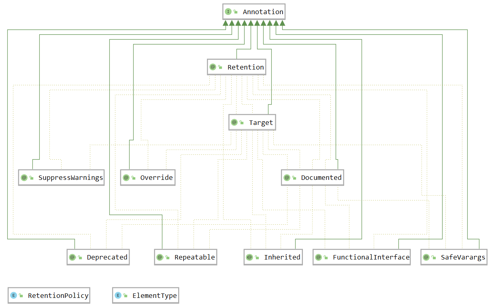

## 概念
Java 注解（Annotation）又称 Java 标注，是 JDK 1.5 引入的一种注释机制。

Java 语言中的类、方法、变量、参数 和包等都可以被注解。和 Javadoc 不同，Java 注解可以通过反射获取注解内容。在编译器生成类文件时，注解可以被嵌入到字节码中。JVM 可以保留注解内容，在运行时可以获取到注解内容 。

注解其实存在于 Java 程序里的各个角落，Spring MVC 等框架里到处都有它的身影，它和反射一样看起来不起眼，但是却十分重要。就如 Controller 里的 `@RequestMapping` ，我们在类或者方法上加上这样一句代码用来映射请求，然后程序就会如我们所愿的执行，好像这一切都是理所当然的，其实这背后有着很多知识。

## Annotation 概览
### 结构图


### Annotation 接口
> The common interface extended by all annotation types. Note that an interface  that manually extends this one does not define an annotation type. Also  note that this interface does not itself define an annotation type.
>
> —— Java 8 API
>

这个普通的接口被所有的注解继承，通过上面的继承关系图我们也可以看到。

### RetentionPolicy 枚举类
> Annotation retention policy. The constants of this enumerated  type describe the various policies for retaining annotations. They are used in  conjunction with the `Retention` meta-annotation type to specify how long annotations are to be retained.
>
> —— Java 8 API
>

RetentionPolicy 枚举类型的常量描述了保留注释的各种策略。它们与 Retention 元注解类型一起使用，以指定注解要保留多长时间。

### ElementType 枚举类
> The constants of this enumerated type provide a simple classification of the syntactic locations where annotations may appear in a Java program. These  constants are used in `java.lang.annotation.Target` meta-annotations to specify where it is legal to write annotations of a given  type.
>
> —— Java 8 API
>

ElementType 枚举类型的常量提供了 Java 程序中注解可出现的语法位置的简单分类。它们与 Target 元注解一起使用，来指定在何处可以合法地编写给定类型的注解。

## 注解的分类
### 元注解
在前面注解结构的介绍中出现了元注解的概念，什么是元注解？可以简单的理解为元注解是注解的注解。一般的注解是用于类、方法等的标注，而元注解专门用于标注注解。

#### @Retention  
作用：指示注解要保留多长时间，如果注解上没有声明该注解，则默认保留策略是 RetentionPolicy.CLASS 。

| 保留策略 | 说明 |
| --- | --- |
| RetentionPolicy.SOURCE | 注解仅保留在源码中，编译时被忽视 |
| RetentionPolicy.CLASS | 默认保留策略，注解会保留在 .class 字节码文件中 |
| RetentionPolicy.RUNTIME | 注解会保留在 .class 字节码文件中，运行时可以通过反射获取到注解信息 |


#### @Target  
作用：指示注解的作用范围。

| 使用位置 | 说明 |
| --- | --- |
| ElementType.TYPE | 作用于接口、类、枚举、注解 |
| ElementType.FIELD | 作用于属性字段、枚举的常量 |
| ElementType.METHOD | 作用于方法 |
| ElementType.PARAMETER | 作用于方法参数 |
| ElementType.CONSTRUCTOR | 作用于构造方法 |
| ElementType.LOCAL_VARIABLE | 作用于局部变量 |
| ElementType.ANNOTATION_TYPE | 作用于注解 |
| ElementType.PACKAGE | 作用于包 |
| ElementType.TYPE_PARAMETER | 作用于任何类型参数声明的地方（jdk 1.8 引入） |
| ElementType.TYPE_USE | 作用于任何类型使用的地方（jdk 1.8 引入） |


#### @Documented  
作用：将注解中的元素包含到 Javadoc 中去。

#### @Inherited  
作用：使注解具有继承性。这里的继承不是指注解本身的继承，使用 @Inherited  注解了的注解修饰了一个父类，如果他的子类没有被其他注解修饰，则它的子类也继承了父类的注解。 

例子：

```java
@Inherited								// 使用注解具有继承性
@Retention(RetentionPolicy.RUNTIME)		// 使注解保留至运行期间，便于反射获取
@Target(ElementType.TYPE)				// 修饰接口、类、枚举、注解
@interface MyAnnotation {				// 自定义注解
}

@MyAnnotation
class Father {							// 父类
}

class Son extends Father {				// 子类
}

public class Main {
    public static void main(String[] args) {
        // 获取 Son 类型
        Class<Son> sonClass = Son.class;
        // 获取注解
        Annotation annotation = sonClass.getAnnotation(MyAnnotation.class);
        System.out.println(annotation);
    }
}
```

程序输出结果：

```plain
@com.company.MyAnnotation()
```

#### @Repeatable  
作用：使注解可重复。在 jdk 1.8 前，同一个注解只能修饰一次某个类、方法等，而被 @Repeatable  注解的注解可以多次修饰某个类、方法等。 

例子：


```java
@Retention(RetentionPolicy.RUNTIME)		// 使注解保留至运行期间，便于反射获取
@Target(ElementType.TYPE)				// 修饰接口、类、枚举、注解
@interface Occupations {
    Occupation[] value();
}

@Repeatable(Occupations.class)			// 使注解可重复（注解容器）
@Retention(RetentionPolicy.RUNTIME)		// 使注解保留至运行期间，便于反射获取
@Target(ElementType.TYPE)				// 修饰接口、类、枚举、注解
@interface Occupation {
    String value() default "";
}

@Occupation("Teacher")
@Occupation("Engineer")
@Occupation("Professor")				// 使用 Occupation 注解多次修饰 People 类
class People {

}

public class Main {
    public static void main(String[] args) {
        // 获取 People 类型
        Class<People> peopleClass = People.class;
        // 获取注解
        Occupations occupations = peopleClass.getAnnotation(Occupations.class);
        // 获取注解值
        Occupation[] ops = occupations.value();
        for(Occupation occupation : ops) {
            System.out.println(occupation.value());
        }
    }
}
```

程序输出结果：

```java
Teacher
Engineer
Professor
```

### JDK 内置注解
#### @Override  
作用：只能标注方法，表示该方法覆盖父类中的方法。

```java
public class Main {
    static class A {
       public void test() {
           System.out.println("From A");
       }
   }
   static class B extends A {
       @Override
       public void test() {
           System.out.println("From B");
       }
   }
    public static void main(String[] args) {
        A a = new B();
        a.test();   // 输出 From B
    }
}
```

#### @Deprecated  
作用：所标注内容，不再被建议使用。如果使用，会报编译警告。

```java
public class Main {
    @Deprecated
    public static void test() {
        System.out.println("不建议使用！");
    }
    public static void main(String[] args) {
        test();
    }
}
```

#### @SuppressWarnings  
作用：指示编译器去忽略注解中声明的警告。

```java
public class Main {
    @SuppressWarnings(value={"unchecked", "rawtypes"})
    //@SuppressWarnings("all")
    public static void test(int num){
        List items = new ArrayList();
        items.add(num);
    }
    public static void main(String[] args) {
        test(123);
    }
}
```

抑制警告的关键字，也即 value 的值有很多种，常见的如 all 、null、rawtypes、unchecked、unused 等，它们可以同时被声明。

#### @SafeVarargs  
作用：Java 7 开始支持，忽略任何使用参数为泛型变量的方法或构造函数调用产生的警告。

```java
public class Main {
    @SafeVarargs
    public static <T> void test(T ... ts){
        for (T t : ts) {
            System.out.println(t);
        }
    }
    public static void main(String[] args) {
        List<Integer> list = Arrays.asList(1,2,3);
        test(list);
    }
}
```

@SafeVarargs  注解只能用在 参数长度可变的方法或构造方法上，且方法必须声明为 static 或 final ，否则会出现编译错误。

一个方法使用 @SafeVarargs  注解的前提是，开发人员必须确保这个方法的实现中对泛型类型参数的处理不会引发类型安全问题，否则可能导致运行时的类型转换异常。 

#### @FunctionalInterface  
作用：Java 8 开始支持，标识一个匿名函数或函数式接口。

```java
@FunctionalInterface
interface Test {
    void method();
}
public class Main {
    public static void main(String[] args) {
        Test test = () -> System.out.println("hello");
        test.method();
    }
}
```

只能标记在有且仅有一个抽象方法的接口上，表示函数式接口，每一个该类型的 Lambda 表达式都会被匹配到这个抽象方法。接口中的静态方法和默认方法以及重写的 Object 类的方法都不算是抽象方法。

### 第三方框架里的注解
许多优秀的开源框架中都有大量的注解，这些注解极大地方便了开发的工作，简化了代码量，在学习这些框架时掌握注解的使用同样十分重要。

### 自定义注解
#### 语法
注解通过 `@interface` 关键字进行定义

```java
修饰符 @interface 注解名 {
    // body
}
```

#### 使用
注解的使用很简单，只需要在被注解的内容上加上 `@注解名` 即可，但是此时的注解使没有任何意义的，还需要靠自己实现类型注解的检查框架，或者第三方框架。

```java
@Target(ElementType.TYPE)
@interface MyAnnotation {
}

@MyAnnotation
class A {
}
```

## 注解的属性
注解的属性类似于类中的成员变量，注解中没有方法，只有成员变量，成员变量名就是属性，其返回值定义了该成员变量的类型。

```java
@Target(ElementType.TYPE)
@Retention(RetentionPolicy.RUNTIME)
@interface MyAnnotation {
    int id();					// 属性 id，类型为 int
    String value() default "";	// 属性 value，类型为 String，默认值为 ""
}
```

注解的属性类型可以是基本数据类型、String、枚举类型、注解类型、Class 类型，以及以上各种类型的一维数组。

给注解的属性赋值时，要在括号里用 `属性名 = 属性值` 的形式声明，如果一个注解内仅仅只有一个名字为 value 的属性时，应用这个注解时可以直接接属性值填写到括号内。

```java
@MyAnnotation(id = 1, value = "hello")
class A {
}
```

## 注解与反射
注解的定义和使用本身并没有意义，有意义的是通过注解标注或者指示自己想要的信息，然后通过某种手段获取到这些信息，进而利用这些信息，这里的信息就是注解的属性，这里的手段就是前面讲过的反射。

获取注解属性，自定义的注解必须使用元注解 @Retention(RetentionPolicy.RUNTIME) ，保证注解信息能够保存至运行时程序中。

通过反射机制获取注解信息的相关方法：

| 常用方法 | 描述 |
| --- | --- |
| public boolean isAnnotationPresent(Class<? extends Annotation> annotationClass) | 如果存在指定类型的注解，则返回true，否则返回false |
| public  A getAnnotation(Class annotationClass) | 如果存在指定类型的注解，则返回该注解，否则为空 |
| public Annotation[] getAnnotations() | 返回所有注解 |
| public  A getDeclaredAnnotation(Class annotationClass) | 如果存在指定类型的直接存在的注解，则返回该注解，否则为空 |
| public Annotation[] getDeclaredAnnotations() | 返回所有直接存在的注解 |


Class.getAnnotations() 获取所有的注解，包括自己声明的以及继承的；Class.getDeclaredAnnotations() 仅获取自己声明的注解。

例子：

```java
@Target(ElementType.TYPE)
@Retention(RetentionPolicy.RUNTIME)
@interface MyAnnotation {
    int id();
    String value() default "";
}

@MyAnnotation(id = 1, value = "hello")
class A {
}

public class Main {
    public static void main(String[] args) {
        Class<A> aClass = A.class;
        if(aClass.isAnnotationPresent(MyAnnotation.class)) {
            MyAnnotation annotation = aClass.getAnnotation(MyAnnotation.class);
            System.out.println(annotation.id());
            System.out.println(annotation.value());
        }
    }
}
```

程序输出结果：

```java
1
hello
```

## 注解的作用
1.  进行编译检查。例如，@SuppressWarnings, @Deprecated  和 @Override  都具有编译检查作用。让编译器执行更严格的检查，保证代码更加的健壮。  
2.  在反射中使用。本来可能需要很多配置文件，需要很多逻辑才能实现的内容，就可以使用一个或者多个注解来替代，在程序运行的时候接受代码的提取，这样就使得编程更加简洁，代码更加清晰。 
3.  生成帮助文档。使用 @Documented  注解自动生成帮助文档。  
4.  便于查看代码。能够读懂别人写的代码，特别是框架相关的代码。 

