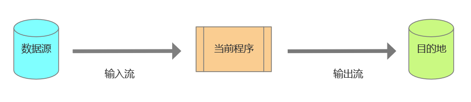
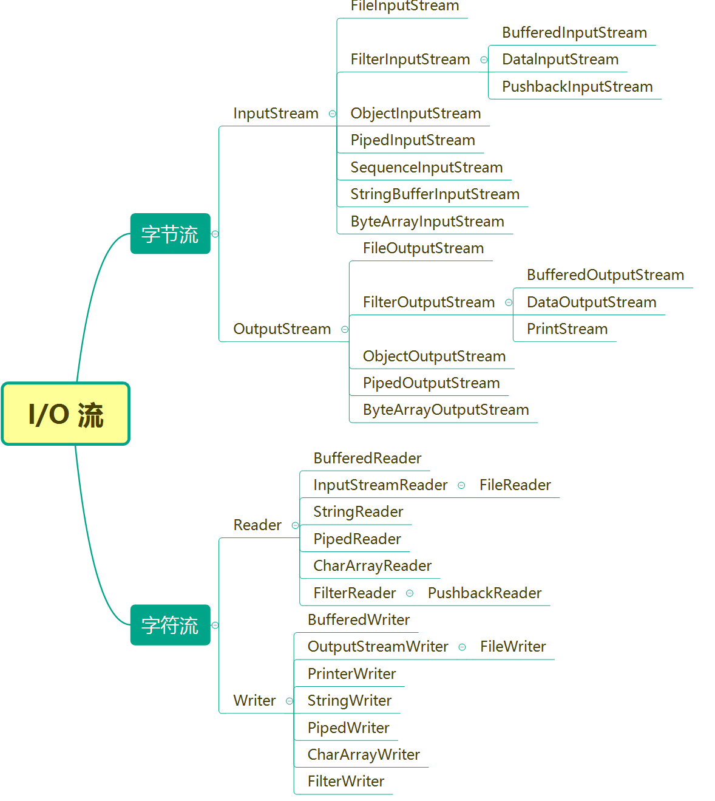
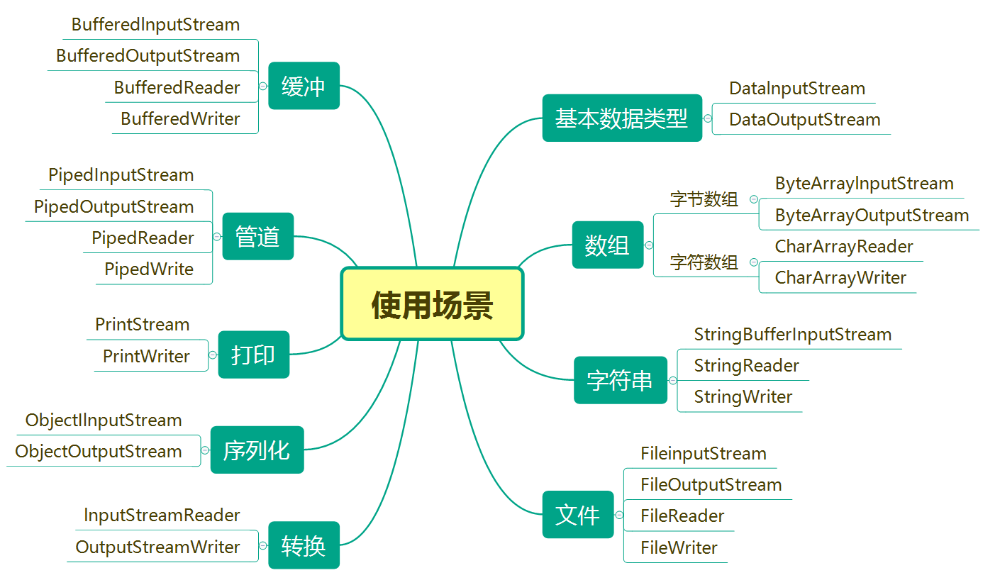

## 概述
I/O 即 Input 和 Output，输入和输出。Java 的核心库 java.io 提供了全面的 I/O 接口。包括：文件读写、标准设备输出等，使其更广泛地应用到文件传输和网络编程中。

Java 中 I/O 是以流为基础进行输入输出的，Java.io 包中的流支持很多种格式，如基本类型、对象、文件等等，所有数据被串行化写入输出流，或者从输入流读入。

## 流（Stream）
### 什么是流
Stream 本意为溪流，而 Java 里的 I/O 流里流的不是水，而是数据。数据流是指一组有序的、有起点和重点的字节集合。

以当前的程序为参照，当程序需要读取数据的时候，程序就会与数据源之间建立一个输入流，这个数据源可以是文件，内存，或是网络；当程序需要写入数据的时候，程序就会与目的地之间建立一个输出流。



整个输入输出过程就是数据流入程序再从程序中流出的过程。由于采用了数据流的概念，在程序设计中我们不必关系系统如何实现具体的输入输出，也不必关心输入输出的设备，只需要注意数据流的工作方式。例如，采用键盘写入数据和采用写入文件的方式是一样的。

### I/O 流的分类
+  按流向分： 
    - 输入流：程序可以从中读取数据的流。
    - 输出流：程序能向其中写入数据的流。
+  按数据传输单位分: 
    - 字节流：以字节为单位传输数据的流
    - 字符流：以字符为单位传输数据的流
+  按功能分: 
    - 节点流：用于直接操作目标设备的流
    - 过滤流：是对一个已存在的流的链接和封装，通过对数据进行处理为程序提供功能强大、灵活的读写功能。

### 基本 I/O 流抽象类
JDK 所提供的所有流类位于 java.io 包中，都分别继承自以下四种抽象流类：

InputStream：继承自 InputStream 的流都是用于向程序中输入数据的，且数据单位都是字节（8位）。

OutputStream：继承自 OutputStream 的流都是程序用于向外输出数据的，且数据单位都是字节（8位）。

Reader：继承自 Reader 的流都是用于向程序中输入数据的，且数据单位都是字符（16位）。

Writer：继承自 Writer 的流都是程序用于向外输出数据的，且数据单位都是字符（16位）。

#### 字节流和字符流的区别
1.  字节流没有缓冲区，字符流有缓冲区，数据处理后先存入缓存。 
2.  字节流按字节读写数据，字符流按字符读写数据。 
3.  字节流可以操作任何类型的数据，字符流只能处理字符类型的数据。 

所有的文件在硬盘或在传输时是都是以字节（byte）形式进行的，包括图片、视频等，字符只有到了内存中才会形成，所以在开发中，字节流使用较为广泛。

### 流的特点
+ 先进先出。先写入输出流的数据先被输入流读取到。
+ 顺序存取。流中的数据是按读写顺序排序的（RandomAccessFile 除外，使用该流可以从文件的任意位置进行读写操作）。
+ 只读或只写。每一种流只能是输入流或输出流的一种，不能同时可读和可写。

### 结构图
#### 按流分类


#### 按使用场景分类


> 每种输入输出流的详细说明，可以在百度百科 [java.io](https://baike.baidu.com/item/java.io/5179754) 词条中 [类摘要](https://baike.baidu.com/item/java.io/5179754#3_4) 部分查看。
>

## Scanner 类
java.util.Scanner 是 Java 5 的新特征，我们可以通过 Scanner 类来获取用户的输入。

下面是创建 Scanner 对象的基本语法：

```java
Scanner sc = new Scanner(System.in);
```

这里的 `System.in` 是 Java 预置的输入流对象，在 java.lang.System 类中，这样的 I/O 流对象一共有3个：

| I/O 流对象 | 说明 |
| --- | --- |
| System.in | 标准输入流，通常应用于键盘输入、由主机环境或用户指定的其他输入源 |
| System.out | 标准输出流，通常应用于显示输出、由主机环境或用户指定的其他输出目的地 |
| System.err | 标准错误输出流，用于显示错误消息或其他应立即引起用户注意的信息 |


Scanner 类的方法有很多，下表中是一些常用的方法：

| 常用方法 | 描述 |
| --- | --- |
| boolean hasNext() | 判断是否还有输入 |
| boolean hasNextXxx() | 判断是否还有指定类型的输入 |
| boolean hasNextLine() | 判断是否还有下一行输入 |
| String next() | 返回下一个分隔符前的字符串 |
| xxx nextXxx() | 返回下一个分隔符前的指定类型值 |
| String nextLine() | 返回下一行输入 |
| Scanner useDelimiter(String pattern) | 设置分隔符（默认分隔符为空格） |


next() 和 nextline() 的区别：

next() 只有在读到有效字符后才能结束输入，有效字符前的空格会被自动去掉，有效字符后的空格被作为分隔符，因此 next() 不能得到带有空格的字符串。

nextLine() 以 Enter 为结束符，也就是说 nextLine() 方法返回的是输入回车之前的所有字符，因此可以获得带空格的字符串。

hasNext() 和 hasNextLine() 的区别：

hasNext() 方法会判断接下来是否有非空字符，如果有，则返回 true，否则返回 false 。

hasNextLine() 方法会根据行匹配模式去判断接下来是否有一行（包括空行），如果有，则返回 true，否则返回 false 。

## 常用 I/O 操作
### 控制台 I/O
控制台输入输出一个最重要的应用场景就是笔试了，笔试算法题一般有两种形式（不同的公司不一样）：

一种是以力扣为代表的核心代码模式，我们不需要自己构造输入输出，代码框中预设代码已经指定好类名、方法名、参数名，我们只需要关心算法的具体逻辑，将其实现直接返回值即可；

另一种是以 OJ 平台为代表的 ACM 模式，编程过程中的输入输出处理方式需要参考题目输入输出描述，自己进行构造。

对于经常在力扣上刷题的同学来说，习惯了核心代码模式，突然让自己处理输入输出往往会很不适应，甚至出错，因此掌握控制台输入输出十分必要。下面举几个常见的例子：

例1：

```plain
输入描述：每个测试用例第一行包含一个正整数n，第二行包含n个正整数nums[i]
示例：
5
1 3 1 1 4
```

```java
public class Main {
    public static void main(String[] args) throws FileNotFoundException {
        Scanner sc = new Scanner(System.in);
        int n = sc.nextInt();
        int[] nums = new int[n];
        for(int i = 0; i < n; i++) {
            nums[i] = sc.nextInt();
        }
    }
}
```

例2：

```plain
输入描述：每个测试用例有多行，每行都是以英文逗号分隔从小到大排列的数字
示例：
1,5,7,9
2,3,4,6,8,10
```

```java
public class Main {
    public static void main(String[] args) throws FileNotFoundException {
        Scanner sc = new Scanner(System.in);
        String[] ss;
        int[] nums;
        while (sc.hasNextLine()) {
            ss = sc.nextLine().split(",");
            nums = new int[ss.length];
            for(int i = 0; i < ss.length; i++) {
                nums[i] = Integer.parseInt(ss[i]);
            }
        }
    }
}
```

例3：

```plain
输入描述：每个测试用例的第一行包含两个整数 n 和 m，接下来的 n 行，每行包含 m 个 0-9 之间的数字
示例：
4 4
3332
3233
3332
2323
```

```java
public class Main {
    public static void main(String[] args) throws FileNotFoundException {
        Scanner sc = new Scanner(System.in);
        int n , m;
        while (sc.hasNext()) {
            n = sc.nextInt();
            m = sc.nextInt();
            int[][] matrix=new int[n][m];
            for (int i = 0; i < n ; i++) {
                String str = sc.next();
                for (int j = 0;j < m ;j++ )
                {
                    matrix[i][j] = str.charAt(j) - '0';
                }
            }
        }
    }
}
```

### 文件 I/O
通过控制台进行输入输出虽然可以满足一定的需求，但是有很明显的弊端，就是数据实在内存中的、临时的，如果数据量大的话很难采用手动输入的方式进行操作。

在笔试题中，我们编写的代码虽然使用了标准输入输出流，但实际上判题程序的输入是通过文件进行的，所有的测试用例均被保存在文件当中，所以我们在自己的 IDE 里进行测试时，同样可以使用文件来模拟输入。

当然，这只是一个小的应用，文件的 I/O 操作作用远不止于此。

例：

```plain
读取指定文件的内容，显示在控制台，并将文件内容复制到新的文件中。
```

```java
public class Main {
    public static void main(String[] args) throws IOException {
        // 输入输出文件
        File fin = new File("F:\\test.txt");
        File fout = new File("F:\\test_copy.txt");
        // 也可以像下面这样写
        // FileInputStream fileInputStream = new FileInputStream("F:\\test.txt");
        // FileOutputStream fileOutputStream = new FileOutputStream("F:\\test_copy.txt");
        // 字节流读写文件
        FileInputStream fileInputStream = new FileInputStream(fin);
        FileOutputStream fileOutputStream = new FileOutputStream(fout);
        int len = 0;
        while ((len = fileInputStream.read()) != -1) {
            System.out.print((char)len);
            // 写入文件
            fileOutputStream.write(len);
            fileOutputStream.flush();
        }
        // 关闭输入输出字节流
        fileInputStream.close();
        fileOutputStream.close();
        // 字符流读写文件
        // InputStreamReader reader = new InputStreamReader(fileInputStream);
        // OutputStreamWriter writer = new OutputStreamWriter(fileOutputStream);

        // while (reader.ready()) {
        //    char ch = (char)reader.read();
        //    System.out.print(ch);
        //    // 写入文件
        //    writer.write(ch);
        //    writer.flush();
        // }
        // 关闭输入输出字符流
        // reader.close();
        // writer.close();
    }
}
```

### 网络 I/O
网络中的两台主机间进行通讯，各种类型的数据在他们之间相互转发，可以是基本的数据类型，也可能是复杂的对象，无论是何种形式，数据传输是以字节形式进行的，到了物理层，所有的数据都是二进制序列，对象本身不能直接传输。

程序运行过程中产生的对象一直在内存中，如果遇到大量产生对象的场景，就需要先将对象以字节的形式保存在硬盘中，减轻内存的压力，典型场景就是 Web 服务器中的 Session 对象。

为了解决上面两个问题，就出现了对象序列化的方法。

把对象转换为字节序列的过程称为对象的序列化；把字节序列恢复为对象的过程称为对象的反序列化。

对象序列化与反序列化需要首先满足对象的类实现了 Serializable 接口。

序列化时创建一个对象输出流 ObjectOutputStream ，它可以包装一个其他类型的目标输出流，如文件输出流，然后通过对象输出流的 writeObject() 方法写对象。

反序列化时创建一个对象输入流 ObjectInputStream ，它可以包装一个其他类型的源输入流，如文件输入流，然后通过对象输入流的 readObject() 方法读取对象。

例：

```java
import java.io.Serializable;
// 定义 Student 类，实现 Serializable 接口，让该类对象可以被序列化
public class Student implements Serializable {
    private String name;
    private int age;
    transient private int score;	// transient 关键字修饰的属性不会被序列化

    public String getName() {
        return name;
    }

    public int getScore() {
        return score;
    }

    public void setScore(int score) {
        this.score = score;
    }

    public void setName(String name) {
        this.name = name;
    }

    public int getAge() {
        return age;
    }

    public void setAge(int age) {
        this.age = age;
    }
}
```

```java
public class Main {
    public static void main(String[] args) throws Exception {
        // 定义一个 Student 对象，设置属性
        Student student = new Student();
        student.setName("Jack");
        student.setAge(20);
        student.setScore(120);
		// 序列化
        ObjectOutputStream oos = new ObjectOutputStream(new FileOutputStream("F:\\test.txt"));
        oos.writeObject(student);
        oos.close();
		// 反序列化
        ObjectInputStream ois = new ObjectInputStream(new FileInputStream("F:\\test.txt"));
        Student student1 = (Student)ois.readObject();
        System.out.println(student1.getName() + "\n" + student1.getAge());
        System.out.println(student1.getScore());
    }
}
```

程序输出结果：

```plain
Jack
20
0
```


## 
