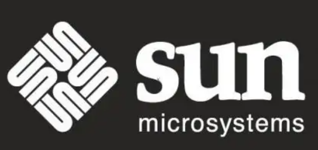
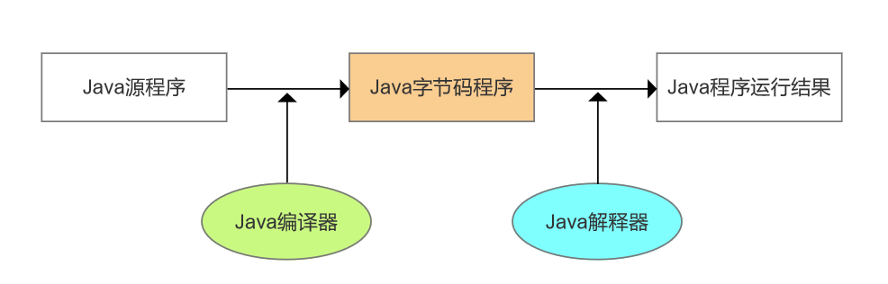
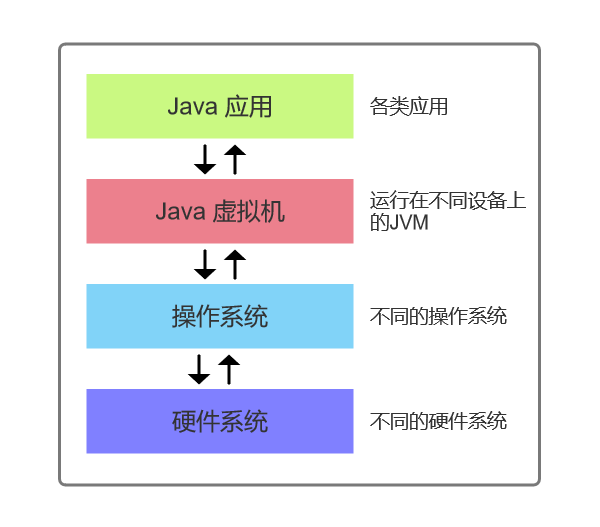
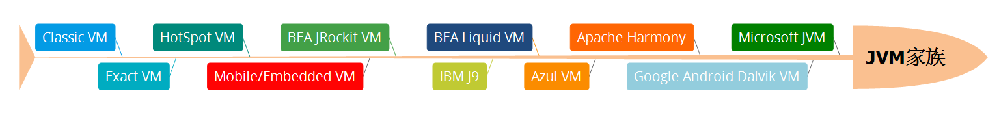

## 前言
> 世界上并没有完美的程序，但我们并不因此而沮丧，因为写程序本来就是一个不断追求完美的过程。
>
> ——《深入理解 Java 虚拟机》
>

说到 Java 大家都不陌生，它是一种面向对象的编程语言，具有功能强大和简单易用两个重要特征。Java 语言具有众多优点，其中一种就是平台独立与可移植，正是因为这个优点，借着互联网浪潮的 Java 迅速发展，这里离不开一个很重要的东西—— Java 虚拟机（Java Virtual Machine ，JVM ）。

JVM 本身的知识非常丰富，这篇文章也仅仅是对 JVM 的一个简单的解释，这个系列后续的文章会更深入地探讨 JVM 的详细知识。如果小伙伴想更加全面地了解 JVM ，推荐阅读周志明老师的《深入理解Java虚拟机》。

## Java 跨平台的原因
### 从 C++ 到 Java
上世纪九十年代，硬件领域出现了单片式计算机系统（单片机），单片机的出现极大地提高了自动控制领域消费电子产品（电视机顶盒、移动电话等）的智能化程度。Sun 公司当然也希望抓住这次热潮，于是在1991年成立了一个称为 Green 的项目小组，专攻计算机在家电产品上的嵌入式应用。



C++ 语言在硬件领域的特殊优势，让研发人员决定使用 C++ 开发，但是单片机硬件资源极其匮乏，无法支撑 C++ 程序的运行，而且嵌入式处理器种类繁多，如何让程序可以跨平台运行就变成了一个很大问题。

因此，研发人员首先将精力放在了语言的研发上，他们并没有开发一种全新的语言，而是摒弃了 C++ 里一些不太实用及影响安全的成分，如指针、多继承等，推出了 Oak 面向对象语言，它也是 Java 的前身。

但是现在我们知道，在今天嵌入式的开发中，几乎都是使用 C/C++ 语言。在当时 Oak 出现时，由于各种原因，它并没有得到广泛地应用，于是团队重新分析市场需求，最后改变了努力的目标——万维网。

1995年互联网潮流的兴起，业界为了使死板、单调的静态网页能够“灵活”起来，急需一种软件技术来开发一种程序，这种程序可以通过网络传播并且能够跨平台运行。Oak 迅速找到了最适合自己发展的市场定位，成功转型，成为了现在的 Java（在申请注册商标时，发现 Oak 已经被人使用了，再想了一系列名字之后，最终使用了提议者在喝一杯 Java 咖啡时无意提到的 Java 词语）。


> Java 是几乎所有类型的网络应用程序的基础，也是开发和提供嵌入式和移动应用程序、游戏、基于 Web 的内容和企业软件的全球标准。Java 在全球各地有超过 900 万的开发人员，使您能够高效地开发、部署和使用精彩的应用程序和服务。
>
> 从笔记本电脑到数据中心，从游戏控制台到科学超级计算机，从手机到互联网，Java 无处不在！
>
> ——Java[官网](https://www.java.com/zh-CN/about/)
>

### Write Once, Run Anywhere
1995年5月23日，Oak 语言改名为 Java，并且在 SunWorld 大会上正式发布 Java 1.0 版本。Java 语言第一次提出了 “Write Once，Run Anywhere” 的口号。

Java 语言源程序经过编译，会被转换成字节码（bytes-codes）文件，字节码的最大特点就是可以跨平台运行。



这里有一个很重要的角色就是解释器，它负责“解释”字节码文件，也就是将字节码文件翻译成机器可以直接运行的代码，而任意一种解释器我们都可以称之为 Java 虚拟机（JVM），我们可以认为 Java 字节码就是 JVM 的机器码。

如果一台计算机，无论是什么操作系统，只要它包含了 Java 的虚拟机，它就可以运行任何正确的 Java 程序，也就实现了 Run Anywhere 。

一个简单的例子：

1. 使用记事本编写下面的代码，并将文件保存为 Helloworld.java ，注意类名和文件名相同。

```java
public class Helloworld {
    public static void main(String[] args){
        System.out.println("Hello World!");
    }
}
```

2. Windows 环境下打开 dos ，进入 Helloworld.java 文件目录下，使用下面的命令编译该程序。

```plain
javac Helloworld.java
```

3. 可以看到文件目录下多了一个 Helloworld.class 文件，这个就是字节码文件，使用下面的命令可以运行该文件，可以看到 dos 打印出了程序运行结果。同样的，将该字节码文件放在任何安装了 JDK 或者 JRE 的电脑上，使用相同的命令都可以得到相同的结果。

```plain
java Helloworld
```

## 什么是 JVM
### JVM 本质
JVM 是一个虚构出来的计算机，它没有寄存器，所以指令集是使用 Java 栈来存储中间数据，通过在实际的计算机上仿真模拟各种计算机功能来实现。它本质上就是一个程序，当它在命令行上启动的时候，就开始执行保存在某字节码文件中的指令。

引入 JVM 后，Java 语言在不同平台上运行时不需要重新编译。Java虚拟机屏蔽了与具体平台相关的信息，使得Java 程序只需生成在 Java 虚拟机上运行的目标代码（字节码），就可以在多种平台上不加修改地运行。



### JVM 家族


JVM 有一个很庞大的家族，在不同的行业、不同的应用场景，程序运行的要求是不一样的，有很强的目标性，并不是所有的 JVM 都会被广泛应用，也不存在一种可以应用于所有场景的 JVM（也不一定，未来的事儿谁说的准呢哈）。

## 为什么要学习 JVM
### 面试会问
毫不夸张地说，绝大多数人开始学习 JVM 的首要原因是为了面试，当然我也不例外。

每年从事互联网的人员越来越多，门槛也随之变高（越来越卷），现在找 Java 相关工作，面试官都或多或少问 JVM 相关的知识，这时候如果一点都不会的话，是不是挺尴尬的。

这么说会有点应试之嫌，但事实确实如此。

### 更加深入地了解 Java
知识如果只停留在表层，几乎任何方向的能够胜任的职位也都只能停留在表层，至少程序员是如此。我们都有一颗不甘平凡的心，如果想超越自我，就需要追求更深层次的知识。

学习 Java 虚拟机能够让我们更深入地了解 Java 这门语言，可以清楚地知道 Java 程序是如何执行的，可以知道如何提高 Java 应用的性能等等。

### 工作中会用得到
正如文章开头所说，世界上并没有完美的程序，任何程序在部署上线后都会出现这样或那样的问题，那么如何解决线上的 Java 应用崩溃问题。

相对于 C/C++ 语言手动管理内存空间，JVM 从这个层面解放了程序员们，我们不需要花精力去对内存进行分配和管理，只需要去关注业务逻辑地实现。但是如果不理解 JVM GC 回收的原理，当出现内存泄露或溢出问题时，就没法或是很难进行排查和定位。

