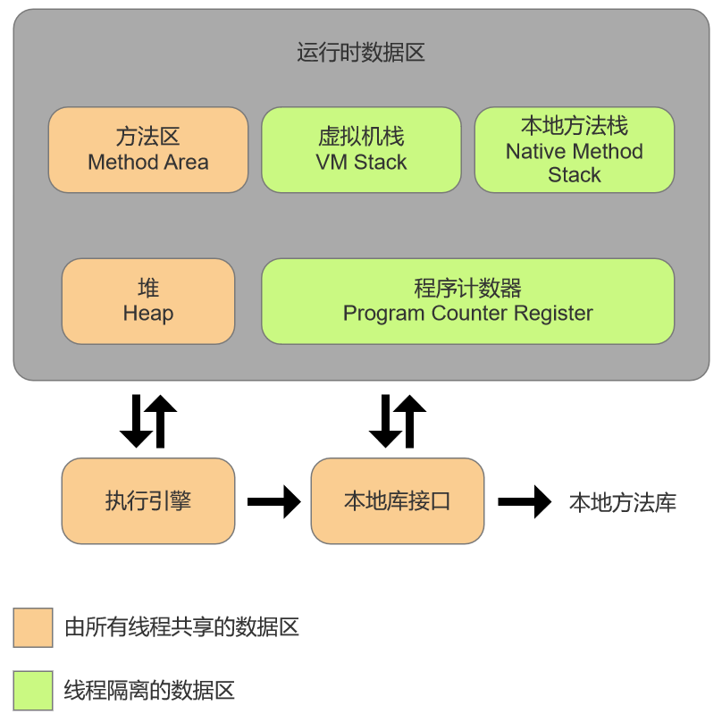

## 前言
> Java与C++之间有一堵由内存动态分配和垃圾收集技术所围成的高墙，墙外面的人想进去，墙里面的人却想出来。
>
> ——《深入理解 Java 虚拟机》
>

对于 C/C++ 程序员来说，malloc/free 和 new/delete 再熟悉不过，使用它们可以很轻易地管理内存和对象，但是这也给开发人员带来了大量的负担。

对于 Java 程序员来说，在 JVM 自动内存管理机制地帮助下，不再需要负责每一个对象的生命周期活动，不容易出现内存泄漏和内存溢出的问题。

不容易出现问题不代表不会出现问题，JVM 内存管理机制确实减少了程序员很多的工作量，但是一旦出现了内存泄漏和内存溢出的问题，如果不了解 JVM 是如何使用内存的，那排查错误、修正问题将会成为一项异常艰难的工作。

### 运行时数据区域
Java 虚拟机在执行 Java 程序的过程中会把它所管理的内存划分为若干个不同的数据区域。这些区域有各自的用途，以及创建和销毁的时间，有的区域随着虚拟机进程的启动而一直存在，有些区域则是依赖用户线程的启动和结束而建立和销毁。

运行时数据区域包括以下几个部分：

+ 线程共享：方法区、堆
+ 线程私有：虚拟机栈、本地方法栈、程序计数器



### 程序计数器
学习过计算机组成原理的同学对这个概念应该不陌生，可能会联想到 CPU 结构章节里的 CPU 寄存器部分的内容，CPU 中有一类寄存器用于控制 CPU 的操作或运算，其中程序计数器（PC）用于存放现行指令的地址，通常具有计数功能，当遇到转移类指令时，PC 的值可被修改。

JVM 中的程序计数器与 CPU 里的程序计数器大同小异，都是用来控制程序中指令的执行顺序，实现对代码段指令的跟踪的 。

#### 作用
程序计数器是一块较小的内存空间，它可以看作是当前线程所执行的字节码的行号指示器。

在 Java 虚拟机的概念模型里，字节码解释器工作时就是通过改变这个计数器的值来选取下一条需要执行的字节码指令，它是程序控制流的指示器，分支、循环、跳转、异常处理、线程恢复等基础功能都需要依赖这个计数器来完成。

如果线程正在执行的是一个 Java 方法，这个计数器记录的是正在执行的虚拟机字节码指令的地址；如果正在执行的是本地（Native）方法，这个计数器值则应为空（Undefined）。

#### 线程私有
由于 Java 虚拟机的多线程是通过线程轮流切换、分配处理器执行时间的方式来实现的，在任何一个确定的时刻，一个处理器（对于多核处理器来说是一个内核）都只会执行一条线程中的指令。因此，为了线程切换后能恢复到正确的执行位置（可以类比 CPU 中断），每条线程都需要有一个独立的程序计数器，各条线程之间计数器互不影响，独立存储，我们称这类内存区域为“线程私有”的内存。

#### 异常
此内存区域是唯一一个在《Java虚拟机规范》中没有规定任何 OutOfMemoryError 情况的区域。

### Java 虚拟机栈
#### 作用
虚拟机栈描述的是 Java 方法执行的线程内存模型：每个方法被执行的时候，Java虚拟机都会同步创建一个栈帧（Stack Frame）用于存储局部变量表、操作数栈、动态连接、方法出口等信息。每一个方法被调用直至执行完毕的过程，就对应着一个栈帧在虚拟机栈中从入栈到出栈的过程。

#### 线程私有
与程序计数器一样，Java虚拟机栈也是线程私有的，它的生命周期与线程相同。

#### 异常
如果线程请求的栈深度大于虚拟机所允许的深度，将抛出 StackOverflowError 异常；如果 Java 虚拟机栈容量可以动态扩展（HotSpot 虚拟机的栈容量是不可以动态扩展的），当栈扩展时无法申请到足够的内存会抛出 OutOfMemoryError 异常。

栈的深度受栈帧的大小影响，栈帧的大小由局部变量表等信息决定，下面通过一个简单的例子来说明：

1. 首先通过 `-Xss` 参数设置线程栈的大小为128k，减少栈的容量，以便进行验证。IDEA 可在 `Run` -> `Edit Configurations` -> `VM options` 中修改。


2. 编写一个简单的递归程序。

```java
public class Main {
    private static int depth = 0;	// 记录栈的深度
    public static void stackOverflowTest() {
        depth++;					// 每递归调用一次深度加一
        stackOverflowTest();
    }
    public static void main(String[] args){
        try {
            stackOverflowTest();
        }catch (Error error) {
            System.out.println(error);
            System.out.println("栈深度为:" + depth);
        }
    }
}
```

2. 观察结果，每次结果可能或有一点差异，但十分接近（运行环境不同结果也不一定相同）。

```plain
java.lang.StackOverflowError
栈深度为:1099
```

3. 增加变量，以增加局部变量表信息，增大栈帧。

```java
public static void stackOverflowTest() {
    long param1, param2;
    depth++;
    stackOverflowTest();
}
```

4. 再次观察结果，可以发现栈的深度减小。

```plain
java.lang.StackOverflowError
栈深度为:773
```

### 本地方法栈
“本地”是相对于虚拟机而言的，本地方法栈与虚拟机栈所发挥的作用是非常相似的，其区别只是虚拟机栈为虚拟机执行 Java 方法（也就是字节码）服务，而本地方法栈则是为虚拟机使用到的本地（Native）方法服务。HotSpot 虚拟机中，本地方法栈和虚拟机栈合二为一。

与虚拟机栈一样，本地方法栈也会在栈深度溢出或者栈扩展失败时分别抛出 StackOverflowError 和 OutOfMemoryError 异常。

### Java 堆
#### 作用
Java 堆是虚拟机所管理的内存中最大的一块，此内存区域的唯一目的就是存放对象实例（以及数组），“几乎”所有的对象实例都在这里分配内存。Java 堆是垃圾收集器管理的内存区域，也被成为 GC 堆（Garbage Collected Heap）。

从内存回收的角度看，现代垃圾收集器大部分都是基于分代收集理论设计的；

从内存分配的角度看，所有线程共享的 Java 堆中可以划分出多个线程私有的分配缓冲区（Thread Local Allocation Buffer，TLAB），以提升对象分配时的效率。

#### 线程共享
Java 堆是被所有线程共享的一块内存区域，在虚拟机启动时创建。

#### 异常
Java 堆既可以被实现成固定大小的，也可以是可扩展的，不过当前主流的 Java 虚拟机都是按照可扩展来实现的（通过参数 `-Xmx` 和 `-Xms` 设定）。

如果在 Java 堆中没有内存完成实例分配，并且堆也无法再扩展时，Java虚拟机将会抛出 OutOfMemoryError 异常。

Java 堆内存的 OutOfMemoryError 异常是实际应用中最常见的内存溢出异常情况，下面通过例子演示堆溢出异常出现的情况：

1. 首先通过 `-Xms` 和 `Xmx` 参数设置堆的最小值和最大值设置为10m。IDEA 可在 `Run` -> `Edit Configurations` -> `VM options` 中修改。


2. 编写程序，一直新建对象。

```java
public class Main {
    static class HeapOOM {
    }
    public static void main(String[] args){
        List<HeapOOM> list = new ArrayList<HeapOOM>();
        while (true) {
            list.add(new HeapOOM());
        }
    }
}
```

3. 观察结果，异常堆栈信息 “java.lang.OutOfMemoryError” 会进一步提示 “Java heap space” 。

```plain
Exception in thread "main" java.lang.OutOfMemoryError: Java heap space
```

### 方法区
方法区与 Java 堆一样，是各个线程共享的内存区域，它用于存储已被虚拟机加载的类型信息、常量、静态变量、即时编译器编译后的代码缓存等数据。

如果方法区无法满足新的内存分配需求时，将抛出 OutOfMemoryError 异常。

### 运行时常量池
运行时常量池（Runtime Constant Pool）是方法区的一部分。Class 文件中除了有类的版本、字段、方法、接口等描述信息外，还有一项信息是常量池表（Constant Pool Table），用于存放编译期生成的各种字面量与符号引用，这部分内容将在类加载后存放到方法区的运行时常量池中。

下面是一个简单的 Helloworld 程序，使用 `javac` 命令编译该得到 `.class` 文件。

```java
public class Helloworld {
    public static void main(String[] args){
        System.out.println("Hello World!");
    }
}
```

使用 `javap` 命令反编译`.class` 文件，在输出信息里可以看到 Constant pool 内容，该部分是 Class 文件常量池表。


运行时常量池相对于 Class 文件常量池的另外一个重要特征是具备动态性，Java 语言并不要求常量一定只有编译期才能产生，也就是说，并非预置入Class文件中常量池的内容才能进入方法区运行时常量池，运行期间也可以将新的常量放入池中。

运行时常量池是方法区的一部分，自然受到方法区内存的限制，当常量池无法再申请到内存时会抛出 OutOfMemoryError 异常。

### 直接内存
在 JDK 1.4 中新加入了 NIO（New Input/Output）类，引入了一种基于通道（Channel）与缓冲区（Buffer）的 I/O 方式，它可以使用 Native 函数库直接分配堆外内存，然后通过一个存储在 Java 堆里面的 DirectByteBuffer 对象作为这块内存的引用进行操作。这样能在一些场景中显著提高性能，因为避免了在 Java 堆和 Native 堆中来回复制数据。

本机直接内存的分配不会受到 Java 堆大小的限制，但会受到本机总内存（包括物理内存、SWAP 分区或者分页文件）大小以及处理器寻址空间的限制，配置虚拟机参数时，容易忽略掉直接内存从而导致动态扩展时出现 OutOfMemoryError 异常。

## 虚拟机眼中的对象
### 对象的创建
创建一个对象通常（创建对象的方式有多种）只需要一个 `new` 关键字，通过这种方式我们可以调用类的无参或者有参构造方法来实例化出一个对象。表面上看这个过程是很简单的，但深入虚拟机层面，对象的创建却不仅仅于此。

这是一个简单的类，在 Main 方法里 new 一个 Person 对象。

```java
public class Person {
    int age = 18;	// 类的属性
    public static void main(String[] args) {
        Person p = new Person();	// 创建对象
    }
}
```

下面是 Main 方法的字节码文件，可以看到在 JVM 层面，创建一个对象被分成了多条指令。

```plain
0 new #2 <com/company/Person>					// 申请内存(此时对象成员变量默认“0”值)
3 dup											// 复制
4 invokespecial #3 <com/company/Person.<init>>	// 调用构造方法
7 astore_1										// 建立关联
8 return										// 返回
```

到这里还没有结束，上面也仅仅只是几条指令，指令背后的逻辑以及完整的对象创建过程如下：


> 参见 CodeSheep [这篇文章](https://mp.weixin.qq.com/s/aZg9SZT3DWkCkEsjlUjTtQ)
>

#### 类加载
当 jvm 遇到一条字节码 new 指令时（如上第一条指令），首先将去检查这个指令的参数是否能在常量池中定位到  
一个类的符号引用，并且检查这个符号引用代表的类是否已被加载、解析和初始化过。如果没有，就必须先执行相应的类加载过程。

#### 声明类型引用
即声明这个对象的符号引用，如 `Person p = new Person()` 中的 `p` 。

#### 堆内存分配
在类加载检查通过后，接下来虚拟机将为新生对象分配内存。对象所需内存的大小在类加载完成后便可完全确定，为对象分配空间的任务实际上便等同于把一块确定大小的内存块从 Java 堆中划分出来。

##### 分配方式
1. 指针碰撞

如果 Java 堆中内存是绝对规整的，所有被使用过的内存都被放在一边，空闲的内存被放在另一边，中间放着一个指针作为分界点的指示器，那所分配内存就仅仅是把那个指针向空闲空间方向挪动一段与对象大小相等的距离。

2. 空闲列表

如果 Java 堆中的内存并不是规整的，已被使用的内存和空闲的内存相互交错在一起，虚拟机必须维护一个列表，记录上哪些内存块是可用的，在分配的时候从列表中找到一块足够大的空间划分给对象实例，并更新列表上的记录。

##### 线程安全问题及解决方法
对象创建在虚拟机中是非常频繁的行为，即使仅仅修改一个指针所指向的位置，在并发情况下也并不是线程安全的。

1. 对分配内存空间的动作进行同步处理——实际上虚拟机是采用 CAS 配上失败重试的方式保证更新操作的原子性；
2. 把内存分配的动作按照线程划分在不同的空间之中进行，即每个线程在 Java 堆中预先分配一小块内存，称为本地线程分配缓冲（Thread Local AllocationBuffer，TLAB），哪个线程要分配内存，就在哪个线程的本地缓冲区中分配，只有本地缓冲区用完了，分配新的缓存区时才需要同步锁定。

#### 属性“0”值初始化
内存分配完成之后，虚拟机必须将分配到的内存空间（但不包括对象头）都初始化为零值，这步操作保证了对象的实例在 Java 代码中可以不赋初始值就直接使用，使程序能访问到这些字段的数据类型所对应的零值。比如 int 的初始化0值就是0，而一个对象的初始化0值就是 null 。

#### 对象头设置
接下来 JVM 会进行对象头的设置，这里面就主要包括对象的运行时数据（比如 Hash 码、分代年龄、锁状态标志、锁指针、偏向线程ID、偏向时间戳等）以及类型指针（ JVM 通过该类型指针来确定该对象是哪个类的实例）。

#### 属性显示初始化
定义一个类的时候，针对某个属性字段手动的赋值，如 `int age = 18` 。

#### 构造方法初始化
在上面工作都完成之后，从虚拟机的视角来看，一个新的对象已经产生了。但是从 Java 程序的视角看来，对象创建才刚刚开始，所有的字段都为默认的零值。new 指令之后会接着执行 () 方法，按照构造方法里的动作执行初始化，至此一个对象诞生。

### 对象的内存布局
在 HotSpot 虚拟机里，对象在堆内存中的存储布局可以划分为三个部分：对象头（Header）、实例数据（Instance Data）和对齐填充（Padding）。

#### 对象头
##### 对象自身的运行时数据
如哈希码、GC分代年龄、锁状态标志、线程持有的锁、偏向线程ID、偏向时间戳等，官方称它为“Mark Word”。

下表是 HotSpot 虚拟机对象头的 Mark Word：

| 存储内容 | 标志位 | 状态 |
| --- | --- | --- |
| 对象哈希码、对象分代年龄 | 01 | 未锁定 |
| 指向锁记录的指针 | 00 | 轻量级锁定 |
| 指向重量级锁的指针 | 10 | 膨胀（重量级锁定） |
| 空，不需要保留信息 | 11 | GC 标记 |
| 偏向线程ID、偏向时间戳、对象分代年龄 | 01 | 可偏向 |


##### 类型指针
对象指向它的类型元数据的指针，JVM 通过这个指针来确定该对象是哪个类的实例。如果对象是一个数组，那在对象头中还必须有一块用于记录数组长度的数据。

#### 实例数据
对象真正存储的有效信息。

#### 对齐填充
不是必然存在的，也没有特别的含义，它仅仅起着占位符的作用。

由于 HotSpot 虚拟机的自动内存管理系统要求对象起始地址必须是8字节的整数倍，也就是任何对象的大小都必须是8字节的整数倍。对象头已经是8字节的整数倍，如果实例数据没有对齐，就需要对齐。

### 对象的访问定位
创建对象自然是为了后续使用该对象，我们的 Java 程序会通过栈上的 reference 数据来操作堆上的具体对象。主流的访问方式主要有使用句柄和直接指针两种。

#### 句柄
Java 堆中将可能会划分出一块内存来作为句柄池，reference 中存储的就是对象的句柄地址，而句柄中包含了对象实例数据与类型数据各自具体的地址信息。

#### 指针
reference 中存储的直接就是对象地址，如果只是访问对象本身的话，就不需要多一次间接访问的开销。

