## 前言
> Java与C++之间有一堵由内存动态分配和垃圾收集技术所围成的高墙，墙外面的人想进去，墙里面的人却想出来。
>
> ——《深入理解 Java 虚拟机》
>

“在食堂里吃饭，吃完把餐盘端走清理的，是 C++ 程序员，吃完直接就走的，是 Java 程序员。”

垃圾回收是 Java 语言的一大特色，在前面的文章中介绍了学习 JVM  的原因，其中一点就是工作中会用得到，如果不理解 JVM GC 回收的原理，当出现内存泄露或溢出问题时，就没法或是很难进行排查和定位。内存自动管理固然极大地方便了程序员的开发工作，但是必要的监控和调节是必不可少的。

## 哪些对象需要被回收
### 判定方法
#### 引用计数算法（Reference Counting)
##### 原理
在对象中添加一个引用计数器，每当有一个地方引用它时，计数器值就加一；当引用失效时，计数器值就减一；任何时刻计数器为零的对象就是不可能再被使用的。

##### 优缺点
引用计数算法的优缺点很明显，优点就是简单高效，缺点就是无法解决循环引用问题。

例子：

```java
class ReferenceCountingGC {
    public Object instance;
    public ReferenceCountingGC(String name){}
}

public class Main {
    public static void main(String[] args){
        // 定义两个对象
        ReferenceCountingGC a = new ReferenceCountingGC("objA");
        ReferenceCountingGC b = new ReferenceCountingGC("objB");
		// 相互引用
        a.instance = b;
        b.instance = a;
		// 将各自的声明指向null
        a = null;
        b = null;
    }
}
```

结果：

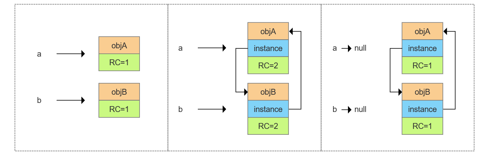

可以看到，通过引用计数算法是无法回收这两个对象的。这个看似简单的算法实际应用起来会有许多问题需要考虑，因此在 Java 虚拟机里，几乎都不采用计数算法来管理内存。

#### 可达性分析算法
##### 原理
通过一系列称为 `GC Roots` 的根对象作为起始节点集，从这些节点开始，根据引用关系向下搜索，搜索过程所走过的路径称为“引用链”（Reference Chain），如果某个对象到 GC Roots 间没有任何引用链相连时，则证明此对象是不可能再被使用的。

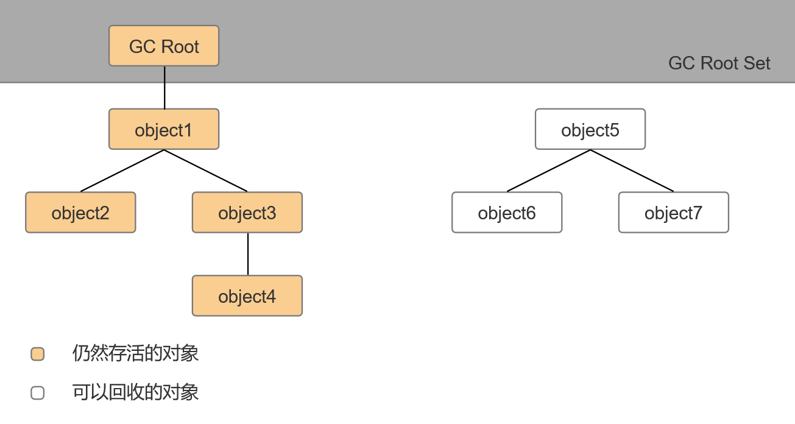

##### 固定可作为 GC Roots 的对象
1. 虚拟机栈（栈帧中的本地变量表）中引用的对象
2. 方法区中类静态属性引用的对象
3. 方法区中常量引用的对象
4. 本地方法栈中 JNI（Native 方法）引用的对象
5. 虚拟机内部的引用
6. 所有被同步锁（synchronized 关键字）持有的对象
7. 反映Java虚拟机内部情况的 JMXBean、JVMTI 中注册的回调、本地代码缓存等

### 引用的分类
无论是通过引用计数算法判断对象的引用数量，还是通过可达性分析算法判断对象是否引用链可达，判定对象是否存活都和“引用”离不开关系。“引用”这个词我们经常听到，但它到底什么呢？

程序在运行时，数据都保存在内存中，当我们想要访问这些数据时，C/C++ 是通过指针，Java 是通过引用，引用指向数据（对象）在内存中的地址。

在 JDK 1. 2 版之后，Java对引用的概念进行了扩充，将引用分为强引用（Strongly Reference）、软引用（Soft Reference）、弱引用（Weak Reference）和虚引用（Phantom Reference）4种，这4种引用强度依次逐渐减弱。

#### 强引用
强引用是指创建一个对象并把这个对象赋给一个引用变量，是传统的引用的概念。

```java
Object obj = new Object();
```

无论任何情况下，哪怕是内存溢出，只要强引用关系还存在，垃圾收集器就永远不会回收掉被引用的对象。

#### 软引用
软引用是用来描述一些还有用，但非必须的对象。只被软引用关联着的对象，在系统将要发生内存溢出异常前，会把这些对象列进回收范围之中进行第二次回收，如果这次回收还没有足够的内存，才会抛出内存溢出异常。

#### 弱引用
被弱引用关联的对象只能生存到下一次 GC ，当垃圾收集器开始工作，无论当前内存是否足够，都会回收掉只被弱引用关联的对象。

#### 虚引用
虚引用是最弱的一种引用关系（就和没有一样），为一个对象设置虚引用关联的唯一目的只是为了能在这个对象被收集器回收时收到一个系统通知。

### finalize() 方法
#### 一个现（wan）象（xiao）
C++ 程序员在转 Java 开发时经常会遇到 OOM 的问题，为什么？

C++ 程序员需要手动管理每一个对象，而 Java 替我们做好了这一切，我们可以通过构造函数随时定义一个对象，当该对象不再被使用时，不用自己去释放相应的内存空间。

除了构造函数，C++ 中还有一种与之对应的析构函数，它在对象消亡时即自动被调用，可以定义析构函数在对象消亡前做善后工作。当 C++ 程序员使用 Java 编程时，他们也希望有一种方法可以在对象消亡时调用，哎，一查发现还真有这么一个方法 finalize() 。于是他们重写了该方法，十分满意地运行起了程序，然而程序不久后就报 OOM 了。

#### 原因
要想说明原因，得从如何确定一个对象真的要被回收这个问题说起。

在可达性分析算法里被认为是不可达的对象也不一定就会被回收，一个对象真正被回收至少需要经过两次标记过程。

第一次标记在可达性分析算法里被判定为不可达，即没有与 GC Roots 相连的引用链，随后进行一次筛选，条件是没有必要执行 finalize() 方法，即对象没有重写 finalize() 方法，或者 finalize() 方法已经被虚拟机调用过。

被筛选的对象会进入一个 `F-Queue` 队列中，并在稍后由一条由虚拟机自动建立的、低调度优先级的 Finalizer 线程去执行它们的 finalize()方法。如果某个对象的 finalize() 方法执行缓慢，或者更极端地发生了死循环，将很可能导致 F-Queue 队列中的其他对象永久处于等待，甚至导致整个内存回收子系统的崩溃。

第二次标记在 F-Queue 队列里执行 finalize() 方法时，如果此时对象与引用链上的任意一个对象建立关联，那么该对象就不会被回收，否则就真要被回收了。

#### 补充
到此因该就明白了开始的问题，finalize() 方法就是 Java 刚诞生时为了使传统 C/C++ 程序员更容易接受 Java 所做出的一项妥协，finalize() 方法无法保证各个对象的调用顺序，如今已被官方明确声明为不推荐使用的语法，如果想要进行清理之类的工作，可以使用 try-finally 或者其他更好的方法代替。

## 垃圾回收算法
### 分代收集理论
#### 三条假说（经验法则）
1. 弱分代假说（Weak Generational Hypothesis）：绝大多数对象都是朝生夕灭的。
2. 强分代假说（Strong Generational Hypothesis）：熬过越多次垃圾收集过程的对象就越难以消亡。
3. 跨代引用假说（Intergenerational Reference Hypothesis）：跨代引用相对于同代引用来说仅占极少数。

基于这些假说，奠定了多款常用的垃圾收集器的一致的设计原则：收集器应该将 Java 堆划分出不同的区域，然后将回收对象依据其年龄（年龄即对象熬过垃圾收集过程的次数）分配到不同的区域之中存储。把分代收集理论具体放到现在的商用 Java 虚拟机里，设计者一般至少会把 Java 堆划分为新生代（Young Generation）和老年代（Old Generation）两个区域。

#### 一些 GC 定义
+ 部分收集（Partial GC），不完整收集整个 Java 堆的垃圾收集。 
    - 新生代收集（Minor GC/Young GC），只进行新生代的回收。
    - 老年代收集（Major GC/Old GC），只进行老年代的回收，目前只有 CMS 收集器会有单独收集老年代的行为。
    - 混合收集（Mixed GC），收集整个新生代以及部分老年代的垃圾收集。目前只有 G1 收集器会有这种行为。
+ 整堆收集（Full GC），收集整个Java堆和方法区的垃圾收集。

### 标记-清除算法（Mark-Sweep）
#### 原理
首先标记出所有需要回收的对象，然后统一回收掉所有被标记的对象（反过来标记存活的对象也可以）。


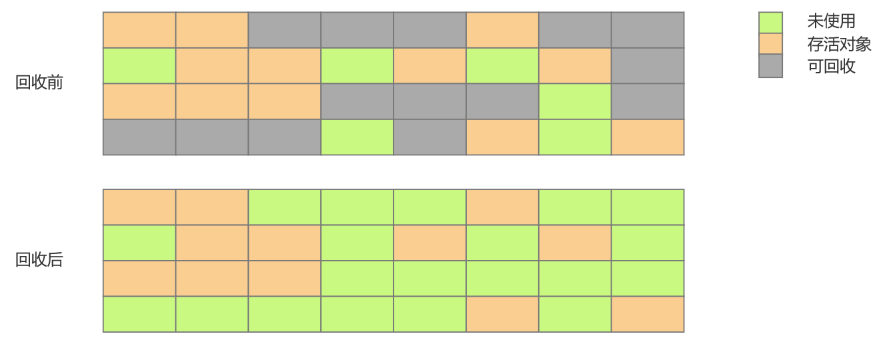

#### 优缺点
作为最基础的回收算法，它原理十分简单，但是有两个明显的缺点，一是执行效率低，二是会导致大量不连续的内存碎片。

### 标记-复制算法（Mark-Copy）
#### 原理
将可用内存按容量划分为大小相等的两块，每次只使用其中的一块。当这一块的内存用完了，就将还存活着的对象复制到另外一块上面，然后再把已使用过的内存空间一次清理掉。

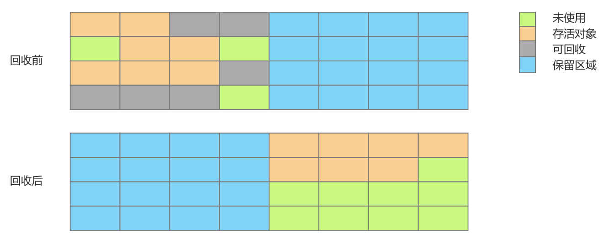

#### 优缺点
解决了面对大量可回收对象时执行效率底下和内存碎片的问题，但是产生了大量的内存复制的时间开销，而且空间浪费太多。

#### 改进
现在的商用 Java 虚拟机大多都优先采用了这种收集算法去回收新生代，但实际并没有按照 1：1 的比例划分新生代内存空间，因为经验和实验表明绝大多数对象都活不过第一轮收集。

于是在1989年，Andrew Appel 提出了一种更为优雅的分配策略，现在称为“Appel式回收”，即新生代分为一块较大的 Eden 空间，和两块较小的 Survivor 空间，每次分配内存只使用 Eden 和其中一块 Survivor。发生垃圾收集时，将 Eden 和 Survivor 中仍然存活的对象一次性复制到另外一块 Survivor 空间上，然后直接清理掉 Eden 和已用过的那块 Survivor 空间。

HotSpot 虚拟机的 Serial、ParNew 等新生代收集器也是采用这种策略划分年轻代的内存布局。HotSpot 虚拟机默认 Eden 和 Survivor 的大小比例是8∶1。

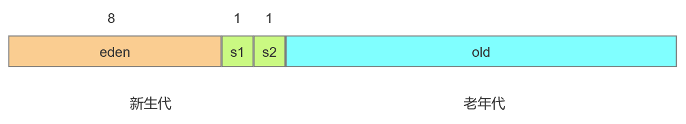

### 标记-整理算法（Mark-Compact）
#### 原理
标记过程仍然与“标记-清除”算法一样，但后续步骤不是直接对可回收对象进行清理，而是让所有存活的对象都向内存空间一端移动，然后直接清理掉边界以外的内存。

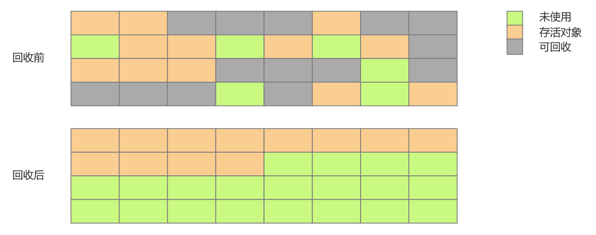

如果对象的存活率较高，标记-复制算法就需要花费很多的内存复制的时间开销，而且浪费了一半的空间。考虑到老年代的对象特征，显然是不适用于这种算法的，于是产生了这种算法。

## 常见垃圾收集器
### 分类
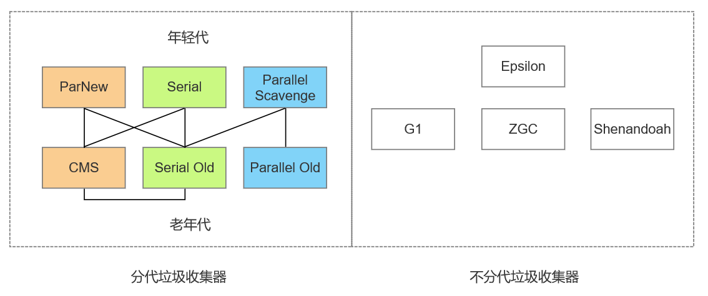

垃圾收集器分为两类，一类采用分代模型，一类采用不分代模型。

常见分代模型垃圾收集器有6种，上图所示中两种收集器之间有连线表示它们之间可以搭配使用，常见搭配为相同颜色的垃圾收集器。

其中 PS/PO 为 jdk 1.8 默认的垃圾收集器，Windows 环境可以使用以下命令查看：

```plain
java -XX:+PrintCommandLineFlags -version
```

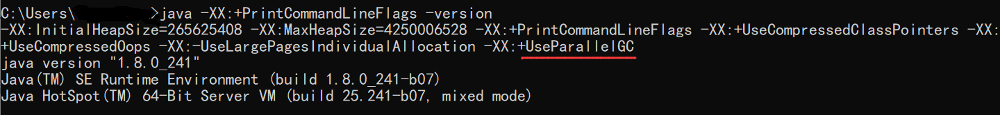

### 分代垃圾收集器
#### Serial 和 Serial Old 收集器
Serial 收集器是最基础、历史最悠久的收集器，Serial Old 就是 Serial 的老年代版本，现在基本已经不再使用。

这对收集器是单线程工作的收集器，这里单线程有两层含义：

1. 它只会使用一个处理器或一条收集线程去完成垃圾收集工作
2. 它进行垃圾收集时，必须暂停其他所有工作线程，直到它收集结束（Stop The World）

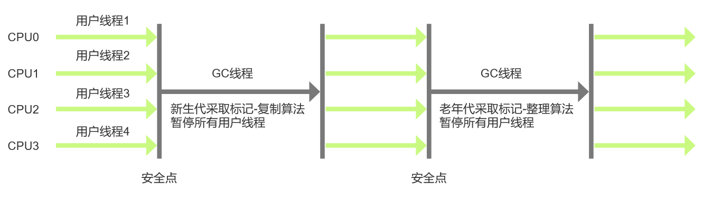

#### Parallel Scavenge 和 Parallel Old 收集器
Parallel Scavenge 收集器也是一款新生代收集器，它同样是基于标记-复制算法实现的收集器，Parallel Old 是Parallel Scavenge收集器的老年代版本，基于标记-整理算法实现，这对收集器支持多线程并行收集。

Parallel Scavenge 收集器的关注点与其他收集器不同，它的目标是达到一个可控制的吞吐量（Throughput）。所谓吞吐量就是处理器用于运行用户代码的时间与处理器总消耗时间的比值。

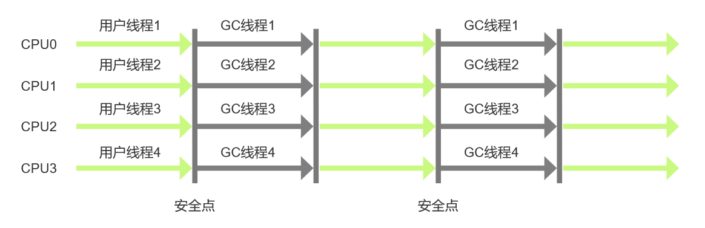

#### ParNew 收集器
ParNew 收集器实质上是 Serial 收集器的多线程并行版本，除了同时使用多条线程进行垃圾收集之外，其余的行为都与Serial收集器完全一致。除了 Serial 收集器外，目前只有它能与 CMS 收集器配合工作。

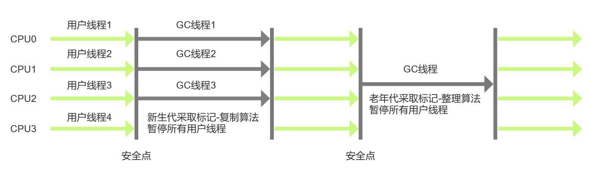

#### CMS（Concurrent Mark Sweep）收集器
CMS 收集器是一种以获取最短回收停顿时间为目标的收集器，是基于标记-清除算法实现的，它的运作过程相对于前面几种收集器来说要更复杂一些，整个过程分为四个步骤，包括：

1. 初始标记（CMS initial mark），标记 GCRoots 能直接关联到的对象，速度很快；
2. 并发标记（CMS concurrent mark），从 GC Roots 的直接关联对象开始遍历整个对象图，这个过程耗时较长但是不需要停顿用户线程，可以与垃圾收集线程一起并发运行；
3. 重新标记（CMS remark），重新标记阶段是为了修正并发标记期间，因用户程序继续运作而导致标记产生变动的那一部分对象的标记记录。
4. 并发清除（CMS concurrent sweep），清理删除掉标记阶段判断的已经死亡的对象，由于不需要移动存活对象，所以这个阶段也是可以与用户线程同时并发的。

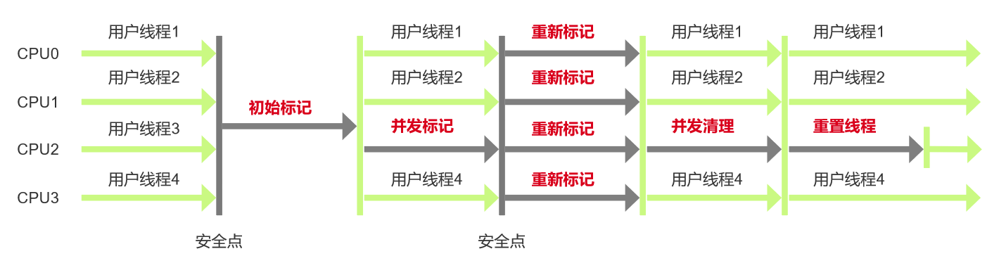

CMS 收集器是一个具有重要意义的收集器，它十分优秀，但也拥有一些问题：

1. CMS 收集器对处理器资源非常敏感，在并发阶段，它虽然不会导致用户线程停顿，但却会因为占用了一部分线程（或者说处理器的计算能力）而导致应用程序变慢，降低总吞吐量。
2. 无法处理“浮动垃圾”，有可能出现 “Con-current ModeFailure” 失败进而导致另一次完全 “Stop The World” 的Full GC的产生。
3. 内存空间碎片，CMS 是一款基于“标记-清除”算法实现的收集器。

### 不分代垃圾收集器
不分代垃圾收集器这里这给出相关概念，其内容比较复杂，感兴趣的小伙伴可以自己阅读周志明老师的《深入理解Java虚拟机》。

#### G1（Garbage First）收集器
Garbage First（简称G1）收集器是垃圾收集器技术发展历史上的里程碑式的成果，它开创了收集器面向局部收集的设计思路和基于 Region 的内存布局形式，可以面向堆内存任何部分来组成回收集（Collection Set，一般简称CSet）进行回收，衡量标准不再是它属于哪个分代，而是哪块内存中存放的垃圾数量最多，回收收益最大，这就是 G1 收集器的 Mixed GC 模式。

#### Shenandoah 收集器
Shenandoah 类似 G1，但做了很多改进，它支持并发的整理算法，（目前）是默认不使用分代收集，摒弃了在 G1 中耗费大量内存和计算资源去维护的记忆集，改用名为“连接矩阵”（ConnectionMatrix）的全局数据结构来记录跨Region的引用关系。

#### ZGC（Z Garbage Collector）收集器
ZGC 收集器是一款基于 Region 内存布局的，（暂时）不设分代的，使用了读屏障、染色指针和内存多重映射等技术来实现可并发的标记-整理算法的，以低延迟为首要目标的一款垃圾收集器。

#### Epsilon 收集器
Epsilon（A No-Op Garbage Collector）垃圾回收器控制内存分配，但是不执行任何垃圾回收工作，一旦 Java 的堆被耗尽，JVM 就直接关闭。设计的目的是提供一个完全被动的 GC 实现，最大限度降低消费内存占用量和内存吞吐时的延迟时间，用于需要剥离垃圾收集器影响的性能测试和压力测试。

## 内存分配策略
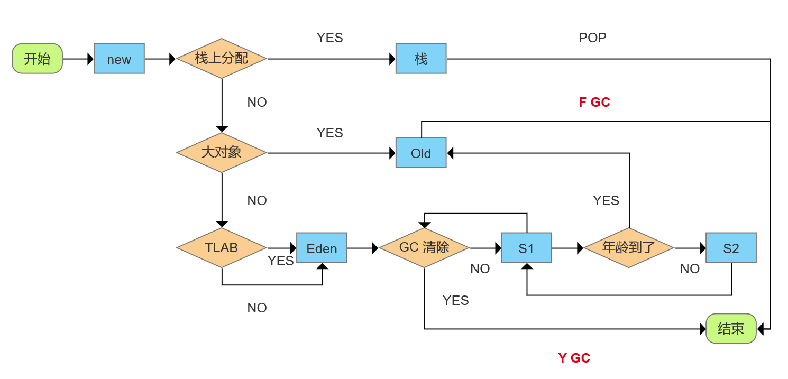

对象的内存分配，从概念上讲，应该都是在堆上分配，而实际上也有可能经过即时编译后被拆散为标量类型（标量替换）并间接地在栈上分配。

大对象指需要大量连续内存空间的对象，这部分对象不管是不是“朝生夕死”，都会直接进到老年代，这样做主要是为了避免在 Eden 区及2个 Survivor 区之间发生大量的内存复制。

JVM 给每个对象定义了一个对象年龄（Age）计数器，正常情况下对象会不断的在 Survivor 的 From 区与 To 区之间移动，对象在 Survivor 区中每经历一次 Minor GC，年龄就增加1岁。当年龄增加到指定岁数 MaxTenuringThreshold （默认15）时，就会被转移到老年代。

实际上虚拟机并不是一定要求对象的年龄必须达到了 MaxTenuringThreshold 才被转移至老年代，如果在 Survivor 空间中相同年龄所有对象大小的总和大于 Survivor 空间的一半，年龄大于或等于该年龄的对象就可以直接进入老年代，无须等到“成年”。

