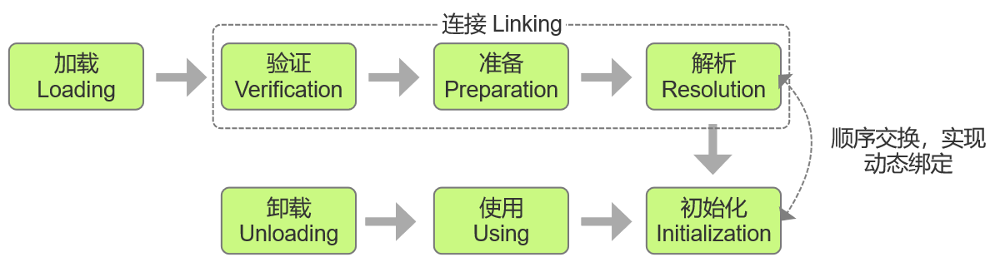
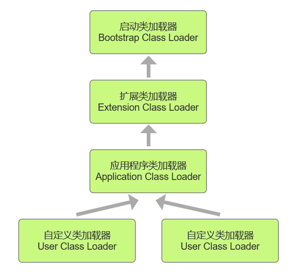

## 前言
> 代码编译的结果从本地机器码转变为字节码，是存储格式发展的一小步，却是编程语言发展的一大步。
>
> ——《深入理解 Java 虚拟机》
>

使用 Java 编写的程序经过编译器编译形成了一系列的描述类信息的 Class 文件，JVM 可以解释并运行字节码文件，但是虚拟机如何加载这些 Class 文件呢？加载后怎样使用它们？

Java 虚拟机把描述类的数据从 Class 文件加载到内存，并对数据进行校验、转换解析和初始化，最终形成可以被虚拟机直接使用的 Java 类型，这个过程被称作虚拟机的类加载机制。

## 类的加载时机
### 类的生命周期
一个类型从被加载到虚拟机内存中开始，到卸载出内存为止，它的整个生命周期将会经历加载（Loading）、验证（Verification）、准备（Preparation）、解析（Resolution）、初始化（Initialization）、使用（Using）和卸载（Unloading）七个阶段，其中验证、准备、解析三个部分统称为连接（Linking）。



### 主动引用
类是在运行期间首次使用时加载的，关于在什么时候开始“加载“这个阶段，《Java 虚拟机规范》中并没有进行强制约束，但是对于初始化这个阶段则进行了严格规定，有且只有以下六种情况必须立即对类进行“初始化”，这六种情况被称为对一个类型进行”主动引用“。

1. 遇到 new、getstatic、putstatic 或 invokestatic 这四条字节码指令时，如果类型没有进行过初始化，则需要先触发其初始化阶段。能够生成这四条指令的典型Java代码场景有：使用 new 关键字实例化对象、读取或设置一个类型的静态字段（被final修饰、已在编译期把结果放入常量池的静态字段除外）、调用一个类型的静态方法。
2. 使用 java.lang.reflect 包的方法对类型进行反射调用的时候，如果类型没有进行过初始化，则需要先触发其初始化。
3. 当初始化类的时候，如果发现其父类还没有进行过初始化，则需要先触发其父类的初始化。
4. 当虚拟机启动时，用户需要指定一个要执行的主类（包含main()方法的那个类），虚拟机会先初始化这个主类。
5. 当使用 JDK 7 新加入的动态语言支持时，如果一个 java.lang.invoke.MethodHandle 实例最后的解析结果为 REF_getStatic、REF_putStatic、REF_invokeStatic、REF_newInvokeSpecial 四种类型的方法句柄，并且这个方法句柄对应的类没有进行过初始化，则需要先触发其初始化。
6. 当一个接口中定义了 JDK 8 新加入的默认方法（被default关键字修饰的接口方法）时，如果有这个接口的实现类发生了初始化，那该接口要在其之前被初始化。

### 被动引用
除上述6种引用之外，所有引用类型的方式都不会触发初始化，称为被动引用。

1. 通过子类引用父类的静态字段，不会导致子类的初始化。

```java
class Father {
    static {
        System.out.println("Father Class Init!");
    }
    public static int x = 123;
}

class Son extends Father {
    static {
        System.out.println("Son Class Init!");
    }
}

public class Main {
    public static void main(String[] args){
        System.out.println(Son.x);
    }
}
```

输出：

```plain
Father Class Init!
123
```

2. 通过数组定义来引用类，不会触发此类的初始化。

```java
class Father {
    static {
        System.out.println("Father Class Init!");
    }
}


public class Main {
    public static void main(String[] args){
        Father[] f = new Father[10];
        System.out.println(f.length);
    }
}
```

输出：

```plain
10
```

3. 常量在编译阶段会存入调用类的常量池中，本质上并没有直接引用到定义常量的类，因此不不会触发定义常量的类的初始化。

```java
class Father {
    static {
        System.out.println("Father Class Init!");
    }
    public static final String x = "Hello world!";
}


public class Main {
    public static void main(String[] args){
        System.out.println(Father.x);
    }
}
```

输出：

```plain
Hello world!
```

## 类的加载过程
### 加载
加载阶段是类加载过程的一部分，在加载阶段，JVM 需要完成下面三件事情：

1. 通过一个类的全限定名来获取定义此类的二进制字节流。
2. 将这个字节流所代表的静态存储结构转化为方法区的运行时数据结构。
3. 在内存中生成一个代表这个类的 java.lang.Class 对象，作为方法区这个类的各种数据的访问入口。

这里获取二进制字节流文件的来源有很多种，并不一定要从某个类的 Class 文件中获取，如：

1. 从压缩包中读取，这也是 JAR、EAR、WAR 格式的基础。
2. 从网络中获取，最典型的应用场景就是 Web Applet。
3. 运行时计算生成，例如动态代理技术，在 java.lang.reflect.Proxy 使用。
4. 由其他文件生成，例如由 JSP 文件生成对应的 Class 类。
5. ...

### 验证
验证是连接阶段的第一步，这一阶段的目的是确保 Class 文件的字节流中包含的信息符合《Java虚拟机规范》的全部约束要求，保证这些信息被当作代码运行后不会危害虚拟机自身的安全。

验证阶段大致上会完成下面四个阶段的检验动作：

1. 文件格式验证，验证字节流是否符合Class文件格式的规范。
2. 元数据验证，对字节码描述的信息进行语义分析，以保证其描述的信息符合《Java语言规范》的要  
求。
3. 字节码验证，通过数据流分析和控制流分析，确定程序语义是合法的、符合逻辑的。
4. 符号引用验证，对类自身以外（常量池中的各种符号引用）的各类信息进行匹配性校验。

### 准备
准备阶段是正式为类中定义的变量（即静态变量，被 static 修饰的变量）分配内存并设置类变量初始值的阶段，这里仅是对类变量进行内存分配，而不包括实例变量，实例变量将会在对象实例化时随着对象一起分配在 Java 堆中，而类变量的初始值通常情况下为各类型的默认零值。

| 数据类型 | 零值 |
| --- | --- |
| byte | （byte）0 |
| short | （short）0 |
| int | 0 |
| long | 0L |
| float | 0.0f |
| double | 0.0d |
| char | '\u0000' |
| boolean | false |
| reference | null |


如下面的代码，类变量 x 被赋值为0，不是123。

```java
public static int x = 123;
```

而如果类字段的字段属性表中存在 ConstantValue 属性，那在准备阶段变量值就会被初始化为 ConstantValue 属性所指定的初始值，如下面的代码，x 在准备阶段被赋值为123。

```java
public static final int x = 123;
```

### 解析
解析阶段是 JVM 将常量池内的符号引用替换为直接引用的过程。

1. 符号引用（Symbolic References）：符号引用以一组符号来描述所引用的目标，符号可以是任何形式的字面量，只要使用时能无歧义地定位到目标即可。
2. 直接引用（Direct References）：直接引用是可以直接指向目标的指针、相对偏移量或者是一个能间接定位到目标的句柄。

### 初始化
类的初始化阶段是类加载过程的最后一个步骤，到这个阶段，JVM 才开始执行类中编写的 Java 代码，将主导权交给应用程序。初始化阶段也可以认为就是执行类构造器 `<clinit>()` 方法的过程。

`<clinit>()` 方法：由编译器自动收集类中的所有类变量的赋值动作和静态语句块（static{}块）中的语句合并产生的，是 Javac 编译器的自动生成物。

编译器收集的顺序是由语句在源文件中出现的顺序决定的，静态语句块中只能访问到定义在静态语句块之前的变量，定义在它之后的变量，在前面的静态语句块可以赋值，但是不能访问。

```java
public class Main {
    static {
        i = 2;
        System.out.println(i);	// 编译错误，Illegal forward reference 非法前向引用
    }
    
    static int i = 1;
}
```

```java
public class Main {
    static int i = 1;
    
    static {
        i = 2;
        System.out.println(i);	// 成功编译
    }
}
```

JVM 会保证在子类的 `<clinit>()` 方法执行前，父类的 `<clinit>()` 方法已经执行完毕，也就是说父类中定义的静态语句块要优先于子类的变量赋值操作。

```java
class Father {
    public static int i = 1;
    static {
        i = 2;
    }
}

class Son extends Father {
    public static int j = i;
}

public class Main {
    public static void main(String[] args){
        System.out.println(Son.j);	// 2	
    }
}
```

## 类加载器
### 类与类加载器
类加载过程中的加载阶段的第一步需要获得描述类的二进制字节流，实现这个过程的代码称为类加载器（Class Loader）。

对于任意一个类，都必须由加载它的类加载器和这个类本身共同确立其在 JVM 中的唯一性。所以比较两个类是否相等，只有在这两个类是由同一个类加载器加载的前提下才有意义，否则，即使这两个类来源于同一个 Class 文件，被同一个 JVM 加载，只要加载它们的类加载器不同，那这两个类就必定不相等。

### 类加载器分类
从 JVM 的角度来看，类加载器分为：

1. 启动类加载器（Bootstrap Class Loader）使用 C++ 实现，是虚拟机自身的一部分；
2. 其他所有的类加载器，由 Java 实现，独立存在于虚拟机外部，并且全都继承自抽象 java.lang.ClassLoader。

从开发人员的角度来看，类加载器分为：

1. 启动类加载器（Bootstrap Class Loader），负责加载存放在 <JAVA_HOME>\lib 目录，或者被 -Xbootclasspath 参数所指定的路径中存放的，而且是 Java 虚拟机能够识别的（按照文件名识别，如rt.jar、tools.jar，名字不符合的类库即使放在lib目录中也不会被加载）类库加载到虚拟机的内存中。
2. 扩展类加载器（Extension Class Loader），负责加载 <JAVA_HOME>\lib\ext 目录中，或者被 java.ext.dirs 系统变量所指定的路径中所有的类库，开发者可以直接在程序中使用扩展类加载器来加载Class文件。
3. 应用程序类加载器（Application Class Loader），负责加载用户类路径（ClassPath）上所有的类库，开发者同样可以直接在代码中使用这个类加载器。

### 双亲委派模型
JDK 9 之前的 Java 应用都是由上面这三种类加载器互相配合来完成加载的，如果用户认为有必要，还可以加入自定义的类加载器来进行拓展。



上图中展示的各种类加载器之间的层次关系被称为类加载器的双亲委派模型（Parents Delegation Model）。双亲委派模型要求除了顶层的启动类加载器外，其余的类加载器都应有自己的父类加载器。不过这里类加载器之间的父子关系一般不是以继承（Inheritance）的关系来实现的，而是通常使用组合（Composition）关系来复用父加载器的代码。

#### 实现
```java
protected Class<?> loadClass(String name, boolean resolve) throws ClassNotFoundException
{
    synchronized (getClassLoadingLock(name)) {
        // 首先检查请求的类是否已经加载了
        Class<?> c = findLoadedClass(name);
        if (c == null) {
            long t0 = System.nanoTime();
            try {
                if (parent != null) { // 如果父加载器不为空则调用父加载器
                    c = parent.loadClass(name, false);
                } else {
                    c = findBootstrapClassOrNull(name);
                }
            } catch (ClassNotFoundException e) {
                // 如果父类加载器抛出 ClassNotFoundException 异常，说明父类加载器无法完成请求
            }

            if (c == null) {
                // 在父类加载器无法加载时再调用本身的 findClass 方法来进行类加载
                long t1 = System.nanoTime();
                c = findClass(name);

                // this is the defining class loader; record the stats
                sun.misc.PerfCounter.getParentDelegationTime().addTime(t1 - t0);
                sun.misc.PerfCounter.getFindClassTime().addElapsedTimeFrom(t1);
                sun.misc.PerfCounter.getFindClasses().increment();
            }
        }
        if (resolve) {
            resolveClass(c);
        }
        return c;
    }
}
```

#### 工作过程
如果一个类加载器收到了类加载的请求，它首先不会自己去尝试加载这个类，而是把这个请求委派给父类加载器去完成，只有当父加载器反馈自己无法完成这个加载请求（它的搜索范围中没有找到所需的类）时，子加载器才会尝试自己去完成加载。

#### 好处
使 Java 中的类随着它的类加载器一起具备了一种带有优先级的层次关系。

### 自定义类加载器
自定义一个类加载器，加载来自文件系统中的 Class 文件。

```java
public class TestClassLoader extends ClassLoader {
    private String classFilePath;       // Class 文件路径

    // 构造方法
    public TestClassLoader(String classFilePath) {
        this.classFilePath = classFilePath;
    }
    // 重写 findClass 方法
    @Override
    protected Class<?> findClass(String name) throws ClassNotFoundException {
        // 获取该 Class 文件字节码数组
        byte[] classData = getClassFileData();
        if (classData == null) {
            throw new ClassNotFoundException();
        } else {
            // 将字节码文件数据转化成 Class 实例
            return defineClass(name, classData, 0, classData.length);
        }
    }

    private byte[] getClassFileData() {
        try {
            // 文件输入流
            InputStream ins = new FileInputStream(classFilePath);
            // 字节数组输出流
            ByteArrayOutputStream baos = new ByteArrayOutputStream();
            byte[] buffer = new byte[4096];
            int size;
            while ((size = ins.read(buffer)) != -1) {
                baos.write(buffer, 0, size);
            }
            return baos.toByteArray();
        } catch (IOException e) {
            e.printStackTrace();
        }
        return null;
    }
}
```

