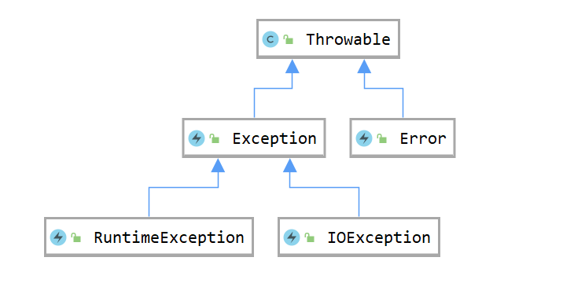
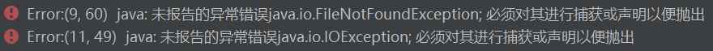

## 概念
程序都难免发生这样或那样的错误，错误大致可以分为两种，一种是编译错误，一种是执行错误。编译错误主要是因为语法问题，在程序编译过程中就可以发现，而执行错误就十分复杂，有些只有在程序执行过程中才会被发现。如何正确地处理运行时发生的错误，就是异常处理的目的所在。

异常就是程序中的一些错误，但并不是所有的错误都是异常，并且错误有时候是可以避免的。

Java 提供了一套有效的错误处理机制——异常处理，它可以监视某段代码是否会发生错误，并将各种错误进行集中处理。

## 异常的继承关系


> The `Throwable` class is the superclass of all errors and exceptions  in the Java language. Only objects that are instances of this class (or one of  its subclasses) are thrown by the Java Virtual Machine or can be thrown by the  Java `throw` statement. Similarly, only this class or one of its  subclasses can be the argument type in a `catch` clause. For the  purposes of compile-time checking of exceptions, `Throwable` and any  subclass of `Throwable` that is not also a subclass of either `RuntimeException`  or `Error` are regarded as checked  exceptions.
>
> —— Java8 API
>

所有的异常类是从 java.lang.Exception 类继承的子类。Exception 类是 Throwable 类的子类。除了 Exception 类外，Throwable 还有一个子类 Error 。

Error 用来指示运行时环境发生的错误。一般来说 Java 程序不捕获也不抛出类 Error 的对象（包括动态链接失败、虚拟机错误等），而只处理 Exception 类的各个子对象。

异常类有两个主要的子类：IOException 类和 RuntimeException 类。

## 异常的分类
异常可以分成两类，Checked Exception（检查型异常）和 Unchecked Exception （非检查型异常）。

> A method is not required to declare in its `throws` clause any  subclasses of `Error` that might be thrown during the execution of  the method but not caught, since these errors are abnormal conditions that  should never occur. That is, `Error` and its subclasses are regarded  as unchecked exceptions for the purposes of compile-time checking of  exceptions.
>
> —— Java8 API
>

> `RuntimeException` and its subclasses are unchecked  exceptions. Unchecked exceptions do not need to be declared in a  method or constructor's `throws` clause if they can be thrown by the  execution of the method or constructor and propagate outside the method or  constructor boundary.
>
> —— Java8 API
>

其中 Error 及其子类和 RuntimeException 及其子类属于非检查型异常，其他所有的异常都是检查型异常。

### Checked Exception
检查型异常。即可检查的异常，这类异常的发生是应该被预测的，比如 IOException ，或者一些自定义的异常。Java 程序必须显式地处理这类异常，否则在编译时就会发生错误，导致无法编译。

最具代表的检查性异常是用户错误或问题引起的异常，这是程序员无法预见的。例如要打开一个不存在文件时，一个异常就发生了，这些异常在编译时不能被简单地忽略。

下面是一个简单的没有对异常进行捕获或声明的按行读取 .txt 文件的例程：

```java
public class Main {
    public static void main(String[] args) {
        File file = new File("F:\\helloworld.txt");
        BufferedReader bufferedReader = new BufferedReader(new FileReader(file));
        String string;
        while ((string = bufferedReader.readLine()) != null) {
            System.out.println(string);
        }
    }
}
```

直接编译就会报下面的错误：



### Unchecked Exception
非检查型异常。即不可检查的异常，这类异常的发生是无法预测的，在编译阶段无法检测到，在运行时才会发生。

#### Error
错误不是异常，而是脱离程序员控制的问题。例如，当栈溢出时，一个错误就发生了，它们在编译也检查不到的。

#### RuntimeException
运行时异常是可能被程序员避免的异常，运行时异常可以在编译时被忽略。如除数为0的异常，数组下标越界的异常等等。

例子：

```java
public class Main {
    public static void main(String[] args) {
        for(int i = 5; i >= 0; i--){
            System.out.println(10 / i);
        }
    }
}
```

程序可以正常编译，但运行时会产生错误，程序输出结果如下：

```plain
2
2
3
5
10
Exception in thread "main" java.lang.ArithmeticException: / by zero
	at com.company.Main.main(Main.java:8)
```

## 异常的捕获与处理
### 异常处理的一般形式
```java
try{
	...	// 被监视的代码块
}
catch(<异常类1> <对象名1>){
	...	// 异常类1的异常处理代码块
}
catch(<异常类2> <对象名2>){
	...	// 异常类2的异常处理代码块
}
...		// 其他异常类
finally{
	...	// try 代码块后面执行的代码块
}
```

try 块用于监视某段代码执行过程中是否会发生异常，如果发生异常就产生异常对象并抛出；

catch 块用于捕获异常并处理它；

finally 块中的语句无论是否发生异常都会被执行，在 finally 块中可以运行一些善后性质的语句，由于 Java 中有垃圾收集器自动管理内存，所以 finally 块一般只在进行文件关闭、网络断开等情况下使用（不是强制性使用的）。

### 异常处理的过程
1. 产生异常对象（这个对象可以由系统产生，也可以在程序中用 new 创建）并中断当前的执行程序，抛出异常对象。
2. 按照程序中 catch 块的编写顺序，查找最近的异常类进行匹配（子类异常可以和父类异常匹配）。
3. 如果找到相应的 catch 块匹配，就执行该 catch 块的程序代码，执行完后再执行 try 块以外的程序。如果没有找到匹配的 catch 块，没有被捕获的异常将由默认的处理程序处理，默认异常处理程序将显示异常的相关信息，然后终止程序的执行并退出。

例子：

```java
public class Main {
    public static void main(String[] args) {
        int count = 1;

        while (count >= 0) {
            try {
                int x = 6 / count--;
                System.out.println("try 块执行");
            }
            catch (ArithmeticException e) {
                System.out.println("catch 块捕获到了异常！");
            }
            finally {
                System.out.println("finally 块执行; count = " + count);
            }
        }
        System.out.println("程序结束！");
    }
}
```

程序执行结果：

```plain
try 块执行
finally 块执行; count = 0
catch 块捕获到了异常！
finally 块执行; count = -1
程序结束！
```

### try 语句的嵌套
#### 显示嵌套
在某个方法中，某个 try 块里包含另一个 try 块，当内层的 try 块抛出异常对象时，内层的 catch 块先对异常对象进行匹配处理，如果匹配则右该 catch 块处理，否则由外层的 catch块处理。

#### 隐式嵌套
在不同的方法中，若方法1中的 try 块中调用了方法2，而方法2中也包含了 try 块，则方法1的 try 块为外层，方法2的 try 块为内层。

### throw 和 throws 语句
#### throw 语句
Java 程序中的异常一般是由系统抛出的，但是程序员也可以自己使用 throw 语句自行抛出异常，throw 语句的语法如下：

```java
throw <Throwable 类或其子类对象>
```

throw 语句执行后，其后续语句将不再执行，执行流程将直接寻找后面的 catch 语句进行异常匹配，如果匹配则执行该 catch 块的程序，没有被捕获的异常将由默认的处理程序处理，默认异常处理程序将显示异常的相关信息，然后终止程序的执行并退出。

例子：

```java
public class Main {
    public static void main(String[] args) {
        try {
            fun();
            System.out.println("不会被执行的程序");
        }
        catch (ArithmeticException e){
            System.out.println(e);
            System.out.println("捕获了人为抛出的异常");
        }
    }

    static void fun() {
        throw new ArithmeticException("这是人为抛出的异常");
    }
}
```

程序执行结果：

```plain
java.lang.ArithmeticException: 这是人为抛出的异常
捕获了人为抛出的异常
```

#### throws 语句
throws 语句用于声明一个方法可能引发的所有异常，这些异常由调用该方法的程序进行处理，throws 语句的语法如下：

```java
type <方法名> (参数表) throws 异常类型表{
	...	// 方法体
}
```

例子：

```java
public class Main {
    public static void main(String[] args) {
        try {
            fun();
        }
        catch (ArithmeticException | ArrayIndexOutOfBoundsException e){
            System.out.println(e);
        }
    }

    static void fun() throws ArithmeticException, ArrayIndexOutOfBoundsException{
        int[] nums = {1 , 0};
        for(int i = 0; i <= 2; i++){
            System.out.println(6 / nums[i]);
        }
    }
}
```

程序执行结果：

```plain
6
java.lang.ArithmeticException: / by zero
```

### 异常处理的一般准则
异常处理的目的是在程序运行的过程中捕获错误并进行响应的处理，以便程序可以在修正错误的基础上继续执行。编写异常处理代码遵行以下两个原则：

1. 尽可能在当前程序中解决问题。如果当前方法知道如何处理该异常，则用 try...catch 块来处理该异常；如果当前方法不知道如何处理该异常，则在定义该方法时声明抛出该异常，由更外层的程序处理。
2. 简化编码。不要因加入异常处理而影响程序的可读性和执行效率。

## 常见异常
### 检查型异常
| 异常 | 描述 |
| --- | --- |
| ClassNotFoundException | 应用程序试图加载类时，找不到相应的类，抛出该异常。 |
| CloneNotSupportedException | 当调用 `Object`<br/> 类中的 `clone`<br/> 方法克隆对象，但该对象的类无法实现 `Cloneable`<br/> 接口时，抛出该异常。 |
| IllegalAccessException | 拒绝访问一个类的时候，抛出该异常。 |
| InstantiationException | 当试图使用 `Class`<br/> 类中的 `newInstance`<br/> 方法创建一个类的实例，而指定的类对象因为是一个接口或是一个抽象类而无法实例化时，抛出该异常。 |
| InterruptedException | 一个线程被另一个线程中断，抛出该异常。 |
| NoSuchFieldException | 请求的变量不存在 |
| NoSuchMethodException | 请求的方法不存在 |


### 非检查型异常
| 异常 | 描述 |
| --- | --- |
| ArithmeticException | 当出现异常的运算条件时，抛出此异常。例如，一个整数"除以零"时，抛出此类的一个实例。 |
| ArrayIndexOutOfBoundsException | 用非法索引访问数组时抛出的异常。如果索引为负或大于等于数组大小，则该索引为非法索引。 |
| ArrayStoreException | 试图将错误类型的对象存储到一个对象数组时抛出的异常。 |
| ClassCastException | 当试图将对象强制转换为不是实例的子类时，抛出该异常。 |
| IllegalArgumentException | 抛出的异常表明向方法传递了一个不合法或不正确的参数。 |
| IllegalMonitorStateException | 抛出的异常表明某一线程已经试图等待对象的监视器，或者试图通知其他正在等待对象的监视器而本身没有指定监视器的线程。 |
| IllegalStateException | 在非法或不适当的时间调用方法时产生的信号。换句话说，即 Java 环境或 Java 应用程序没有处于请求操作所要求的适当状态下。 |
| IllegalThreadStateException | 线程没有处于请求操作所要求的适当状态时抛出的异常。 |
| IndexOutOfBoundsException | 指示某排序索引（例如对数组、字符串或向量的排序）超出范围时抛出。 |
| NegativeArraySizeException | 如果应用程序试图创建大小为负的数组，则抛出该异常。 |
| NullPointerException | 当应用程序试图在需要对象的地方使用 `null`<br/> 时，抛出该异常 |
| NumberFormatException | 当应用程序试图将字符串转换成一种数值类型，但该字符串不能转换为适当格式时，抛出该异常。 |
| SecurityException | 由安全管理器抛出的异常，指示存在安全侵犯。 |
| StringIndexOutOfBoundsException | 此异常由 `String`<br/> 方法抛出，指示索引或者为负，或者超出字符串的大小。 |
| UnsupportedOperationException | 当不支持请求的操作时，抛出该异常。 |


## 
