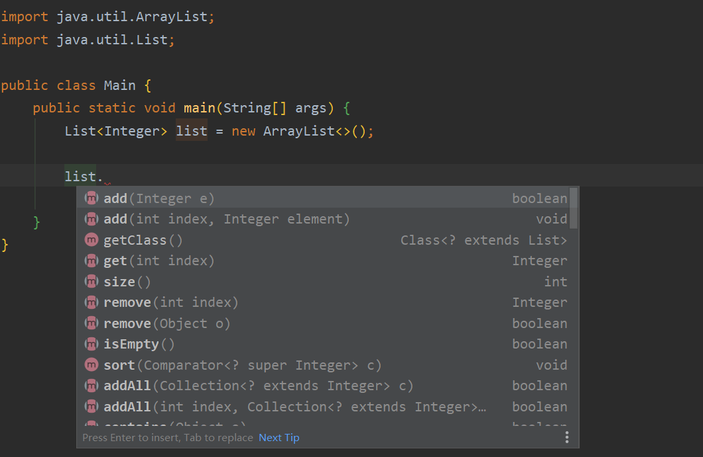

##  概念
反射是 Java 中非常重要和强大的功能特性，很多优秀的开源框架如 Spring 都是基于反射的思想实现的，那什么是反射？

> Java 的反射（reflection）机制是指在程序的运行状态中，可以构造任意一个类的对象，可以了解任意一个对象所属的类，可以了解任意一个类的成员变量和方法，可以调用任意一个对象的属性和方法。这种动态获取程序信息以及动态调用对象的功能称为 Java 语言的反射机制。反射被视为动态语言的关键。
>
> ——百度百科
>

举一个最常见的例子，当我们在程序里创建某个对象的时候，我们想要调用这个对象的某个方法，程序员很难记住所有的方法的类型、参数等信息，但是我们键入 `.` 时，IDE 会帮我们自动列出该对象的所有可以访问的方法和属性，如下图，这里就用到了反射的机制。



Java 反射机制的核心时在程序运行时动态加载类，同时获取类的所有信息，进而可以创建该类的实例、操作类的属性和方法。Java 是先编译再执行的语言，一般来说，程序中的对象在编译期已经确定了，但当程序在运行时需要动态加载以前没有用到的类就可以利用反射机制完成，不需要在编译阶段就知道运行时的对象属于哪一个类。

## 反射常用类
反射机制所需的类主要有 java.lang 包中的 Class 类和 java.lang.reflect 包中的 Constructor 类、Field 类、Method 类、Modifier 类和 Parameter 类。

### java.lang.Class
> Instances of the class `Class` represent classes and interfaces in a  running Java application. An enum is a kind of class and an annotation is a kind  of interface. Every array also belongs to a class that is reflected as a  `Class` object that is shared by all arrays with the same element  type and number of dimensions. The primitive Java types (`boolean`,  `byte`, `char`, `short`, `int`,  `long`, `float`, and `double`), and the keyword  `void` are also represented as `Class` objects.
>
> `Class` has no public constructor. Instead `Class`  objects are constructed automatically by the Java Virtual Machine as classes are  loaded and by calls to the `defineClass` method in the class loader.
>
> —— Java8 API
>

万物皆对象，类也不例外。

Class 类是一个比较特殊的类，它是反射机制的基础，Class 类的对象表示正在运行的 Java 程序中的类或接口，也就是任何一个类被加载时，即将类的 .class文件（字节码文件）读入内存的同时，JVM 都自动为之创建一个 java.lang.Class 对象，从该 Class 对象中可以获得类的许多基本信息。

枚举是一种类，注解是一种接口。每一个数组都被映射成 Class 对象的一个类，这个类被所有具有相同元素类型和维度数的数组共享。基本的 Java 数据类型（`boolean`,  `byte`, `char`, `short`, `int`,  `long`, `float`, and `double`）和 `void` 被认为是 Class 的对象。

Class 类没有公共构造方法，其对象是 JVM 在加载类时通过调用类加载器中的 defineClass() 方法创建的，因此不能显式地创建一个 Class 对象。

| 常用方法 | 描述 |
| --- | --- |
| public Package getPackage() | 返回 Class 对象对应类的包 |
| public static Class<?> forName(String className) | 返回名称为 className 的类或接口的 Class 对象 |
| public String getName() | 以字符串的形式返回由这个类对象表示的实体（类、接口、数组类、基本类型或 void）的名称 |
| public native Class<? super T> getSuperclass() | 返回 Class 对象对应类的父类 Class 对象 |
| public Class<?>[] getInterfaces() | 返回 Class 对象对应类的所有接口 |
| public Annotation[] getAnnotations() | 以数组的形式返回该类元素上的所有注解 |
| public Constructor getConstructor(Class<?>... parameterTypes) | 返回 Class 对象对应类的指定参数列表的 public 构造方法 |
| public Constructor<?>[] getConstructors() | 返回 Class 对象对应类的所有 public 构造方法 |
| public Constructor getDeclaredConstructor(Class<?>... parameterTypes) | 返回 Class 对象对应类的指定参数列表的构造方法 |
| public Constructor<?>[] getDeclaredConstructors() | 返回 Class 对象对应类的所有构造方法 |
| public Field getField(String name) | 返回 Class 对象对应类名为 name 的 public 成员变量 |
| public Field[] getFields() | 返回 Class 对象对应类的所有 public 成员变量 |
| public Field[] getDeclaredFields() | 返回 Class 对象对应类的所有成员变量 |
| public Method getMethod(String name, Class<?>... parameterTypes) | 返回 Class 对象对应类的指定参数列表的 public 方法 |
| public Method[] getMethods() | 返回 Class 对象对应类的所有 public 方法 |
| public Method[] getDeclaredMethods() | 返回 Class 对象对应类的所有方法 |


### java.lang.reflect.Constructor
> `Constructor` provides information about, and access  to, a single constructor for a class.
>
> `Constructor` permits widening conversions to occur when matching  the actual parameters to newInstance() with the underlying constructor's formal  parameters, but throws an `IllegalArgumentException` if a narrowing  conversion would occur.
>
> —— Java8 API
>

java.lang.reflect.Constructor 类是 java.lang.reflect.Executable 类的子类，用于表示类的构造方法。Constructor 类提供关于类的单个构造函数的信息和访问。

| 常用方法 | 描述 |
| --- | --- |
| public String getName() | 返回构造方法的名称 |
| public T newInstance(Object ... initargs) | 构造一个指定参数列表的对象 |
| public void setAccessible(boolean flag) | 设置构造方法的访问权限 |


`public void setAccessible(boolean flag)` 继承自 `AccessibleObject` 类，使用该方法可以设置对象的访问控制权限。

如果构造方法访问控制权限为 private ，默认是不允许使用 newInstance 方法创建对象的，如果将参数设置为 true 并执行该方法，此时可以创建构造方法控制权限为 private 的对象。

### java.lang.reflect.Field
> A `Field` provides information about, and dynamic  access to, a single field of a class or an interface. The reflected field may be  a class (static) field or an instance field.
>
> A `Field` permits widening conversions to occur during a get or  set access operation, but throws an `IllegalArgumentException` if a  narrowing conversion would occur.
>
> —— Java8 API
>

java.lang.reflect.Field 类用于封装成员变量信息。Field 类提供关于类或接口的单个属性的动态访问，反射的属性可以是类（静态）或者接口的属性。

| 常用方法 | 描述 |
| --- | --- |
| public String getName() | 返回成员变量名称 |
| public Object get(Object obj) | 获取成员变量的值 |
| public xxx getXxx(Object obj) | 获取成员变量的值，xxx 表示基本数据类型 |
| public void set(Object obj, Object value) | 设置成员变量的值 |
| public void setXxx(Object obj, xxx x) | 设置成员变量的值，xxx 表示基本数据类型，x 表示具体值 |
| public Class<?> getType() | 返回成员变量类型 |


### java.lang.reflect.Method
> A `Method` provides information about, and access  to, a single method on a class or interface. The reflected method may be a class  method or an instance method (including an abstract method).
>
> A `Method` permits widening conversions to occur when matching the  actual parameters to invoke with the underlying method's formal parameters, but  it throws an `IllegalArgumentException` if a narrowing conversion  would occur.
>
> —— Java8 API
>

java.lang.reflect.Method 类是 java.lang.reflect.Executable 类的子类，用于封装成员方法的信息。Method 类提供关于类或接口的单个方法的信息和访问，反射的方法可以是类方法或者实例方法（包括抽象方法）。

| 常用方法 | 描述 |
| --- | --- |
| public String getName() | 返回方法的名称 |
| public Class<?> getReturnType() | 返回当前方法的返回类型 |
| public Object invoke(Object obj, Object... args) | 执行指定对象中的指定参数列表的方法 |


### java.lang.reflect.Modifier
> The Modifier class provides `static` methods and  constants to decode class and member access modifiers. The sets of modifiers are  represented as integers with distinct bit positions representing different  modifiers. The values for the constants representing the modifiers are taken  from the tables in sections 4.1, 4.4, 4.5, and 4.7 of The Java™ Virtual  Machine Specification.
>
> —— Java8 API
>

Modifier 类提供静态方法和常量来解码成员访问修饰符，修饰符的集合里的修饰符用的整数来表示。

| 常用方法 | 描述 |
| --- | --- |
| public static String toString(int mod) | 将参数修饰符以字符串形式返回 |


### java.lang.reflect.Parameter
> Information about method parameters. A `Parameter`  provides information about method parameters, including its name and modifiers.  It also provides an alternate means of obtaining attributes for the  parameter.
>
> —— Java8 API
>

java.lang.reflect.Parameter类是参数类，每个Parameter对象代表方法的一个参数。Parameter 类提供关于方法参数的信息，包括其名称和修饰符，它还提供了获取参数属性的另一种方法。

| 常用方法 | 描述 |
| --- | --- |
| public int getModifiers() | 返回参数的修饰符 |
| public String getName() | 返回参数的形参名 |
| public Type getParameterizedType() | 返回带泛型的形参类型 |
| public Class<?> getType() | 返回形参类型 |
| public boolean isVarArgs() | 判断该参数是否为可变参数 |
| public boolean isNamePresent() | 判断 .class 文件中是否包含方法的形参名信息 |


## 反射的使用
下面通过具体的例子来说明反射的使用，这里定义了一个 Student 类。

```java
package com.company;

public class Student {
    public String name;	// 公有属性
    private int age;	// 私有属性

    public Student(String name) {	// 公有构造方法
        this.name = name;
    }

    private Student(String name, int age) {	// 私有构造方法
        this.name = name;
        this.age = age;
    }

    public int getAge() {
        return age;
    }

    public void setAge(int age) {
        this.age = age;
    }

    public void study() {	// 共有成员方法
        System.out.println("I love learning.");
    }
    
    private void sport() {	// 私有成员方法
        System.out.println("I like do sports.");
    }
}
```

### 获取 Class 对象
获取 Class 对象有三种方法：

1. 类名.class
2. Class.forName(类名)
3. 对象.getClass()

第一种方式需要导入类包，依赖性强。

第二种方式是最常用的，也是反射实现的基础。还可以把类名字符串写入配置文件，通过修改配置文件就可以实现动态加载类，加载数据库驱动用到的也是这种方式。

第三种需要提前构造类的对象，如果已经知道类了，反射也就用不到了。

例子：

```java
package com.company;

public class Main {
    public static void main(String[] args) {
        // 方式1
        Class studentClass1 = Student.class;
        // 方式2
        Student student = new Student("Jack");
        Class studentClass2 = student.getClass();
        // 方式3
        String className = "com.company.Student";
        Class studentClass3 = null;
        try {
            studentClass3 = Class.forName(className);
        } catch (ClassNotFoundException e) {
            System.out.println("Class not found!");
        }

        System.out.println(studentClass1 + "\n" + studentClass2 + "\n" + studentClass3);
    }
}
```

程序输出结果：

```plain
class com.company.Student
class com.company.Student
class com.company.Student
```

### 运行时创建类的对象
不同于传统的使用 new 方式创建对象，通过反射创建对象需要先通过类对象获取相应的构造方法，然后通过构造器对象实例化目标对象。

例子：

```java
package com.company;

import java.lang.reflect.Constructor;

public class Main {
    public static void main(String[] args) throws Exception {
        // 类名
        String className = "com.company.Student";
        Class studentClass = null;

        studentClass = Class.forName(className);
		// 获取该类的所有构造方法
        System.out.println("All constructor:");
        Constructor[] constructors = studentClass.getDeclaredConstructors();
        for(Constructor constructor: constructors) {
            System.out.println(constructor);
        }
		// 指定参数列表
        Class[] param = {String.class, int.class};
		// 找到该参数列表的构造方法
        Constructor con = studentClass.getDeclaredConstructor(param);
        // 设置该构造方法可以访问（无视修饰符）
        con.setAccessible(true);
		// 构造对象
        Object obj = con.newInstance("Jack", 18);
        System.out.println(obj);
    }
}
```

程序输出结果：

```plain
All constructor:
public com.company.Student(java.lang.String)
private com.company.Student(java.lang.String,int)
com.company.Student@1b6d3586
```

### 获取运行时类的成员变量
例子：

```java
package com.company;

import java.lang.reflect.Constructor;
import java.lang.reflect.Field;

public class Main {
    public static void main(String[] args) throws Exception {
        // 类名
        String className = "com.company.Student";
        Class studentClass = null;

        studentClass = Class.forName(className);
		// 获取该类的所有的成员变量
        System.out.println("All params:");
        Field[] fields = studentClass.getDeclaredFields();
        for(Field field : fields) {
            System.out.println(field);
        }
		// 构造对象
        Class[] param = {String.class, int.class};
        Constructor con = studentClass.getDeclaredConstructor(param);
        con.setAccessible(true);
        Object obj = con.newInstance("Jack", 18);
        System.out.println("before: " + ((Student) obj).getAge());
		// 获取指定字段的属性
        Field field = studentClass.getDeclaredField("age");
        // 设置该属性可访问（无视修饰符）
        field.setAccessible(true);
        // 修改该属性
        field.set(obj, 20);
        System.out.println("after: " + ((Student) obj).getAge());
    }
}
```

程序输出结果：

```plain
All params:
public java.lang.String com.company.Student.name
private int com.company.Student.age
before: 18
after: 20
```

### 获取运行时类的成员方法
例子：

```java
package com.company;

import java.lang.reflect.Constructor;
import java.lang.reflect.Method;

public class Main {
    public static void main(String[] args) throws Exception {
        // 类名
        String className = "com.company.Student";
        Class studentClass = null;

        studentClass = Class.forName(className);
		// 获取该类的所有的成员方法
        System.out.println("All methods:");
        Method[] methods = studentClass.getDeclaredMethods();
        for(Method method : methods) {
            System.out.println(method);
        }
		// 构造对象
        Class[] param = {String.class, int.class};
        Constructor con = studentClass.getDeclaredConstructor(param);
        con.setAccessible(true);
        Object obj = con.newInstance("Jack", 18);
		// 获取指定名字的方法
        Method method = studentClass.getDeclaredMethod("sport", null);
        // 设置该方法可访问（无视修饰符）
        method.setAccessible(true);
        // 执行该方法
        method.invoke(obj, null);
    }
}
```

程序输出结果：

```plain
All methods:
private void com.company.Student.sport()
public int com.company.Student.getAge()
public void com.company.Student.setAge(int)
public void com.company.Student.study()
I like do sports.
```

## 反射的优缺点
### 好处
1.  反射机制极大的提高了程序的灵活性和扩展性，降低模块的耦合性，提高自身的适应能力。 
2.  通过反射机制可以让程序创建和控制任何类的对象，无需提前硬编码目标类。 
3.  使用反射机制能够在运行时构造一个类的对象、判断一个类所具有的成员变量和方法、调用一个对象的方法。 
4.  反射机制是构建框架技术的基础所在，使用反射可以避免将代码写死在框架中。 

### 弊端
1.  性能问题。Java 反射机制中包含了一些动态类型，所以 JVM 不能够对这些动态代码进行优化。因此，反射操作的效率要比正常操作效率低很多。我们应该避免在对性能要求很高的程序或经常被执行的代码中使用反射。 
2.  安全限制。使用反射调用方法时可以忽略权限检查，没有安全方面的限制。 
3.  程序健壮性。反射允许代码执行一些通常不被允许的操作，比如突破泛型，所以使用反射有可能会导致意想不到的后果。 


## 
