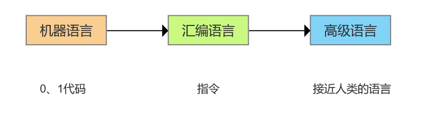
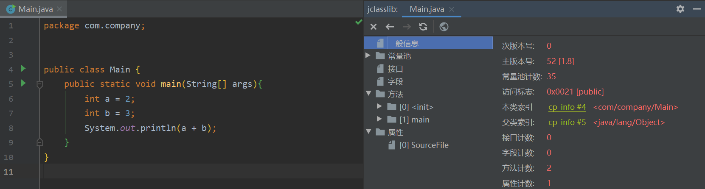

##  前言
> 代码编译的结果从本地机器码转变为字节码，是存储格式发展的一小步，却是编程语言发展的一大步。
>
> ——《深入理解 Java 虚拟机》
>

计算机自1946年诞生以来，已经发展到现在的第四代计算机，硬件采用大规模集成电路和超大规模集成电路，性能越来越强，不变的是依然利用数字电路完成对数字量的算数运算和逻辑运算。数字电路只能表示0和1，对应着电路低电平和高电平，代表逻辑上的假和真，因此计算机也只能认识0和1。

从机器语言到汇编语言，再到现在各种高级语言，从直接编写0、1代码，到现在越来越脱离计算机表示的范围，越来越接近人类的语言，晦涩难懂的程序变得容易理解，这极大地方便了程序员的编程工作。但无论我们用什么语言编写程序，最终都必须翻译成由0和1构成的二进制文件（Native Code），才能被计算机执行。

但是，现在越来越多的程序语言选择了与操作系统和机器指令集无关的、平台中立的格式作为程序编译后的存储格式，Java 就是其中一种。

## 无关性的基石
### 平台无关性
百家争鸣、百花齐放的世界固然竞争激烈，但是是缤纷多彩的，一枝独秀和垄断不是我们希望看到的。

为了能够在众多不同的的平台上无差别的运行相同的 Java 程序，出现了 JVM 。运行在不同的硬件平台和操作系统上的 JVM 不尽相同，但他们都可以解释和执行同一种平台无关的代码——字节码（Byte Code），从而实现“一次编写，到处运行”，它是构成平台无关性的基石。

### 语言无关性
然而，经过多年的发展，Java 虚拟机已经远不止于满足当初那种纯粹的实现 Java 程序平台无关的理想，而出现了语言无关性的倾向。

Java 语言的成功无疑引起了巨大的关注，商业企业和开源机构已经在 Java 语言之外发展出一大批运行在 Java 虚拟机之上的语言，如 Kotlin、Clojure、Groovy、JRuby、JPython、Scala 等。

Java 虚拟机不与包括 Java 语言在内的任何程序语言绑定，它只与 “Class文件” 这种特定的二进制文件格式所关联，Class 文件中包含了 Java 虚拟机指令集、符号表以及若干其他辅助信息。

JVM 作为一个机器无关的平台，其他的语言只要将程序编译成严格满足要求的 Class 文件，就可以运行在 Java 虚拟机上，因此实现语言无关性的基础仍然是虚拟机和字节码存储格式。

## Class 类文件的结构
### 概述
Class 文件是一组以8个字节为基础单位的二进制流，各个数据项目严格按照顺序紧凑地排列在文件之中，中间没有添加任何分隔符，这使得整个 Class 文件中存储的内容几乎全部是程序运行的必要数据，没有空隙存在。当遇到需要占用8个字节以上空间的数据项时，则会按照高位在前的方式分割成若干个8个字节进行存储。

Class 文件格式采用一种类似 C 语言结构体的伪结构体来存储数据，这种伪结构体种只有两种数据类型：无符号数和表。

1. 无符号数属于基本的数据类型，以 u1、u2、u4、u8 来分别代表1个字节、2个字节、4个字节和8个字节的无符号数，无符号数可以用来描述数字、索引引用、数量值或者按照 UTF-8 编码构成字符串值。
2. 表是由多个无符号数或者其他表作为数据项构成的复合数据类型，表用于描述有层次关系的复合结构的数据。整个Class文件本质上也可以视作是一张表，如下。

| 类型 | 名称 | 数量 | 描述 |
| --- | --- | --- | --- |
| u4 | magic | 1 | 魔数 |
| u2 | minor_version | 1 | 次版本号 |
| u2 | major_version | 1 | 主版本号 |
| u2 | constant_pool_count | 1 | 常量池容量计数器 |
| cp_info | constant_pool | constant_pool-count-1 | 常量池 |
| u2 | access_flags | 1 | 访问标志 |
| u2 | this_class | 1 | 类索引 |
| u2 | super_class | 1 | 父类索引 |
| u2 | interfaces_count | 1 | 接口计数器 |
| u2 | interfaces | interfaces_count | 接口索引集合 |
| u2 | fields_count | 1 | 字段计数器 |
| filed_info | fields | fields_count | 字段表集合 |
| u2 | methods_count | 1 | 方法计数器 |
| method_info | methods | methods_count | 方法表集合 |
| u2 | attributes_count | 1 | 属性计数器 |
| attribute_info | attributes | attributes_count | 属性表集合 |

下面是一个简单的应用程序，在 IDEA 种使用 jclasslib 插件可以清楚地看到这些 Class 文件的详细信息。

### 魔数和 Class 文件版本
每个 Class 文件的头4个字节被称为魔数（Magic Number），它的唯一作用是确定这个文件是否为一个能被虚拟机接受的 Class 文件。Class 文件的魔数值为 `0xCAFEBABE`（咖啡宝贝）。

紧接着魔数的4个字节存储的是Class文件的版本号，第5和第6个字节是次版本号（Minor Version），第7和第8个字节是主版本号（Major Version）。JDK 1.1之后的每个 JDK 大版本发布主版本号向上加1（JDK 1.0～1.1使用了45.0～45.3的版本号）

### 常量池
紧接着主、次版本号之后的是常量池入口，由于常量池中常量的数量是不固定的，所以在常量池的入口需要放置一项 u2 类型的数据，代表常量池容量计数值（constant_pool_count）。

常量池中主要存放两大类常量：字面量（Literal）和符号引用（Symbolic References）。

1. 字面量比较接近于Java语言层面的常量概念，如文本字符串、被声明为final的常量值等。
2. 符号引用则属于编译原理方面的概念，主要包括下面几类常量：被模块导出或者开放的包、类和接口的全限定名、字段的名称和描述符、方法的名称和描述符、方法句柄和方法类型、动态调用点和动态常量。

常量池中每一项常量都是一个表，截至 JDK 13，常量表中分别有17种不同类型的常量。

### 访问标志
在常量池结束之后，紧接着的2个字节代表访问标志（access_flags），这个标志用于识别一些类或者接口层次的访问信息。

| 标志名称 | 标志 | 描述 |
| --- | --- | --- |
| ACC_PUBLIC | 0x0001 | 是否为 public 类 |
| ACC_FINAL | 0x0010 | 是否被声明为 final ，只有类可以设置 |
| ACC_SUPER | 0x0020 | 是否允许使用 invokespecial 字节码指令的新语义，invokespecial 指令的语义在 JDK 1.0.2 发生过改变，为了区别这条指令使用哪种语义，JDK1.0.2之后编译出来的类的这个标志都必须为真 |
| ACC_INTERFACE | 0x0200 | 标识这是一个接口 |
| ACC_ABSTRACT | 0x0400 | 是否为 abstract 类型，对于接口或者抽象类来说，此标志值为真，其他类型值为假 |
| ACC_SYNTHETIC | 0x1000 | 标识这个类并非由用户代码产生的 |
| ACC_ANNOTATION | 0x2000 | 标识这是一个注解 |
| ACC_ENUM | 0x4000 | 标识这是一个枚举 |
| ACC_MODULE | 0x8000 | 标识这是一个模块 |

### 类索引、父类索引、接口索引
在访问标志后是类索引、父类索引和接口索引集合，类索引用于确定这个类的全限定名，父类索引用于确定这个类的父类的全限定名，接口索引集合就用来描述这个类实现了哪些接口。

由于Java语言不允许多重继承，所以父类索引只有一个，除了 java.lang.Object 之外，所有的Java类都有父类，因此除了 java.lang.Object 外，所有 Java 类的父类索引都不为0。

类索引和父类索引用两个 u2 类型的索引值表示，这两个字节保存的值为常量池中的索引值，根据索引值就能在常量池中找到这个类的全限定名。

对于接口索引集合，入口的第一项 u2 类型的数据为接口计数器（interfaces_count），表示索引表的容量。如果该类没有实现任何接口，则该计数器值为0，后面接口的索引表不再占用任何字节。

### 字段表集合
字段表（field_info）用于描述接口或者类中声明的变量，包含类级别的变量以及实例变量，但是不包含方法内部声明的局部变量。

字段表的结构如下：

| 类型 | 名称 | 数量 | 描述 |
| --- | --- | --- | --- |
| u2 | access_flags | 1 | 字段的访问标志 |
| u2 | name_index | 1 | 字段名称的索引, 名称的常量在 constant_pool 中的索引 |
| u2 | descriptor_index | 1 | 字段类型的索引, 指向一个在 constant_pool 中的常量 |
| u2 | attributes_count | 1 | 字段的基本属性数量 |
| attribute_info | attributes | attributes_count | 字段的基本属性 |

### 方法表集合
Class 文件存储格式中对方法的描述与对字段的描述采用了几乎完全一致的方式，方法表的结构如同字段表一样。

方法表的结构如下：

| 类型 | 名称 | 数量 | 描述 |
| --- | --- | --- | --- |
| u2 | access_flags | 1 | 方法的访问标志 |
| u2 | name_index | 1 | 方法名称的索引 |
| u2 | descriptor_index | 1 | 方法类型的索引 |
| u2 | attributes_count | 1 | 方法的基本属性数量 |
| attribute_info | attributes | attributes_count | 方法的基本属性 |

### 属性表集合
存放属性的基本信息，Class文件、字段表、方法表都可以携带自己的属性表集合，以描述某些场景专有的信息。

### 字节码指令
在前面的系列文章中曾经介绍过，JVM 是一个虚构出来的计算机，它没有寄存器，所以指令集是使用栈来存储中间数据，通过在实际的计算机上仿真模拟各种计算机功能来实现。JVM 本质上就是一个程序，当它在命令行上启动的时候，就开始执行保存在某字节码文件中的指令。

和实际计算机的指令格式很相似，Java 虚拟机的指令由一个字节长度的、代表着某种特定操作含义的数字（称为操作码，Opcode）以及跟随其后的零至多个代表此操作所需的参数（称为操作数，Operand）构成。

JVM 字节码指令有很多，这里不再一一列举。

