## 安装 Jenkins 镜像
### 拉取镜像
```shell
docker pull jenkins/jenkins:lts
```

目前 docker 被墙，使用 docker pull 拉取 certbot 镜像会失败，可以使用自行查找第三方镜像仓库。

我这里使用的是阿里云的镜像加速服务：

> 当前仅支持阿里云用户使用具备公网访问能力的阿里云产品进行镜像加速，且仅限于特定范围内的容器镜像。详情请见[公告](https://help.aliyun.com/zh/acr/product-overview/product-change-acr-mirror-accelerator-function-adjustment-announcement)。
>

### 运行 Jenkins 容器
```shell
docker run -it -d \
   --name jenkins \
   -p 18080:8080 \
   -p 50000:50000 \
   -v your_host_jenkins_home_dir:/var/jenkins_home \
   -e JENKINS_URL=your_domain \
   -e JAVA_OPTS=-Dhudson.security.csrf.GlobalCrumbIssuerConfiguration.DISABLE_CSRF_PROTECTION=true \
   jenkins/jenkins:lts
```

上述配置中，

`--name`，自定义容器名称；

`-p`，宿主机与容器直接端口映射，Jenkins 容器默认端口就是 8080，不需要修改。50000 端口用于 Jenkins 代理通信，不需要修改；

`-v`，将宿主机目录挂载到 Jenkins 容器的配置目录下，这样可以便于后续迁移，如果容器删除或者在其他服务器部署，保存宿主机的目录下的文件即可恢复；

`-e`，分别是 Jenkins URL 配置和跨域配置，URL 即域名访问，与后续 Nginx 配置一起使用，非必要。跨域配置是为了解决高版本 Jenkins 配置过程 403 等异常问题，禁止跨域保护可能存在安全风险，如果没问题，可以不加，非必要。

## Nginx 配置
使用 nginx 时，必须要配置反向代理，配置方式如下：

```shell
    server {
        listen   80;
        server_name  your_domain;
        location = / {
            proxy_pass http://localhost:18080;
        }
        
        location ~ .* {
            proxy_pass http://localhost:18080;
            proxy_redirect     default;
            proxy_set_header   Host               $host:$server_port;
            proxy_set_header   X-Real-IP          $remote_addr;
            proxy_set_header 	 X-Forwarded-Host   $host:$server_port;
            proxy_set_header   X-Forwarded-Server $host;
            proxy_set_header   X-Forwarded-For    $proxy_add_x_forwarded_for;
            proxy_set_header   X-Forwarded-Proto  $scheme;
        }
    }
```

Jenkins 官方文档，关于反向代理的说明，不配置或者反向代理配置错误都可能在管理页面有错误信息提示。

> [https://www.jenkins.io/doc/book/system-administration/reverse-proxy-configuration-troubleshooting/](https://www.jenkins.io/doc/book/system-administration/reverse-proxy-configuration-troubleshooting/)
>

另外反向代理错误，还有一个原因就是 Jenkins URL 设置错误，如果开启了 https，要在设置中将 URL 改为 https://your_domain.com/ 。

## Jenkins 配置
### 初始化
Jenkins 镜像运行后，可以可以通过域名访问。Jenkins 需要花费一点时间完成初始化配置，完成配置后，可以进入引导流程。

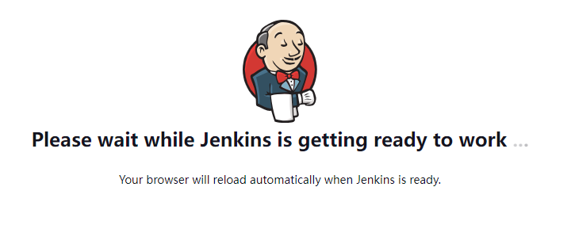

### 密码
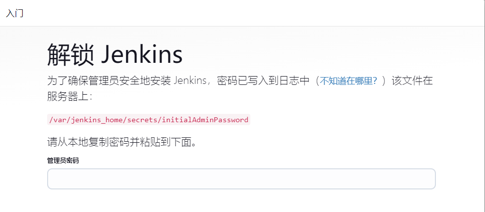

密码在容器的 /var/jenkins_home/ 目录下，宿主机看个人设置，我这里是在 /usr/local/project/personal_website/jenkins/jenkins_home/ 目录下。

cat /usr/local/project/personal_website/jenkins/jenkins_home/secrets/initialAdminPassword 即可得到初始管理员密码，页面输入密码，进入插件安装页面。

### 插件
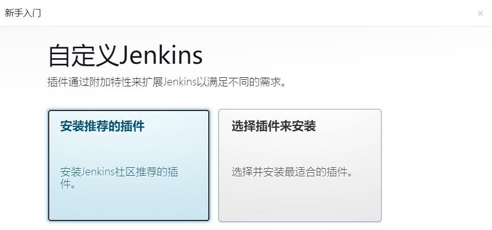

这里选择了第二个，选择插件来安装。

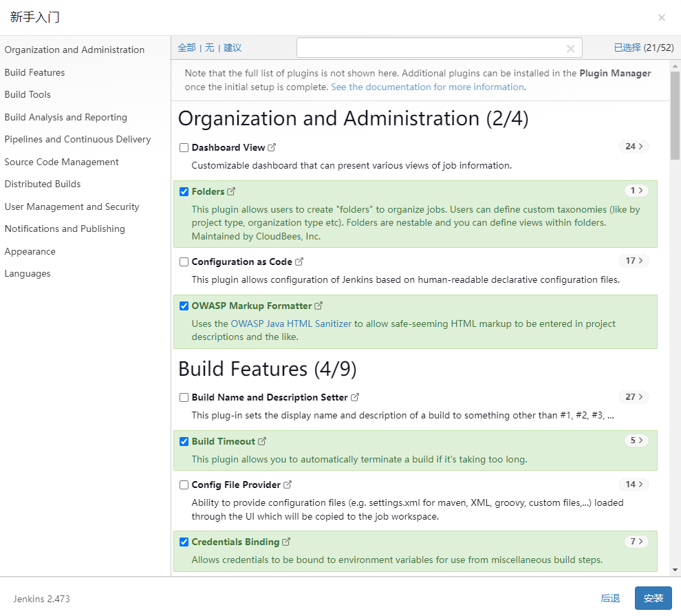

根据自身需要选择安装，我这里默认，直接按照。如果后续有需要，可以再安装，没有影响，然后等待安装完成即可。

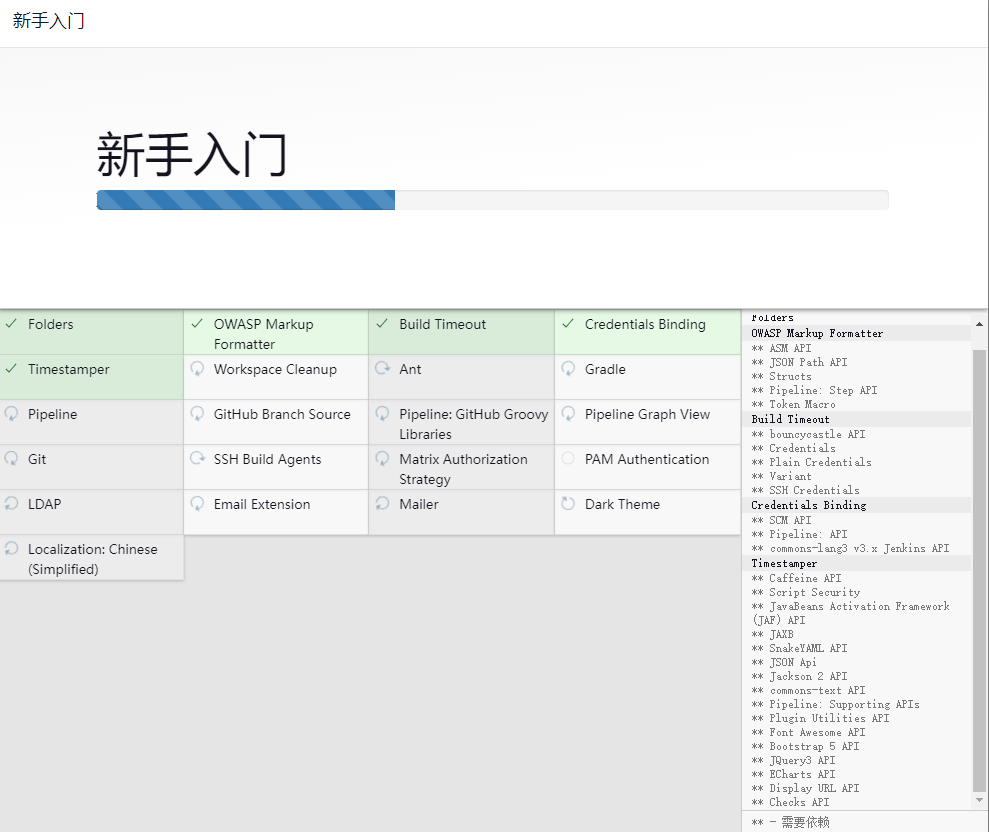

### 管理员配置
按照个人情况，配置管理员信息。

配置完管理员后，就只能通过管理员进行登录了。

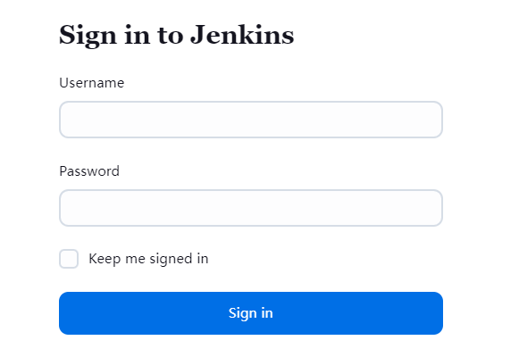

### 实例配置
配置 Jenkins URL，因为在 Jenkins 容器启动时已经配置，这里直接确认即可。

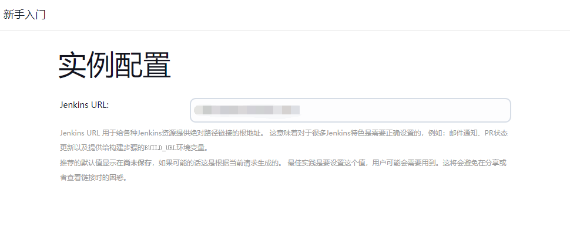

### 完成配置
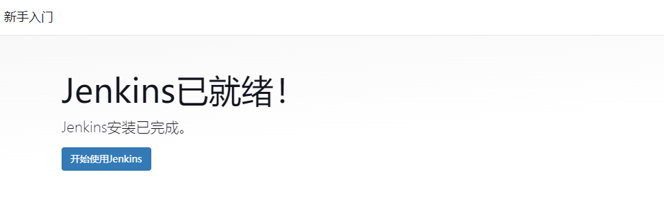


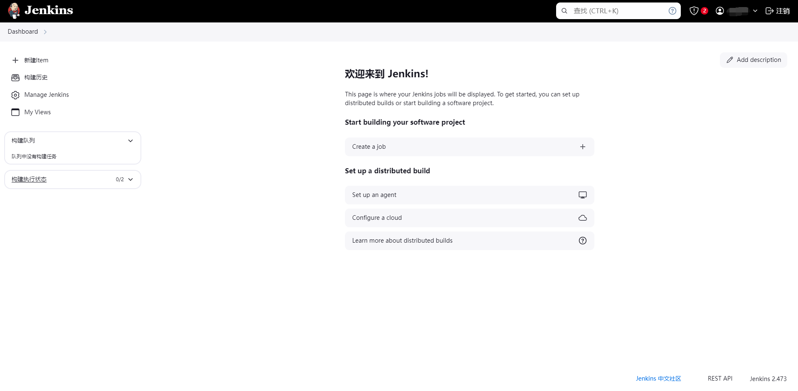

## 安全配置
Jenkins 涉及的内容与服务器直接关系，加上 Jenkins 有很多漏洞，公网上使用 Jenkins 尤其需要注意。

### SSL
SSL证书配置无需过多解释，https安全性要比http要高得多。

> 具体配置可以参考后面的博文。
>

### 节点
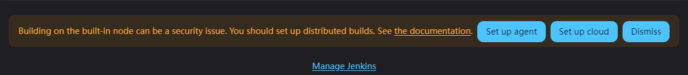

Jenkins 默认配置完成 后，会提示在主节点上执行构建有安全隐患，所以可以配置从节点，用于构建任务。

默认情况下，只有一个 master 主节点。

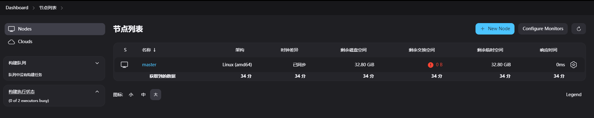

对于个人使用来说，也用不上集群构建，默认主节点即可。

