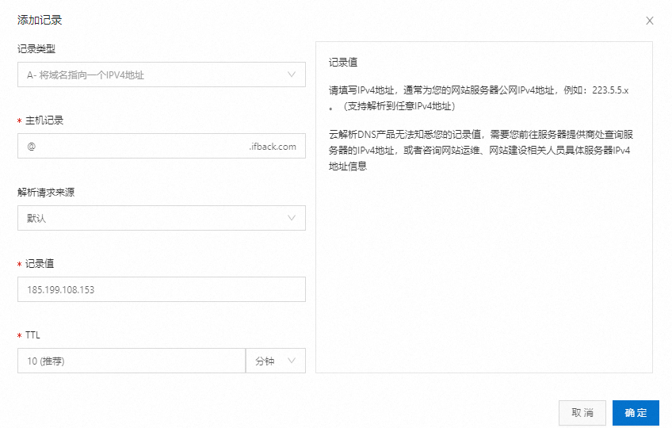
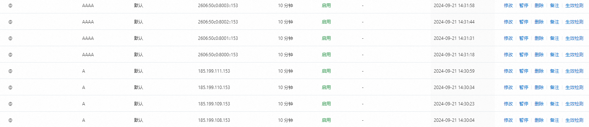
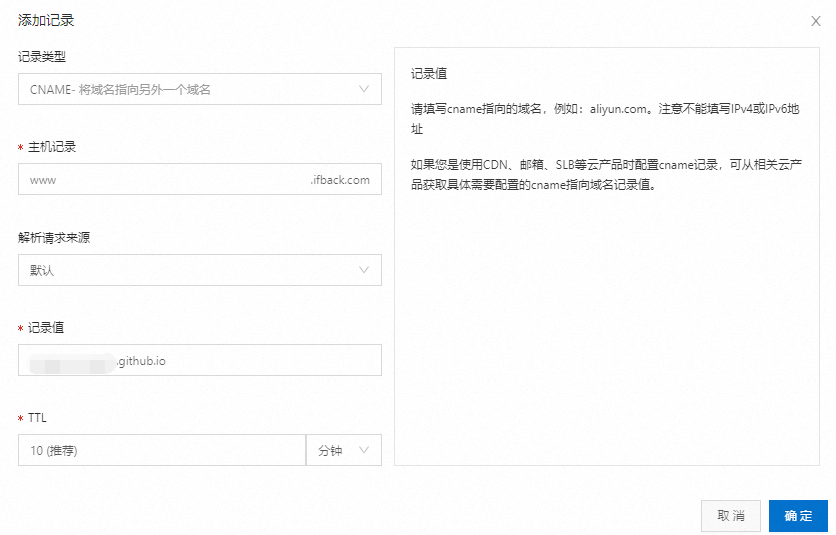
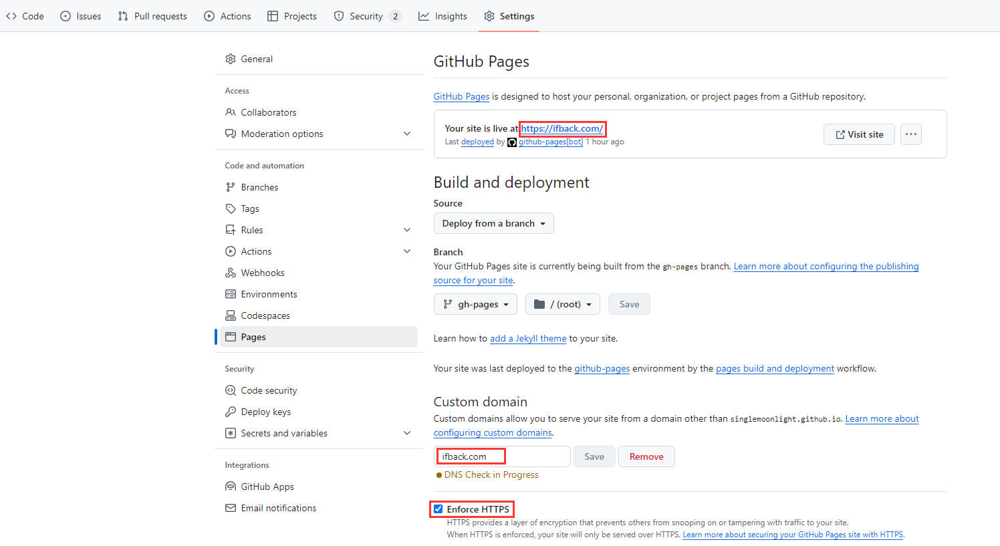
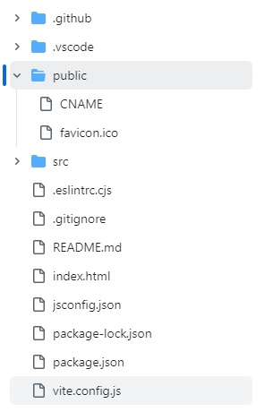

##  DNS 配置
### 顶级域名
在云服务厂商的 DNS 配置下，分别创建 IPV4 和 IPV6 的解析记录，指向 GitHub Pages 的 IP 地址，这个地址是不会变化的。

#### IPV4
`A`记录，将域名解析指向 GitHub Pages 的 IP 地址。

```shell
185.199.108.153
185.199.109.153
185.199.110.153
185.199.111.153
```

#### IPV6
`AAAA`记录，请将顶点域指向 GitHub Pages 的 IP 地址。

```shell
2606:50c0:8000::153
2606:50c0:8001::153
2606:50c0:8002::153
2606:50c0:8003::153
```

这里以阿里云为例：

全部创建完成后结果如下：



### 子域名
如果有多个网站，希望给子域名，如`www.example.com`、`blog.example.com`，需要创建将子域名指向`<user>.github.io`的`CNAME`记录。



如：


## GitHub Pages 配置
在仓库的`Setting`->`Pages`里，在自定义域名里输入 DNS 配置好的域名，点击保存，GitHub 会自动进行 DNS 校验，这个过程需要一点时间。



当校验通过以后，就可以勾选下面的强制开启 HTTPS ，没错，是不需要申请 SSL 证书的，GitHub 会自动帮申请（虽然是免费的 Let's Encrtpy ）。

再过一会儿，刷新一下，就可以看到个人站点部署完成了，可以进行访问。

## CNAME 配置
配置完后，未来肯定会有更新代码，推送提交到 GitHub 的情况，这时候会发现 GitHub Pages 绑定的域名失效了。

这是因为页面配置自定义域名本质上是在部署目录下创建了一个名为`CNAME`的文件，里面存着自定义域名，每次 push 重新构建后会被覆盖，然后丢失。

因此需要保证在打包的输出目录，能够有 CNAME 文件，这样就不用每次打包都再指定一遍。

对于 vue  项目来说，只需要将 CNAME 文件放在 public 文件夹下即可，这样构建后 CNAME 文件会保留在产物的根目录下。



