## 写在前面
个人站点使用本地化开发，本地打包后手动上传到服务器，这个流程说麻烦也麻烦，说简单也简单。如果每次一个小的改动都需要这么走一遍，也挺不爽的。借助 CI/CD 工具，自动化地完成上述步骤，连更新都会变得更有动力呢，哈哈哈。

下面实现的 CI/CD 流程如下：

1、本地开发，push 到 Github 仓库后

2、触发 Github 的钩子函数，通知 Jenkins，进行重新构建

3、Jenkins 构建完成后，将前端打包出来的 dist 目录，发送到部署的服务器上的 Nginx 容器挂载的部署目录下

4、完成部署，进行访问

## 插件安装
> docker 部署 Jenkins 可以见：[https://blog.ifback.com/article/docker-deploy-jenkins/](https://blog.ifback.com/article/docker-deploy-jenkins/)
>

在插件市场选择必须的插件进行安装，如果按照上述文章进行配置 Jenkins，这里应该只差下面几个插件。

### NodeJS
NodeJS 是 vue 项目的打包构建必备环境，不必多说。

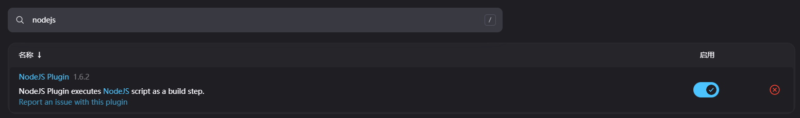

### Publish Over SSH
配置 Jenkins 与服务器之间的 SSH，用于将 Jenkins 容器中的文件上传至宿主机。

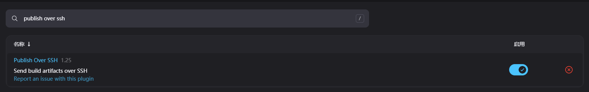

## GitHub 配置
首先要有一个 vue 项目仓库，这里以本人项目为例。

### GitHub 配置 WebHook
在项目 Setting 下选择 WebHook，点击点击 WebHook。


输入 WebHook 的基本配置：

Payload URL 为`Jenkins URL/github-webhook/`，即自己搭建的 Jenkins 服务器地址。

何时触发 WebHook，这里选择的`Just the push event`表示当有 push 时，请求上述 WebHook 地址。


### GitHub 配置 Access Token
Jenkins 访问 GitHub 需要通过令牌进行鉴权，因此需要添加 Assess Token。

在开发者设置中，选择个人令牌生成。

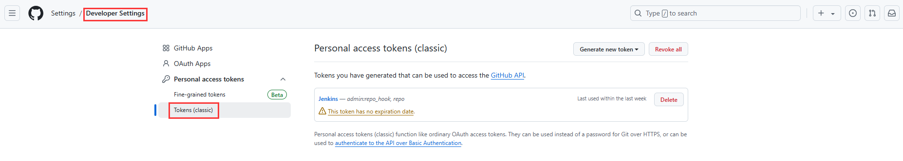

输入名字，便于区分。


勾选 repo 和 repo_hook。

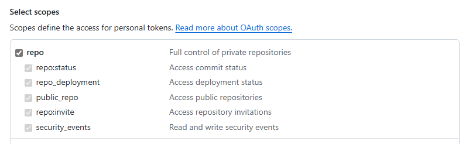

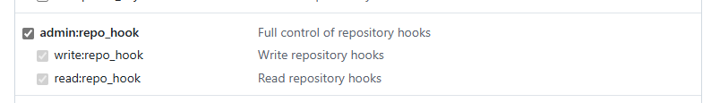

最后点击生成即可，注意需要将 token 即时保存下来，因为它只会显示一次。

## 全局凭据配置
Jenkins 提供了集中管理凭据的地方，即全局凭据配置，可以理解为密码箱，在这里可以配置所需的凭据。

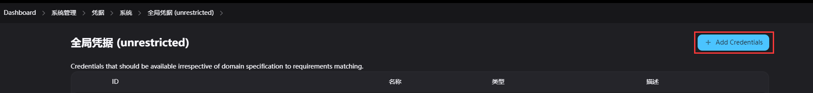

### GitHub 账号凭据
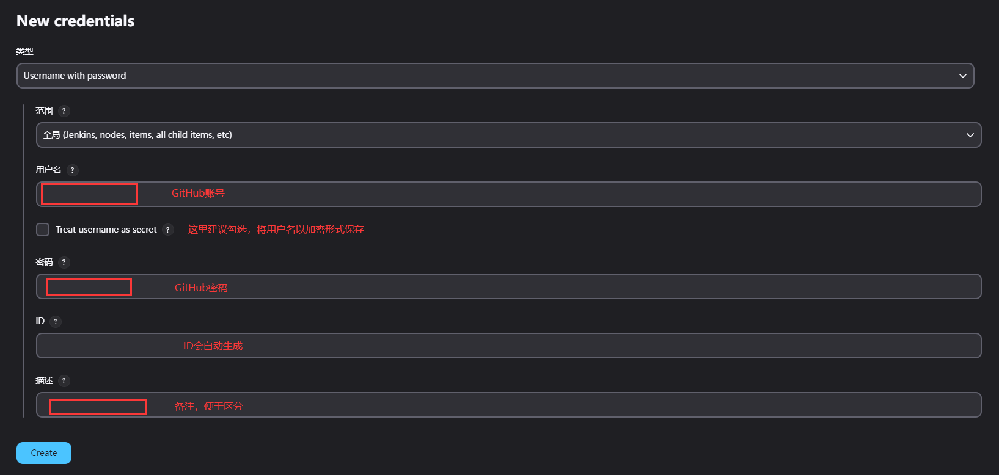

### GitHub 令牌凭据
这里要选择 Secret text，密钥就是 Assess Token。

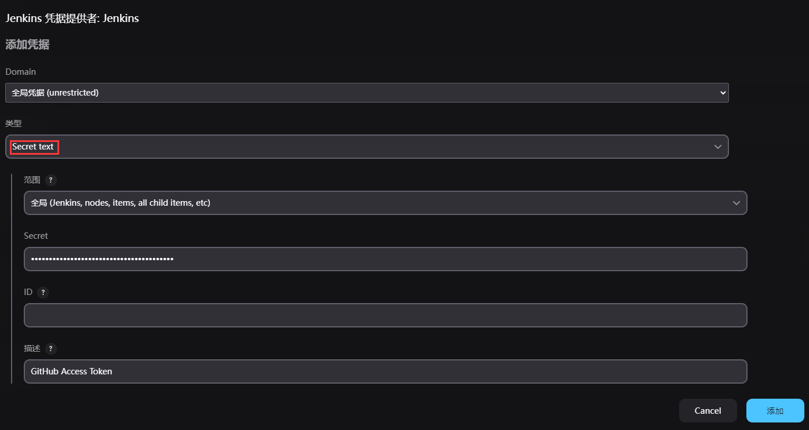

配置完成效果如下：

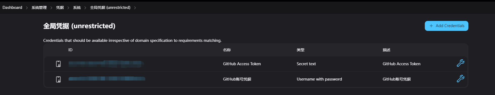

## Jenkins 插件配置
### 配置 NodeJS
在系统管理>全局工具配置里新增 NodeJS，新增安装里这里选择了镜像网站，实测使用官网下载会失败。


设置别名、版本等信息后，点击保存。


### 配置 Publish Over SSH
这里也简单记录下 SSH 配置过程：

1、首先在 Jenkins 容器里执行如下命令：

```shell
ssh-keygen -t rsa -f /var/jenkins_home/.ssh/id_rsa -N jenkins -C jenkins
```

-t，表示生成算法；

-f，表示生成文件路径以及文件名称，这里的路径是容器里的路径；

-N，表示生成是添加密码，也可以不加，不过生产过程需要手动确认；

-C，表示对生成的 SSH 密钥添加注释。

2、然后在宿主机，将生成的 SSH 公钥，即 id_rsa.pub 配置到宿主机，这里的路径是宿主机的路径。

```shell
cat jenkins_home/.ssh/id_rsa.pub > /root/.ssh/authorized_keys
```

配置完成后，在系统管理下面，找到 Publish Over SSH，输入密码、密钥路径。

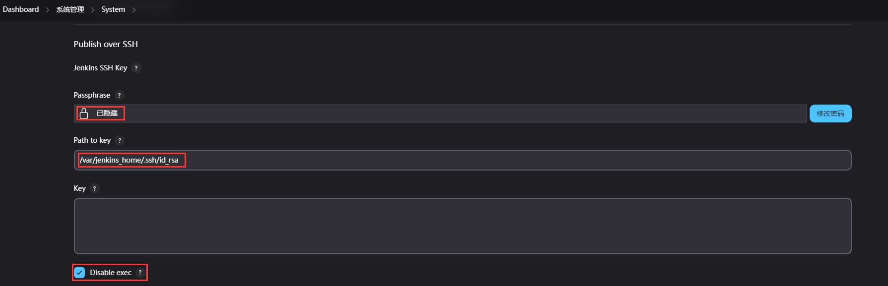

Disable exec 视情况，可以勾选也可以不勾选，勾选后就不能通过 SSH 执行宿主机命令。

然后在 SSH Server 里添加宿主机的基本信息，Name 可以自己取，Hostname 就是宿主机 IP，Username 就是宿主机用户，Remote Directory 是宿主机的目录，可以自定义，这里就定义为根目录。

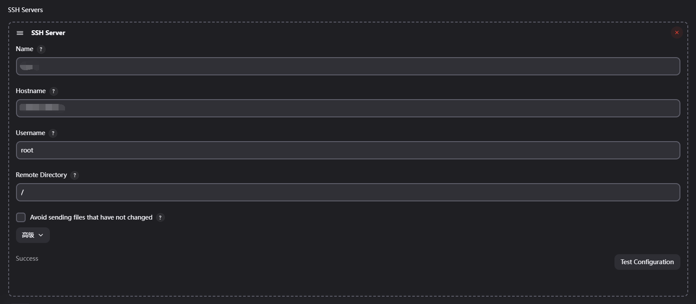

配置完成，点击测试，显示 Success 证明配置成功。

### 配置 GitHub 服务器
在系统管理里，找到添加 GitHub 服务器，然后输入服务器名称和 URL，默认已经输入好了。

凭据选择上面新增的个人令牌凭据，输入完成可以点击测试，出现下图所示 log 即为成功。

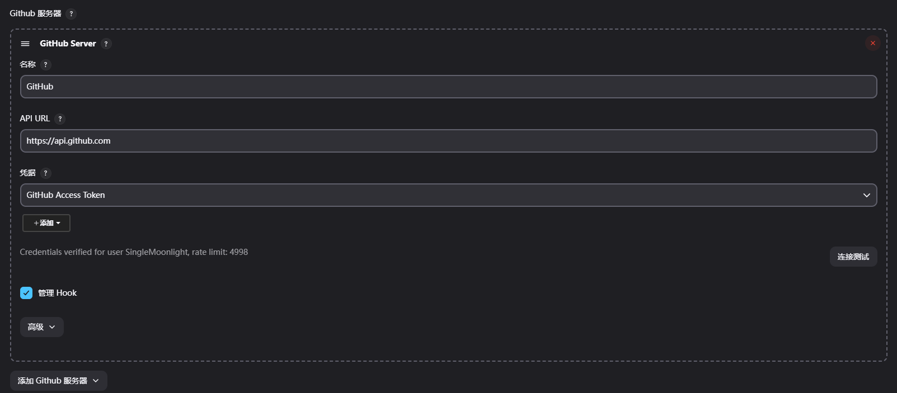

## 创建任务
完成上述配置后，就可以开始创建任务了。

输入任务命令，选择任务类型，这里选择的是自由风格软件项目，自由风格可供配置的自由度非常高，然后点击创建。

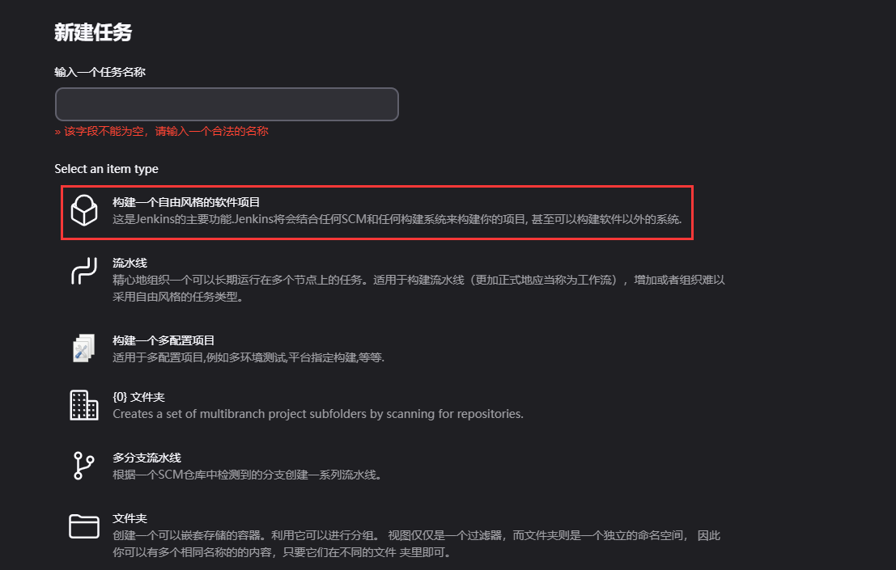

进入项目配置界面后，可以看到有六个配置项，可以根据实际情况进行配置。


下面就 GitHub vue 项目进行配置介绍。

### General
输入项目描述等，途中 GitHub 项目输入实际项目地址。

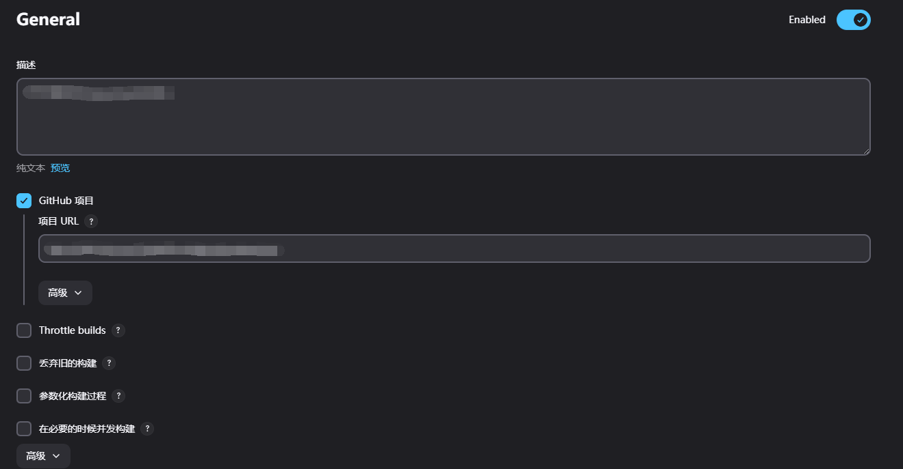

### 源码管理
源码仓库地址输入实际项目地址，凭据选择 GitHub 账号凭据，构建将通过该地址和凭据拉取代码。

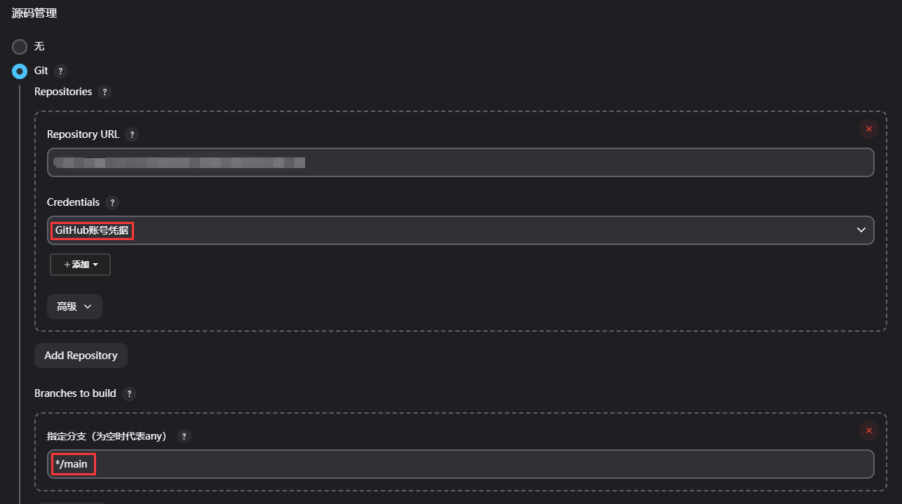

如果遇到了无权限访问 The TLS connection was non-properly terminated 的情况，可以执行如下命令。

```shell
git config --global  --unset https.https://github.com.proxy
git config --global  --unset http.https://github.com.proxy
git config --global --unset http.proxy
git config --global --unset https.proxy
```

参考：[https://zhuanlan.zhihu.com/p/436645167](https://zhuanlan.zhihu.com/p/436645167)

### 构建触发器
构建触发器选择 GitHub hook，因为前面配置了 GitHub WebHook，当我们 push 代码时，Jenkins 就会自动开始构建。


### 构建环境
构建环境需要选择 NodeJS ，这里选择前面配置的 NodeJS 20.11.0。

然后还选择了在构建日志中添加时间戳，如果有问题便于查看和分析。

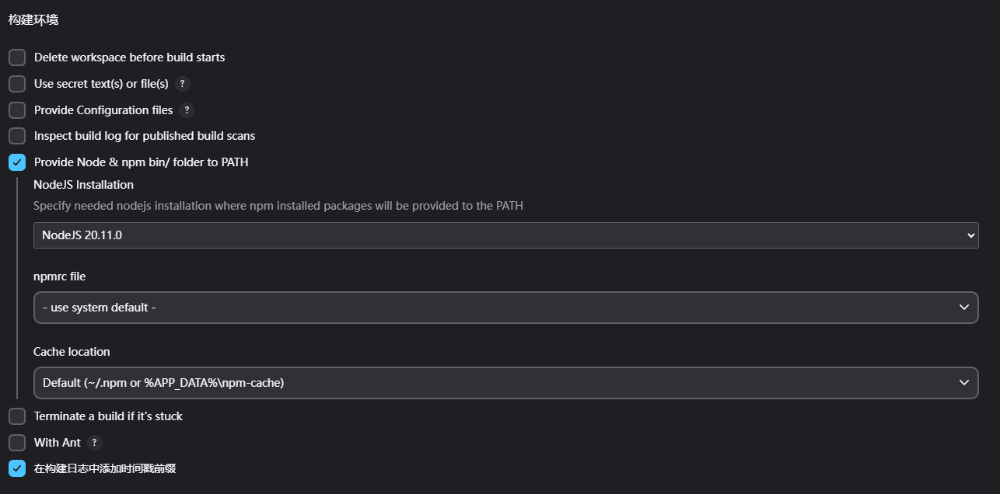

### 构建步骤
构建步骤选择添加执行 shell，内容就是构建 vue 项目的命令。

```shell
echo ">>>>>> Start build..."
npm config set registry https://registry.npmmirror.com
npm install
npm run build
echo ">>>>>> Build dist.tar.gz"
tar -czvf dist.tar.gz dist
```

当然如果有其他需求，也可以自行添加，想我这里添加了配置 npm 镜像和打包的命令。

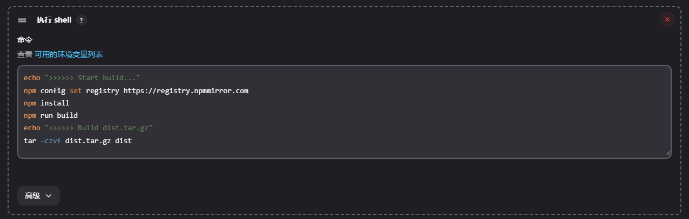

### 构建后操作
构建后操作，即完成构建后执行的操作，这里就是将构建好的 dist 文件拷贝到 nginx 配置的目录下。

添加通过 SSH 发送构建产物的操作，SSH Server 选择上面配置的宿主机。


在执行命令中，选择要执行的命令，注意这里执行是在宿主机执行。


同时我这里还添加了一个归档成品的步骤，用于保存每次构建成功的 dist 压缩包。


## 手动构建
配置完任务后，可以点击手动构建，查看构建是否符合预期。

构建过程可以在控制台输出查看，如果遇到错误可以根据报错进行解决。

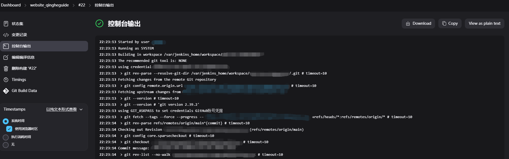

## 自动构建
在本地代码仓库推送代码到远程仓库，即可触发自动构建。

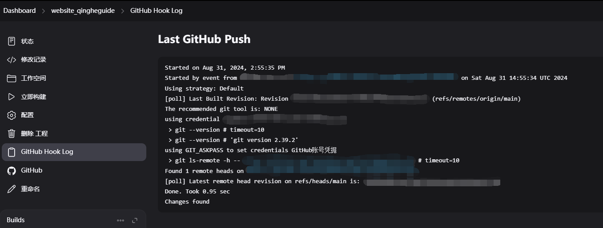

如果构建发现时间与实际时间差了 8 个小时，可以在脚本命令行处粘贴并运行如下命令：

```shell
System.setProperty('org.apache.commons.jelly.tags.fmt.timeZone','Asia/Shanghai');
```

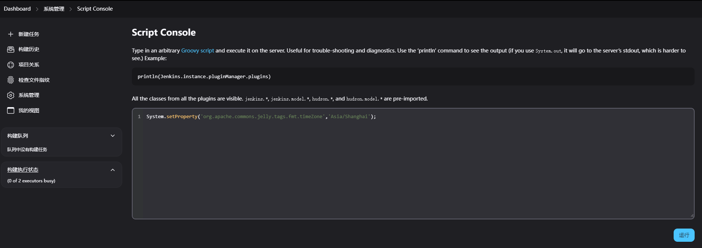

再次构建可以看到时间就正常了：

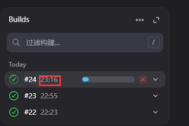

