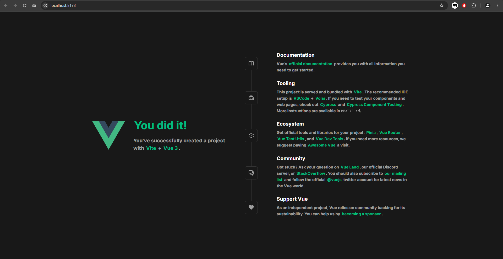
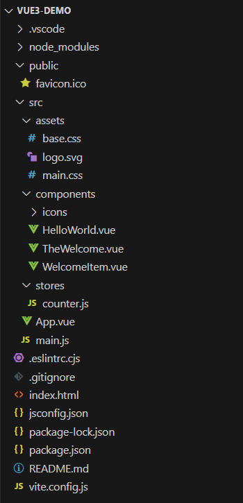

## 创建
在 CMD 或者 PS 中输入如下命令：

```shell
npm create vue@latest
```

按照步骤，根据自己需求选择即可。初始化完成结果如下：

```shell
PS E:\ProgramData\VS_code> npm create vue@latest

Vue.js - The Progressive JavaScript Framework

√ 请输入项目名称： ... vue3-demo
√ 是否使用 TypeScript 语法？ ... 否 / 是
√ 是否启用 JSX 支持？ ... 否 / 是
√ 是否引入 Vue Router 进行单页面应用开发？ ... 否 / 是
√ 是否引入 Pinia 用于状态管理？ ... 否 / 是
√ 是否引入 Vitest 用于单元测试？ ... 否 / 是
√ 是否要引入一款端到端（End to End）测试工具？ » 不需要
√ 是否引入 ESLint 用于代码质量检测？ ... 否 / 是
√ 是否引入 Prettier 用于代码格式化？ ... 否 / 是
√ 是否引入 Vue DevTools 7 扩展用于调试? (试验阶段) ... 否 / 是

正在初始化项目 E:\ProgramData\VS_code\vue3-demo...

项目初始化完成，可执行以下命令：

  cd vue3-demo
  npm install
  npm run dev

PS E:\ProgramData\VS_code>
```

## 运行
进入项目文件夹，安装依赖后运行：

```shell
PS E:\ProgramData\VS_code> cd .\vue3-demo\
PS E:\ProgramData\VS_code\vue3-demo> npm install
npm WARN deprecated inflight@1.0.6: This module is not supported, and leaks memory. Do not use it. Check out lru-cache if you want a good and tested way to coalesce async requests by a key value, which is much more comprehensive and powerful.
npm WARN deprecated @humanwhocodes/config-array@0.11.14: Use @eslint/config-array instead
npm WARN deprecated rimraf@3.0.2: Rimraf versions prior to v4 are no longer supported
npm WARN deprecated glob@7.2.3: Glob versions prior to v9 are no longer supported
npm WARN deprecated @humanwhocodes/object-schema@2.0.3: Use @eslint/object-schema instead

added 139 packages in 9s

30 packages are looking for funding
  run `npm fund` for details
PS E:\ProgramData\VS_code\vue3-demo> npm run dev

> vue3-demo@0.0.0 dev
> vite


  VITE v5.3.2  ready in 1282 ms

  ➜  Local:   http://localhost:5173/
  ➜  Network: use --host to expose
  ➜  press h + enter to show help

```

运行结果：



## 开发
项目文件结构：



之后就可以在此基础上进行开发了。

