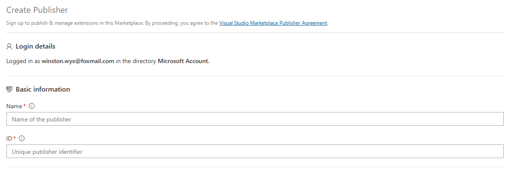
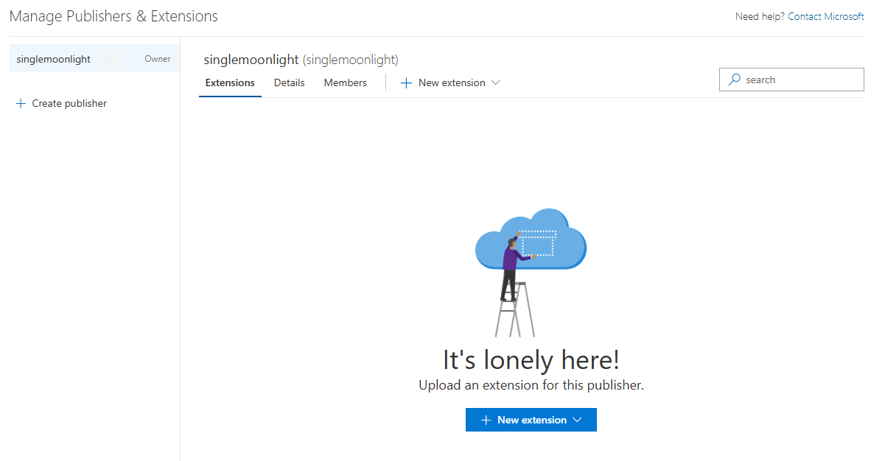
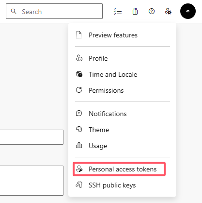
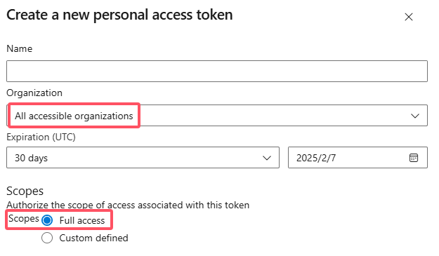
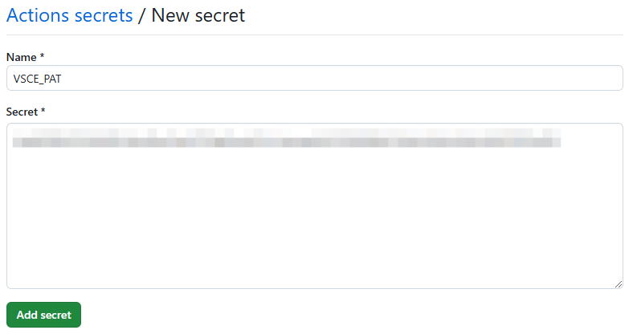
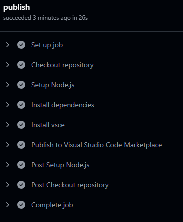
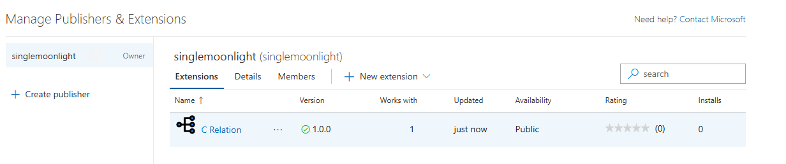
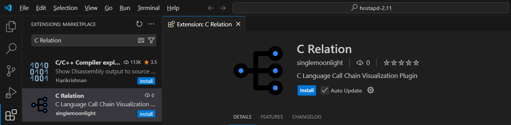

## 写在前面
为了满足自己的使用需求，这段时间抽空开发了一个 VS Code 插件，开发完成后准备打包发布。看了一下发布方式，觉得使用 vsce 命令行工具发布 VS Code 插件步骤比较繁琐，还是借助 GitHub Action 自动发布更优雅，整体过程和自动发布 npm 包基本相同，感兴趣的可以看看这一篇[文章](https://blog.ifback.com/article/automatically-publish-npm-packages-using-github-action/)。

## 创建 VS Code publisher
去微软的插件市场[官网](https://marketplace.visualstudio.com/manage/createpublisher)注册创建发布者，里面的内容只有 Name 和 ID 是必填的，其他信息都可以不填。这里的 ID 在后续发布插件的时候会用到。



填好信息后，点击创建即可。需要特别注意的是，创建 publisher 用到了谷歌的验证服务，需要保证网络能够访问谷歌验证服务，否则点击创建后是没有反应的。

创建完成后就会看到下面的界面，此时还是没有插件的。



## 生成个人访问 Token
VC Code 的应用市场基于微软自己的 Azure DevOps ，插件的身份验证、托管和管理都是在这里。如果想自动化发布插件，需要在这里创建一个 Token，后面 GitHub Action 会用到。

访问 [Azure DevOps](https://aka.ms/SignupAzureDevOps) ，如果从来没有使用过 Azure，按照提示下一步即可（登录微软账号）。

登录完成后，在页面右上角个人设置里，选择 `Personal Access Tokens` ，然后点击创建新的 Token。



给 Token 随便取一个名字，下面选项中，Organization 选择所有，Scopes 选择全部权限。



填好之后点击创建，生成的 Token 只会显示一次，记得把复制下来。

## 插件配置
在插件的 package.json 中，填写此前创建的 VS Code publisher 的 ID。

```json
{
  "publisher": "singlemoonlight"
}
```

## 配置 GitHub Action
### 创建 GitHub 仓库
创建好 GitHub 仓库，然后将插件源码推送到仓库中，这一步不必多说。

### 设置 GitHub Secret
在 GitHub 仓库中，进入 `Settings` -> `Secrets and variables` -> `Actions`。

添加一个密钥，名字比如就叫 VSCE_PAT ，并将前面创建的生成的个人访问 Token 作为值。



### 创建 GitHub Actions 工作流
在仓库的 .github/workflows 目录下创建一个 YAML 文件，例如 publish.yml。

```json
name: Publish VS Code Extension

on:
  push:
    branches: [master]

jobs:
  publish:
    runs-on: ubuntu-latest

    steps:
    - name: Checkout repository
      uses: actions/checkout@v4

    - name: Setup Node.js
      uses: actions/setup-node@v4
      with:
        node-version: 20

    - name: Install dependencies
      run: npm install

    - name: Install vsce
      run: npm install -g vsce

    - name: Publish to Visual Studio Code Marketplace
      run: vsce publish
      env:
        VSCE_PAT: ${{ secrets.VSCE_PAT }}
```

这里的触发条件是当推送新的提交到 master 分支时触发发布，可以自行修改。

创建完成后，将改 yml 改动推送到 GitHub，不出意外的话就能够完成第一次发布了，构建过程如下：



## 查看成果
GitHub Action 构建完成后，回到 VS Code 发布者[页面](https://marketplace.visualstudio.com/manage/publishers/)，就能够看到刚刚发布的插件了。



打开 VS Code 的插件市场，搜索自己的插件，也能够搜到并安装。



## 注意事项
1、 创建 VS Code publisher 需要能够访问谷歌验证服务。

2、 插件的 package.json 中需要填写仓库信息，否则在发布插件的时候会出现下面的错误：

```json
Error: Couldn't detect the repository where this extension is published. 
```

仓库信息示例：

```json
{
  "repository": {
    "type": "git",
    "url": "https://github.com/SingleMoonlight/crelation"
  }
}
```

3、 如果后面插件有更新，直接 push 到 GitHub 即可，需要注意的是版本号需要递增，这部分规则和 npm 一样。

