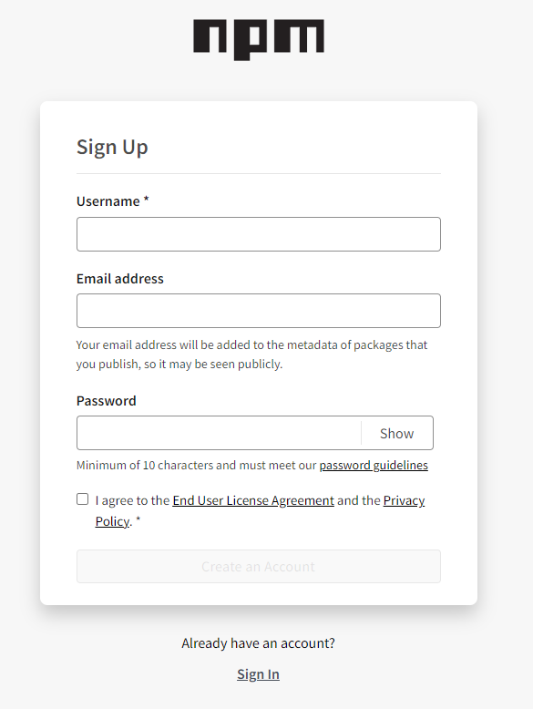
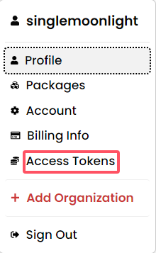
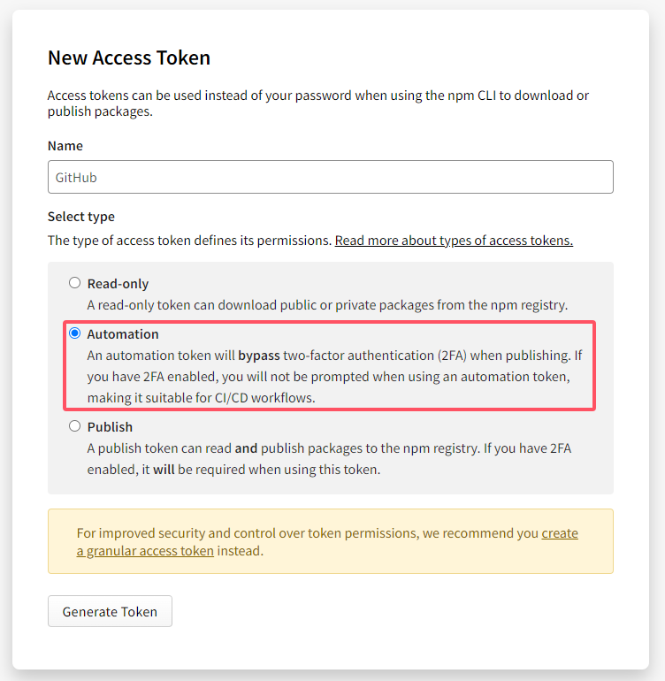
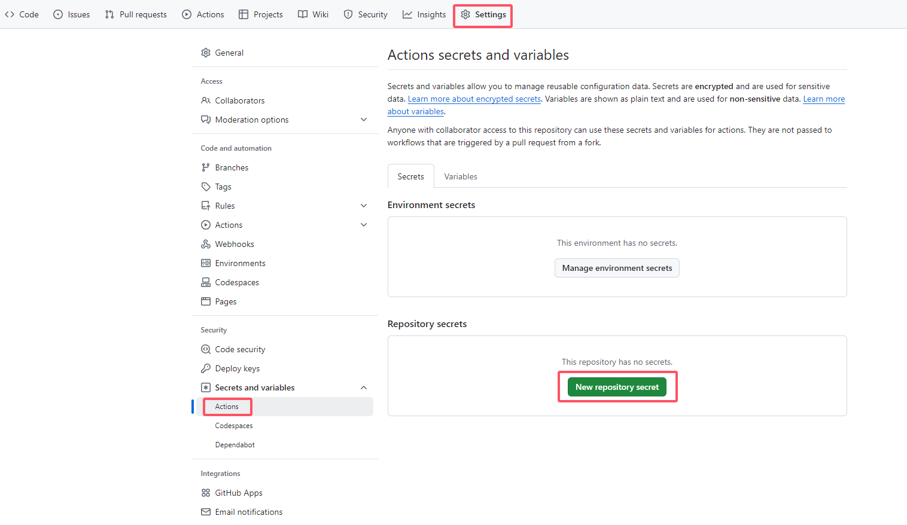
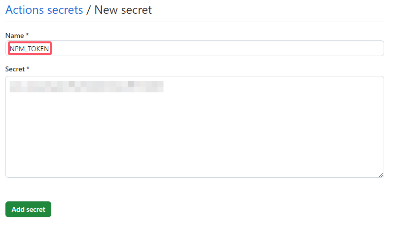

## 写在前面
如果自己开发了一个工具包，希望在不同的项目里使用，或者希望分享给别人使用，就可以将其封装上传到 npm，这样别人就可以很简单地一行命令安装和使用。

一般情况下，需要在本地项目目录下登录 npm，然后使用 publish 命令推送。如果包有更新，就需要重复执行，不够方便。加上开发基本都会用 GitHub 进行版本管理，因此就可以借助于 GitHub Action 自动发布 npm 包。

## 开始实践
### npm 账号注册
如果还没有 npm 账号，首先需要注册一个，可以访问 [npm 官网](https://www.npmjs.com/signup) 并按照提示完成注册。




### 获取 npm Access Token
注册完成后登录到 npm，点击头像，在下拉目录里选择`Access Tokens`。



点击创建新的 Token，选择下面的`Classic Token`。


然后给 Token 取一个名字，类型选择`<font style="color:rgb(6, 6, 7);">Automation</font>`。



最后点击创建，记得将 Token 复制保存下来，这里只会展示一次。


### 设置 GitHub Secret
在拿到 npm 的 Assoc Token 后，需要在 GitHub 里进行配置，后续 GitHub Action 脚本中会使用到。

在项目仓库页面，点击`Settings`->`Secrets and variables`->`Acions`->`New repository secret`。




创建一个名为`NPM_TOKEN`，值为上一步获取的 Access Token 的 secret。



### 创建 GitHub Action workflow
在仓库根目录下，创建`.github/workflows/publish.yml`文件，文件内容如下：

```bash
name: Publish Package to npmjs
on:
  push:
    branches: [master]
jobs:
  build:
    runs-on: ubuntu-latest
    permissions:
      contents: read
      id-token: write
    steps:
      - uses: actions/checkout@v4
      # Setup .npmrc file to publish to npm
      - uses: actions/setup-node@v4
        with:
          node-version: '20.x'
          registry-url: 'https://registry.npmjs.org'
      - run: npm ci
      - run: npm publish --provenance --access public
        env:
          NODE_AUTH_TOKEN: ${{ secrets.NPM_TOKEN }}
```

其中触发 GitHub Action 的动作这里设置的是有提交 push 到 master 分支，如有需要可以自行修改。

## 注意事项
### 包名
公共空间的 npm 的包名是不能重复的，可以在 npm 官网搜索查看是否有重名的包，或者使用以下命令来检查包名是否已被注册。如果返回了版本号，说明该包名已被注册；如果没有返回任何信息或返回 404 错误，则说明包名可用。

```bash
npm view package-name version
```

这时候可以选择：

1. 更改包名
2. 使用命名空间

命名空间就是账户名，如果确实想用某个包名，但是它已经被占用了，可以通过添加命名空间来创建一个新的包名。例如，如果cool-ui已经被占用，可以使用@yourname/cool-ui这样的命名空间来注册 npm 包。

### 仓库信息
在 package.json 中需要声明具体的代码仓库信息，如下：

```bash
{
  "repository": {
    "type": "git",
    "url": "https://github.com/SingleMoonlight/YuqueExporter.git"
  }
}
```

如果不声明的话，会在自动构建过程中出现以下错误：

```bash
npm error code E422
npm error 422 Unprocessable Entity - PUT https://registry.npmjs.org/@singlemoonlight%2fyuque-exporter - Error verifying sigstore provenance bundle: Failed to validate repository information: package.json: "repository.url" is "", expected to match "https://github.com/SingleMoonlight/YuqueExporter" from provenance
```

### 版本号
发布 npm 包时需要更新版本号，否则会出现以下错误：

```bash
npm error code E403
npm error 403 403 Forbidden - PUT https://registry.npmjs.org/@singlemoonlight%2fyuque-exporter - You cannot publish over the previously published versions: 1.0.0.
```

