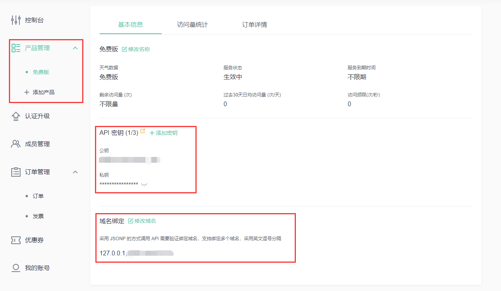

没想到一个简单的 API 请求，调通花了我一个小时，只能说官网文档描述的不够清晰，而且不同文档之间还有出入，挺让人迷糊的。

下面完整记录一下流程，其实真的很简单。

## 准备工作
### 获取公钥和私钥
使用 jsonp 请求天气数据，必须要通过公钥签名的方式进行请求，不能通过私钥请求。

当你添加了 API 产品后，即可在`控制台`->`产品管理`中点击某个产品，查看该 API 产品的密钥，这里用的就是免费版。



### 配置域名
心知天气回对发起请求的原站做域名校验，只有绑定的域名才被准许请求，对于本地调试来说，就需要绑定一个 `127.0.0.1`，见上图。

同时本地开发环境也需要修改，vue 默认的预览地址是 localhost，也需要改成 `127.0.0.1`。我这里使用的是 vite，在 defineConfig 中添加 server 成员即可。

```javascript
export default defineConfig({
  // 其他配置
  server: {
      host: '127.0.0.1',
      port: 8080,
    },
})
```

## jsonp 封装
jsonp 请求比较具有工具性质，可以单独封装一下，后面也可以重复使用，这里直接给出我写的接口，里面有详细注释，后面使用均基于此。

```javascript
export function jsonpRequest(url, callbackName) {
    return new Promise((resolve, reject) => {
        // 检查 URL 是否已经包含 callback 参数
        let urlAlreadyHasCallback = /[?&]callback=/.test(url);
        let scriptSrc = url;
        let actualCallbackName = callbackName;

        if (!urlAlreadyHasCallback) {            
            // 使用用户指定的 callbackName 或生成一个唯一的回调函数名
            actualCallbackName = `${callbackName}_${Date.now()}_${Math.random().toString(16).slice(2)}`;
        }

        // 定义全局的回调函数
        window[actualCallbackName] = function (data) {
            // 调用对应的 resolve 函数
            resolve(data);
            // 移除回调函数
            delete window[actualCallbackName];
            // 移除 script 标签
            let script = document.querySelector(`script[src*="${actualCallbackName}"]`);
            if (script) {
                document.body.removeChild(script);
            }
        };

        if (!urlAlreadyHasCallback) {
            scriptSrc = url + (url.indexOf('?') === -1 ? '?' : '&') + 'callback=' + actualCallbackName;
        }

        // 创建一个 script 标签
        let script = document.createElement('script');
        script.type = 'text/javascript';
        script.src = scriptSrc;
        script.onerror = function () {
            reject(new Error('JSONP request failed'));
            // 移除回调函数
            delete window[actualCallbackName];
            document.body.removeChild(script);
        };

        // 添加 script 标签到文档中
        document.body.appendChild(script);
    });
}
```

## 请求 URL 构建
这里以查询地址为例（因为需要地址 ID 去查询天气，这个是基础）。

### 确定请求 API
心知天气的 API，查询地址的 API 如下：

```javascript
https://api.seniverse.com/v3/location/search.json
```

其中请求所需参数为 `q=查询文本`。

### 确认 jsonp API 参数
通过 jsonp 请求，除了基本的 API 参数外，还需要额外的公钥、时间戳、保活时间、回调函数，其中保活时间不是必须的。

```javascript
let params = {
    q: searchText,
    public_key: import.meta.env.VITE_APP_XINZHI_WEATHER_PUBLIC_KEY,
    ts: Date.now(),
    ttl: 300,
    callback: callbackName,
};
```

### 计算签名
使用上一步的所有参数通过特定算法进行计算，具体步骤如下：

1、将所有参数按照 `key=value` 的格式字典序升序进行排列，中间用`&`进行连接。对于本请求，就是下面这样：

```javascript
callback=callbackName&public_key=your_public_key&q=beijing&ts=1727534325845&ttl=300
```

2、使用私钥，对上一步产生的字符串进行 HMAC-SHA1 的方式做哈希运算得到二进制结果，并用 Base64 的方式编码，得到一串哈希字符串。

3、再将上一步的哈希字符串做 URLEncode 编码，即可得到最终的签名。

看起来很复杂，实际很简单，这里直接贴出计算代码，需要注意的是，首先要安装 `crypto-js` 库：

```javascript
npm install crypto-js
```

然后就可以计算签名了：

```javascript
import CryptoJS from "crypto-js"

function generateSig(params, privateKey) {
    // 先按照键的字典序升序排列所有的键值对
    let entries = Object.entries(params).sort((a, b) => a[0].localeCompare(b[0]));
    // 将键值对转换为 "key=value" 格式
    let keyValuePairs = entries.map(([key, value]) => `${key}=${value}`);
    // 将键值对连接成字符串
    let paramsString = keyValuePairs.join('&');
    // 生成签名
    let sig = encodeURIComponent(
        CryptoJS.HmacSHA1(paramsString, privateKey)
            .toString(CryptoJS.enc.Base64));

    return sig;
}
```

### 拼接最终 URL
计算完签名后，需要把签名在拼接到上一步排列好的字符串后面，即在后面加上 `&sig=sigString` 。

其实可以在上一步一并完成，这里合并为一个新的接口：

```javascript
function (params) {
    // 先按照键的字典序升序排列所有的键值对
    let entries = Object.entries(params).sort((a, b) => a[0].localeCompare(b[0]));
    // 将键值对转换为 "key=value" 格式
    let keyValuePairs = entries.map(([key, value]) => `${key}=${value}`);
    // 将键值对连接成字符串
    let paramsString = keyValuePairs.join('&');
    // 生成签名
    let sig = encodeURIComponent(
        CryptoJS.HmacSHA1(paramsString, import.meta.env.VITE_APP_XINZHI_WEATHER_PRIVATE_KEY)
            .toString(CryptoJS.enc.Base64));
    paramsString += '&sig=' + sig;

    return paramsString;
}
```

## 测试请求
结合封装好的 jsonp，就可以进行请求测试了：

```javascript
function searchLocation(searchText) {
    return new Promise((resolve, reject) => {
        let searchLocationUrl = 'https://api.seniverse.com/v3/location/search.json';
        let callbackName = 'jsonpCallback_searchLocation';
        let params = {
            q: searchText,
            public_key: import.meta.env.VITE_APP_XINZHI_WEATHER_PUBLIC_KEY,
            ts: Date.now(),
            ttl: 300,
            callback: callbackName,
        };
        let paramsString = generateRequestParamsString(params);
        searchLocationUrl += '?' + paramsString;
        jsonpRequest(searchLocationUrl, callbackName)
            .then(data => {
                if (data.results.length > 0) {
                    resolve(data.results);
                } else {
                    reject(data);
                }
            })
            .catch(error => {
                reject(error);
            });
    })
}
```

上述代码除了公钥和私钥需要自行替换外，可以直接使用，一共三个接口 `jsonpRequest`、`generateRequestParamsString`、`searchLocation`。搜索地址的接口也可以根据实际情况修改为其他业务，比如查询当前的天气，获取未来的天气等等。

