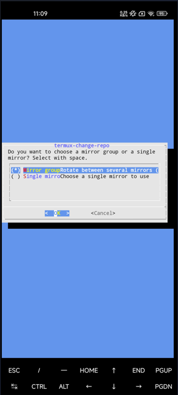
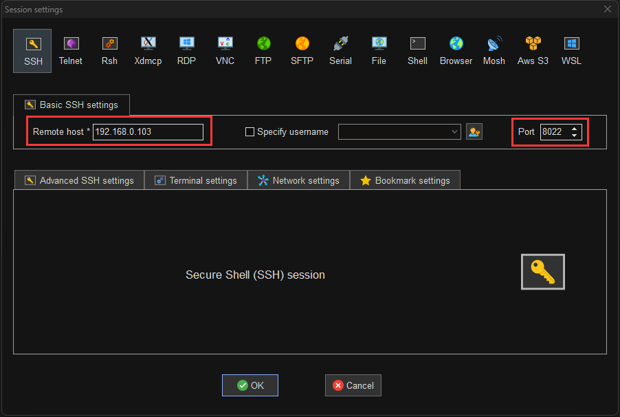
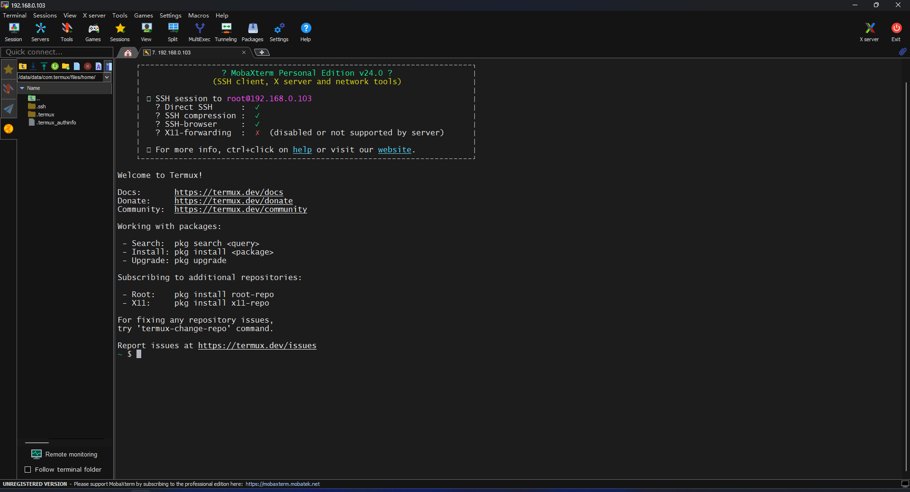
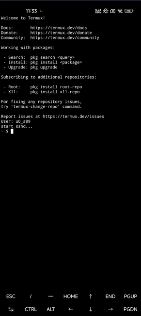
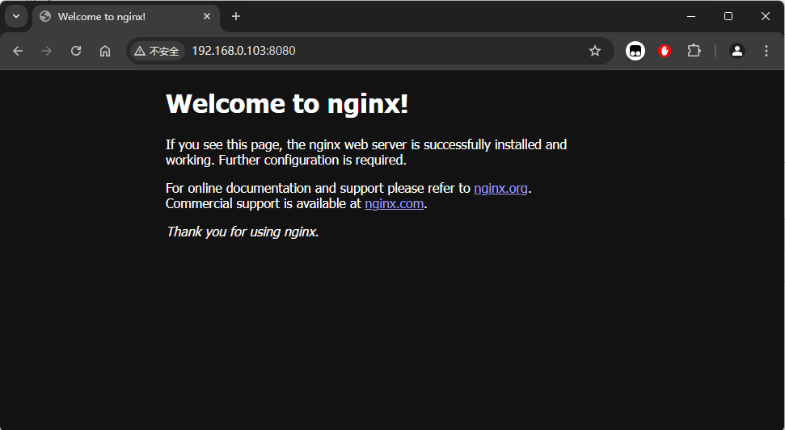

## 写在前面
之前折腾个人网站的时候用云服务器，想到云服务器本质就是一个跑程序的 Linux 系统，想到用闲置的安卓手机是不是也可以，于是用淘汰下来的安卓手机试着部署了个人网站。

当然，这样部署的网站只能在局域网内访问，如果要想实现公网访问，要么通过内网穿透，要么想办法获取公网 IP。IPV4 地址获取的难度比较大（几乎不可能），不过 IPV6 公网地址获取还是比较容易的，而且现在的手机都是默认开启 IPV6 的，通过 IPV6 访问也算是个不错的选择。

后面再专门写一篇文章介绍如何让本次搭建的网站（或者其他方式搭建的局域网网站）通过域名即公网进行访问。

## 准备工作
一台安卓手机，手机不需要 root 。本篇文章使用的手机是小米 11，系统是 HyperOS。

一台电脑。

## 开始实践
### 安装 Termux
> Termux 是一个 Android 终端模拟器和 Linux 环境应用程序，允许用户在 Android 设备上无需 root 权限即可运行 Linux 命令行工具和软件。
>

Termux 软件商店里应该是没有的，Termux [官网](https://termux.dev/cn/)也提供了项目的 GitHub 地址，可以在 GitHub 项目 Releases 中下载安装包，要注意选择相应的版本，这里选择的是 ARM64 位版。

下载后安装，系统可能会提示风险，继续安装即可。

### Termux 换源
首次安装时，Termux 没有配置软件源，需要先配置源，才能下载和更新软件包。

```javascript
termux-change-repo
```

输入上述命令后，会出现一个 GUI 页面，在图形界面引导下，使用自带方向键可上下移动。



第一步使用空格选择需要更换的仓库，之后在第二步选择相应镜像源。确认无误后回车，镜像源会自动完成更换。

### SSH 远程连接
手机端页面和命令行输入不方便，为了后续方便起见，还是通过 SSH 远程连接至手机的 Termux。

#### 安装 SSH Server
```javascript
#安装OpenSSH
$ pkg install openssh

#运行SSH Server
$ sshd

#设置密码
$ passwd 
```

注意设置的密码在后面 SSH 远程登录的时候会用到。

> Termux 默认包管理工具是 pkt。
>

#### 查看 IP
就像远程云服务器一样，首先确认一下手机的 IP 地址，可以通过如下命令查看，或者直接在手机 WiFi 管理页面查看。

```javascript
ifconfig
```

#### 远程连接
SSH 远程连接需要一个 PC 端的终端工具，此类工具有很多，比如 Xshell、putty 等，这里使用的是 MobaXterm，免费好用。MobaXterm [官网](https://mobaxterm.mobatek.net/)，直接下载安装即可。

> 每个人可能习惯用的工具不太一样，只要能用 SSH 就好。
>



需要注意的是，默认端口号是 `8022`，而不是 `22`。

设置好后，输入用户名和密码登录，用户名为 `root`，密码为上一步设置的，连接成功后类似这样。后面就可以在 PC 端进行操作了。



#### 设置 sshd 自启动
手机端每次 Termux 退出重新打开，都需要重新运行 sshd，不是很方便，因此我们可以设置 sshd 开机自动启动。

Termux 默认没有文本处理工具，可以根据个人习惯选择安装，这里使用的是 `vim`。

> 如果使用 MobaXterm 的话，可以在窗口右侧直接看到文件，双击即可在 PC 端进行编辑，很方便，推荐试一试。
>

编辑 `.bashrc` 文件：

```javascript
# 安装 vim
pkg install vim

# 编辑 .bashrc 文件
vim ~/.bashrc
```

在文件中添加如下内容：

```javascript
echo 'User: '$(whoami)

if pgrep -x "sshd" > /dev/null
then
  echo "sshd is running..."
else
  sshd
  echo "start sshd..."
fi
```

保存后，每次启动 Termux 软件就可以自动运行 sshd 了。



### 后台运行
安卓系统可能会杀掉运行中的不活跃应用，为了保证 Termux 一直运行，可以将其设为后台常驻。对于小米手机来说，在后台页面下拉即可。

### 固定 IP
手机连接 WiFi 后，每次 IP 地址可能发生变化，这样 PC SSH 连接手机还需要修改 IP 地址，比较麻烦。可以在手机 WiFi 页面，在连接 WiFi 前，选择静态 IP 地址，注意要与路由的网段保持一致。

### 配置 Nginx
#### 安装 Nginx
```javascript
# 安装 nginx
~ $ pkg install nginx
# 查看 nginx 版本
~ $ nginx -v
nginx version: nginx/1.27.
```

#### 运行 Nginx
```javascript
~ $ nginx
```

nginx 运行起来后，就可以在同一局域网下的设备浏览器中访问 nginx 默认网站了，地址为 `IP:8080`，PC 浏览器查看运行效果如下：



#### 部署个人网站
nginx 的默认配置文件和网站代码在如下目录中，剩下的就是将自己的网站代码上传到 Termux 中，然后配置 nginx.conf 即可，这里就不再展示了。

```javascript
# nginx 配置文件
/data/data/com.termux/files/usr/etc/nginx/nginx.conf
# 网站代码
/data/data/com.termux/files/usr/share/nginx/html
```

#### 设置 Nginx 开机自启动
和前面 sshd 一样，nginx 默认是不会开机启动的，需要进行配置。

编辑 `.bashrc` 文件，在其中添加如下内容：

```javascript
if pidof -x "nginx" > /dev/null
then
  echo "nginx is running..."
else
  nginx
  echo "start nginx..."
fi
```

这样每次开启 Termux 软件后，就会自动运行 nginx。

