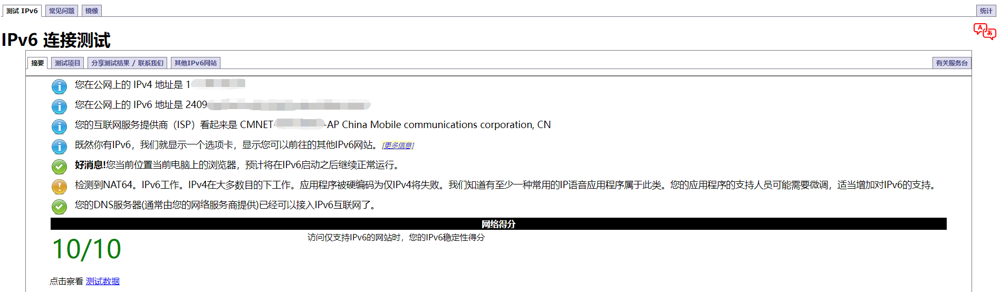
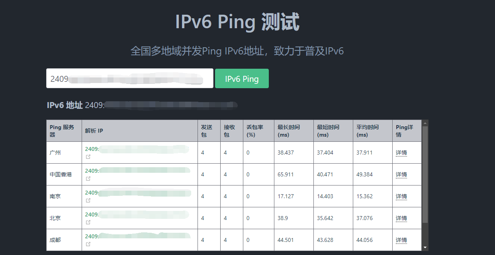
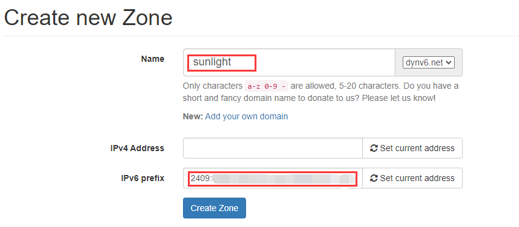
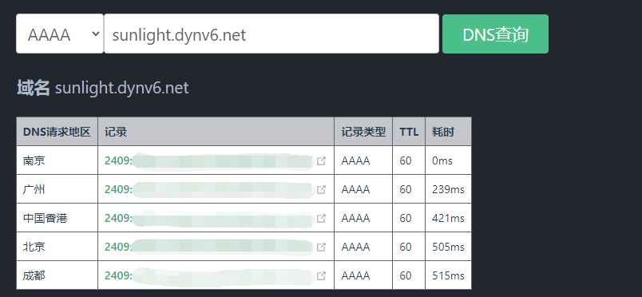
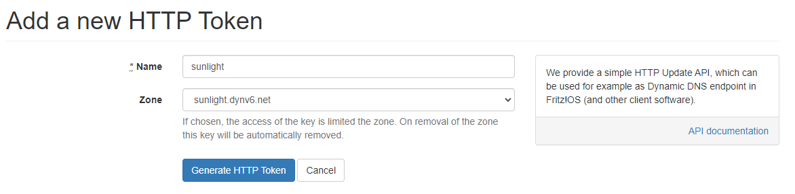
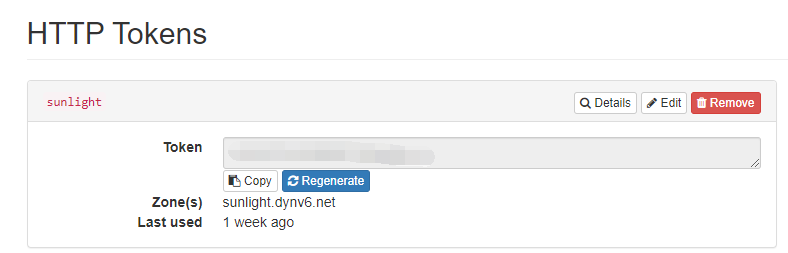
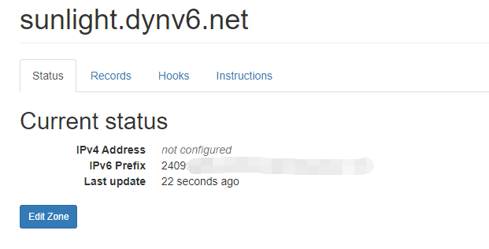
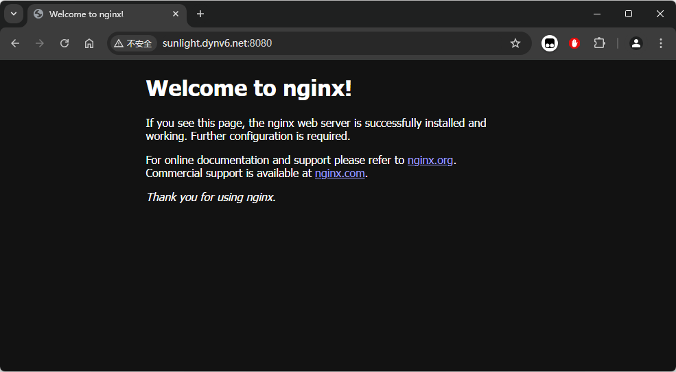
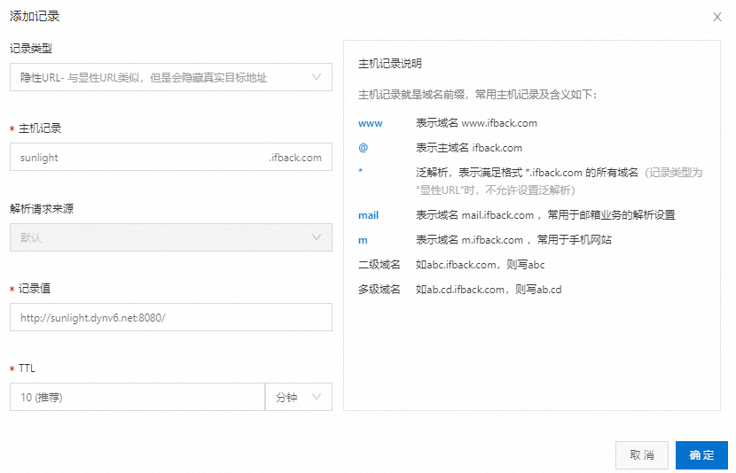

## 写在前面
如果想让局域网的个人网站能够在公网访问，就必须要公网地址，目前公网 IPV4 地址个人难以申请，但 IPV6 地址使用门槛就非常低，几乎都是支持的。

本篇文章就接着[这篇](https://blog.ifback.com/article/android-phone-deploy-personal-website-by-termux/)介绍的 Termux 部署个人网站，让这个网站可以在公网访问。如果你没有看过，可以先看一下。如果你有部署个人网站，或者其他需要通过公网访问的需求，也可以参考一下。

## 开始实践
### 开启 IPV6
#### 光猫和路由开启 IPV6
现在的路由大多都是从光猫获取动态 IP，光猫和路由可能默认没有开启 IPV6，如果没有的话，需要在光猫和路由的后台开启 IPV6。

开启 IPV6 后还需要配置光猫和路由器的防火墙，一般默认情况下只允许出站流量，不允许入站流量，需要关闭防火墙。

不同型号的光猫和路由页面可能会有差异，这里不再展开。

#### 测试 IPV6
当开启光猫和路由的 IPV6 后，连接 WiFi 的设备就可以获取到 IPV6 地址。当然这个 IPV6 地址也有可能是假公网 IPV6 地址，可以在 IPV6 测试网站进行测试，如：[http://ipv6-test.ch/index.html.zh_CN](http://ipv6-test.ch/index.html.zh_CN)

如果测试结果显示拥有公网 IPV6 地址，那么就可以继续，如果没有的话，就可以打住了。

下面是我这里的测试结果：



#### Termux 获取 IPV6
由于安卓手机的权限问题，尽管手机实际上已经获取了 IPV6 地址，但是在 Termux 中通过 ifconfig 查看还是只有 IPV4 地址。

```javascript
~ $ ifconfig
Warning: cannot open /proc/net/dev (Permission denied). Limited output.
lo: flags=73<UP,LOOPBACK,RUNNING>  mtu 65536
        inet 127.0.0.1  netmask 255.0.0.0
        unspec 00-00-00-00-00-00-00-00-00-00-00-00-00-00-00-00  txqueuelen 1000  (UNSPEC)

wlan0: flags=4163<UP,BROADCAST,RUNNING,MULTICAST>  mtu 1500
        inet 192.168.0.103  netmask 255.255.255.0  broadcast 192.168.0.255
        unspec 00-00-00-00-00-00-00-00-00-00-00-00-00-00-00-00  txqueuelen 3000  (UNSPEC)
```

因此如果要查看 IPV6 地址可以通过其他方式，<font style="color:rgb(25, 27, 31);">运行以下指令，获取 ipv6 地址：</font>

```bash
curl https://ipv6.ddnspod.com
```

然后在外网 ping 一下这个 IPV6 地址，看一下能不能 ping 通，如果能 ping 通，就基本成功一大半了，如果 ping 不通，就检查一下防火墙配置。

IPV6 ping 可以在这个网站进行测试：[https://ipw.cn/ipv6ping/](https://ipw.cn/ipv6ping/)，下图是我这里的测试结果：



### DDNS 配置
#### 域名配置
获取到 IPV6 地址后，下一步就是将这个 IPV6 地址解析到我们指定的域名上，这里推荐一个专为 IPV6 提供免费域名和 DDNS 服务的网站：[https://dynv6.com/](https://dynv6.com/)

先去这个网站注册一下账号，这里就不演示了。

然后点击创建新的空间，选择一个域名，输入上一步获取的 IPV6 地址：



> dynv6 提供的免费域名为二级域名，有几个域名可选。三级域名，即我们创建的域名可以自行设置，不过一些可能已经被占用了。
>

创建完成后就可以在[这里](https://ipw.cn/dns/)验证一下解析是否正确：



#### 自动化更新 IPV6 地址
IPV6 地址和 IPV4 地址一样，都是有地址租期的，到期之后可能发生变化，这时候我们就需要更新解析到域名上的 IPV6 地址，这就是 DDNS 的意思了。

在 dynv6 平台上，也是提供了相应的 API 接口，我们只要在 Termux 上运行一个定时任务，每隔一段时间检查一下 IPV6 地址是否发生变化，如果变化，调用 API 接口更新 IPV6 地址即可。

##### 添加 HTTP Token
在 dynv6 右上角`账号`->`key`->`HTTP Tokens`选择添加新的 HTTP Token，取一个名字，选择空间，这里选择了上一步创建的域名，也可以选择 all，这样 Token 就对账号下的所有空间生效。



创建好的 Token 需要保存下来，也可以在 HTTP Tokens 里再次查看：



##### Termux 添加定时任务
按照 dynv6 平台的 API，写一个简单的 IPV6 更新脚本，这里命名为 `ipv6_update.sh`。 

脚本里的执行间隔可以自行设置，空间要替换为自己的空间， TOKEN 需要替换为上一步获取的 HTTP Token。

```bash
INTEREVAL=60
ZONE=sunlight.dynv6.net
TOKEN=xxxxxxxxxxxxxxx

# 将标准输出和标准错误重定向到日志文件
LOG_DIR=$PWD
LOG_FILE="ipv6_update.log"
exec >> "${LOG_DIR}/${LOG_FILE}" 2>&1


while true
do
  IPV6_ADDR=$(curl --silent https://ipv6.ddnspod.com)
  TIMESTAMP=$(date +%Y-%m-%d_%H:%M:%S)
  echo "[$TIMESTAMP] IPV6 address: $IPV6_ADDR"

  curl --silent "http://dynv6.com/api/update?zone=$ZONE&token=$TOKEN&ipv6=$IPV6_ADDR"
  echo ""

  sleep $INTEREVAL
done
```

赋予脚本可执行权限：

```bash
~ $ chmod +777 ipv6_update.sh
```

测试运行效果：

```bash
~ $ ./ipv6_update.sh
[2024-10-19_13:34:49] IPV6 address: 2409:xxxx:xxxx:xxxx:xxxx:xxxx:xxxx:xxxx
addresses updated
```

可以看到 dynv6 平台已经成功更新：



设置脚本开启自启动，编辑 `.bashrc` 文件，在其中添加如下内容：

```javascript
# & 后台运行
./ipv6_update.sh &
```

注意将脚本路径设置为实际路径，我这里把 `ipv6_update.sh` 脚本放在了 `.bashrc` 同一目录下。

此后每次启动 Termux 就会自动运行定时更新 IPV6 地址的脚本了，脚本日志在同目录下的 `ipv6_update.log` 文件里。

### Nginx 配置 IPV6
现在我们有了域名，nginx 就可以开启域名和 IPV6 访问了。

编辑 `nginx.conf` 文件，在 server 中添加对于 IPV6 的 `listen`，并将 `server_name` 改为自己的域名。

```bash
server {
        listen       8080;
        listen       [::]:8080;
        server_name  sunlight.dynv6.net;
  # 其他配置
}
```

重启 nginx：

```bash
nginx -s reloag
```

在公网尝试使用域名访问 nginx，可以看到访问成功：



### URL 转发
不过这里还有一点需要注意，运营商一般会将一些应用端口，比如 80、443 等封禁，不能用这些端口配置 nginx，这样就导致我们访问网站时还需要在域名后面加上具体的端口号，不够优雅。

dynv6 平台并未提供 URL 转发功能，目前我了解到，且可以进行 URL 转发的有阿里云的 DNS 解析：



将记录类型设置为隐性，记录值设置为 dynv6 平台的域名，不过这样还是需要自己有一个域名，而且被转发的域名需要进行备案，暂时没有更好的解决办法。


