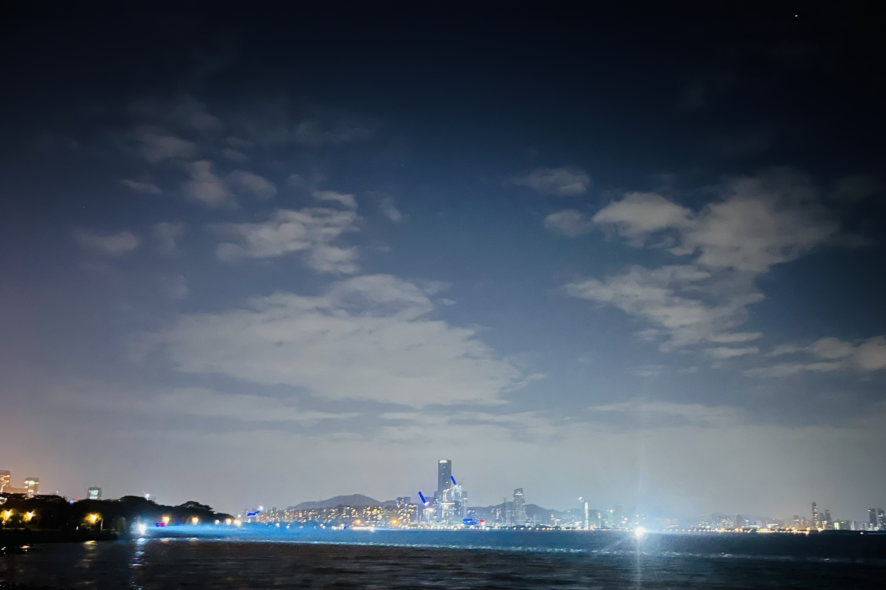

难得假期，和两朋友小聚一番，谈天说地、追忆往昔，好不快活。

我们爱吵闹，吃饭自然得去人多的地方，烧烤就是一个不错的选择。选定地方，步行到店里。烧烤无外乎吃肉喝酒，但我们喝的不多，毕竟价格摆在那里。

高中毕业以后，各奔东西。每年也就寒假能有机会聚上一聚，中间还来了个疫情。从小县城农村里走出来的我们，度过大学能够远在他乡组起局，还是挺不容易的，虽然只有三个人。

“真就和班主任说的一样，高中以后，有些同学再也见不到面了。”是啊，都很怀念高中的时光，可我们也是真正成为过来人才懂得那段光阴的珍贵。

从夜半翻墙外出，到清晨水库采风；从夏日激情排位，到冬天滑倒丢人；从高中入学分班，到毕业师生聚会。在一件件往事绘声绘色的描述中，我们逐渐回到那三年。

吃完饭，一块到海边走走。五光十色的霓虹灯映着夜空，只见躲在云彩后面的月亮，还有几颗叫不上名字的星星。时间还长，接着聊天。

大学四年里，彼此联系很少，各自的趣事自然得多唠唠。学习情况、恋爱经历，实习考研、步入社会。我们仨，一个考研未果、一个直接工作、一个父母安排。完全不同的经历碰撞在一起，总能擦出些思维的火花，这不就不知不觉聊到了人生，哈哈。

有感而发，就说起了我这二十多年来，自认为是有价值的人生总结：一定要有目标；少说话，多做事。

毫无意义的两句话对吧，我上学的时候也是这么认为的。问题是当时只能看到浅浅的一层，没有理会其成立的复杂条件。

目标要实际、具体，能够在付出一定努力的情况下实现。高中的我就没有个目标，目标就是考上大学最低 211，仅此而已，不过确实是实现了。大学也没个目标，到最后选择工作也是几天决定的。如果你问我后悔吗，我不后悔。因为那是在那个我的当下，做出的自己的选择。

少说话是要在说话前，思考说出的话的影响，要对自己说的话负责。我们一生会遇到很多人，说很多话，一定会有一些话有意或无意间对别人造成了伤害，也许我们当时没有意识到或者现在不记得了。等到我们意识到或突然想起的时候，早就物是人非了。多做事是做有意义的事，什么是有意义的事，这个只有自己知道。

“我好想变成高中时候的我，自信充满活力。大学四年还有现在的工作，改变了我。”

“过去的事情已经过去了，值得怀念，但不必留恋。现在依然能够改变自己，你这不五一就愿意走出门和我们见见嘛。”

“我很羡慕你，活得很通透。”

“我该说这是在夸我吗，我也才二十几啊！”

云彩散尽，皎月当空，一架架飞机起飞、转弯、消失在视野尽头。路上的行人逐渐少了，海风还在吹，我们还在走。

---

2023/5/2 夜

