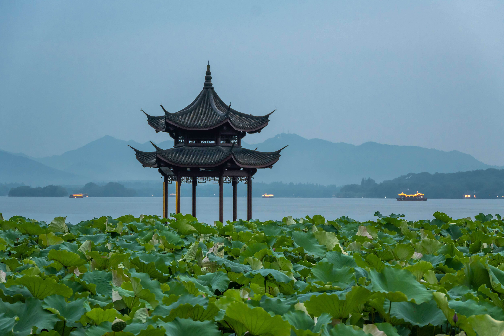
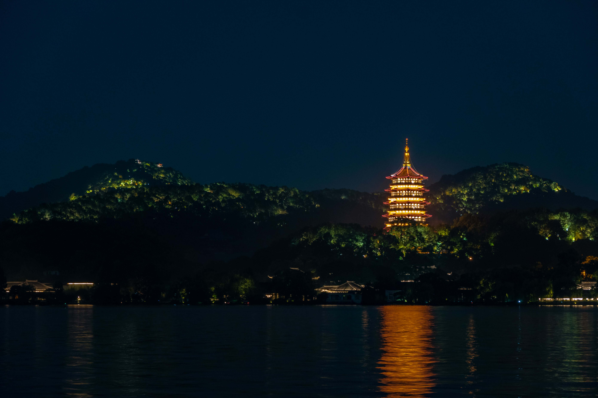

都说“晴西湖不如雨西湖，雨西湖不如雪西湖”，来杭州快一年，初来杭州的十一节间第一次去了西湖，后面大大小小周边地带连着逛的时候，又去了几回，看了不少晴西湖。春节回家前的夜晚，下了好大的雪，不过归心似箭，难去专看雪西湖了。前些天入梅，江南各地阴雨连绵，没有出门，倒是枉费了雨西湖的美景。这周末小雨淅淅，天气不热，有空去西湖逛逛了。

加完班，坐上地铁，五号线转一号线，龙翔桥站出站。

没有下雨，一如往常一样，人山人海，远远瞧见前面围了起来，很多人排队，记得此前是没有围栏的。走了约莫百十步，到了围栏边，排队到是挺快，跟着走了上去。进去以后发现是围观音乐喷泉，不过时间还早，到晚上七点半才开始，这会儿还有四十分钟。

考虑一二并没有留下，一来时间尚早、人已许多，二来此次来是有其他目的的，就是除了想看看雨西湖，还想看看上次漫步意外发现观看雷峰塔的位置夜景会是如何。

出口离开后，顺时针绕着湖边走，走过一回，已然熟路。

不远处就是集贤亭，亭子已经被围起来了，梅雨虽过，防汛防水还是紧着。这倒是给了拍照的好机会，不然乌泱泱的人，联排的荷叶怕是都嫌挤。

天色渐暗，远山层层，几分薄雾盖在山间，平静的湖面上偶尔驶过几艘游船，天、山、水浑然一体。岸边的荷叶静静地，一片翠绿，零星几个莲蓬望着水面，看来荷花没能拒了夏雨的好意。集贤亭站在湖面和荷叶之间，一份静谧古典的美就这样呈现在眼前。

再往前走，是一段不短的商业区，沿途各色店铺还有饭店，并没有拦下我的脚步。

忽地一艘快艇驶过，水面留下激起的浪花，打到岸边呼呼作响。不知怎的突然联想到三体，曲速飞船留下的黑域尾迹。

各个游船中心的工作人员，招喊着游客，要不是已定下的目的，估计也会上了船，体验一番夜游西湖的趣味。

天色更暗了，肉眼已经可以看到对岸山上点点灯光了，透过树叶，那种质地有点难以描述。路旁的柳树下，灯也都开了起来，尽管下了雨，还是有些飞虫绕着光飞。岸边的长椅上几个游客坐着，静静地看着湖面，不知是在思考着什么。

越往前走，人越来越少。到看到雷峰塔，还有段距离。

岸边的路不是连着的，中间需要转弯穿过柳浪闻莺公园到学士公园，这段路没什么灯光，倒是有些神秘。走完后才又回到岸边，已经能看到雷峰塔了。

暗色的天空和湖面，中间是绵延的透着光的山，可以想象其中游客穿行。雷峰塔的周身围着缕缕升腾雾气，想来应该是景区内的餐厅酒店之类做饭引起的，倒也算的是烟火气。塔上的灯光，在夜空中分外惹眼，倒映在湖面上，像是夕阳的余晖。不知道湖里的鱼儿，能否感知这夜色下璀璨的灯光。

不一会，开始下起了小雨，索性没有打伞，自顾往回走了......

---

2024/7/14 夜

